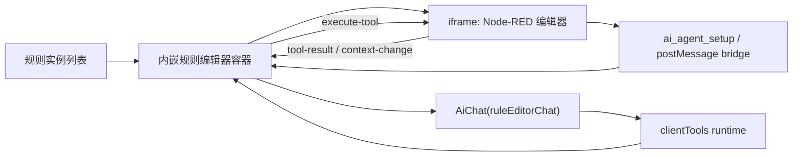

# 规则编排智能体辅助配置

## 当前结论

在规则实例的 Node-RED 编排编辑器中接入智能体辅助配置能力。智能体会话以规则实例作为
subject 隔离，所有画布理解与修改能力都由前端 Node-RED 编辑器运行时注册，后端不新增
AI 专用工具接口，也不绕过编辑器直接改写规则实例 `modelMeta`。

本任务属于跨前端边界的 L 级变更，需要先固定计划再实施。后端设计测试门禁不适用：本次不新增后端
AI 工具、命令服务、事件或数据结构。

## 影响范围与 owning module

- `runtime-ui/modules/rule-engine-manager-ui`：规则实例列表打开编辑器的方式、内嵌编辑器承载页、规则编排智能体 subject 与前端工具接入。
- `runtime-ui/jetlinks-web-core`：新增 `ruleEditorChat` 智能体发布槽和必要的国际化配置。
- `runtime-ui/modules/device-manager-ui`：通过首页智能体 provider 公开设备、产品等只读业务查询能力，规则编排助手按权限复用这些能力解析业务对象。
- `modules/rule-engine-manager/src/main/resources/static/rule-editor`：Node-RED 静态编辑器暴露 AI 能力注册与 `postMessage` RPC bridge。

不修改 `ui/` 运营端，不新增 `runtime/ai-service` 或 `modules/rule-engine-manager` 后端接口。

## 交互方案档案

- `solutionName`：配置态-运行态切换页的轻量派生，编辑态主体为全屏 Node-RED 画布。
- `primaryFilterSurface`：不需要搜索筛选面；入口仍在规则实例列表。
- `contentSurface`：iframe 承载 Node-RED 编辑器，作为规则配置画布的唯一主视觉锚点。
- `detailCarrier`：当前规则实例 subject；不在本页重复构建完整规则详情。
- `editMode`：规则拓扑和节点配置由 Node-RED 编辑器承担；智能体通过前端工具辅助读取、定位和发起修改。
- `coreComponents`：复用现有 `AiChat` / `AiChatDrawer` / `clientTools` 能力，编辑器壳层使用 Ant Design Vue 基础容器与加载、错误、关闭反馈。
- `actionPlacement`：规则实例列表保留“编辑”入口；编辑器内右下角展示规则编排智能体气泡，新增和连线类草稿改动执行后告知用户，配置修改和删除类工具走统一确认。
- `densityTarget`：首屏只保留画布、轻量头部和智能体气泡，不叠加 KPI、介绍 banner 或额外说明卡。
- `sidebarMode`：不新增业务侧栏；Node-RED 自身侧栏维持原样。
- `confirmationMode`：当前事实明确支持该方案，已按本方案进入实现与联调验证。
- `rejectedAlternatives`：
  - 新浏览器窗口：无法稳定挂载当前页面智能体和 subject，也不利于父子工具注册。
  - 后端 AI 工具：会复制 Node-RED 编辑器状态，容易和未保存草稿不一致。
  - 普通详情页表单：不适合规则拓扑编排，且会绕开 Node-RED 的校验与画布状态。
- `searchShellDecision`：不涉及 `ConditionFilter` / `ProSearch`。

执行时遵守前端壳层约束：一屏一主视觉锚点，浮动气泡使用受控 z-index，用户可见文案走当前 i18n，不展示工具 ID、内部协议名或开发态文案。

### 编辑器壳层状态与操作反馈优化计划

当前补充规则实例编辑器壳层的可恢复状态和顶部操作反馈：

- 打开规则编辑器时，父页面把规则实例 ID 写入当前 hash 路由查询参数；刷新浏览器后由父页面读取 ID 并重新拉取规则实例详情，恢复到编辑器打开状态。
- 保存、发布仍调用 iframe 内编辑器提供的动作，外层不再额外弹成功提示，避免和编辑器内部提示重复；外层按钮只展示加载态，成功后短暂切换为勾选图标。
- 顶部标题区以规则实例为主体，展示可直接编辑的规则名称、弱化的 ID 和规则说明；第二行按 `ID -> 说明` 排列，说明支持在头部直接编辑，不再重复展示“规则编排”字样。

不做：

- 不修改 Node-RED 原生编辑器入口和 `red.js`。
- 不绕过编辑器保存、发布或校验流程。
- 不新增后端 AI 工具或直接改写规则画布数据。

实现与验证结果：

- `runtime-ui/modules/rule-engine-manager-ui/views/Instance/useRuleEditorRouteState.ts` 管理 `editorId` 路由同步、关闭清理和刷新恢复。
- `runtime-ui/modules/rule-engine-manager-ui/views/Instance/RuleEditor/useRuleEditorActions.ts` 管理保存 / 发布加载态、成功勾选态和规则名称 / 说明编辑。
- `runtime-ui/modules/rule-engine-manager-ui/views/Instance/RuleEditor/RuleEditorHeader.vue` 顶部改为规则名称 + ID + 说明展示，名称和说明可直接编辑，外层保存 / 发布不再弹成功 toast。
- 已执行 `pnpm -C runtime-ui build:modules rule-engine-manager-ui`，构建通过；构建过程仍有历史 warning：`Scene/Save/Device/InvokeFunction.vue` 中对象字面量重复 `type` key，以及现有 CSS `//background` 注释 warning。
- 已用本地浏览器验证 `#/iot/rule-engine/Instance?editorId=2057302213636481024` 刷新后可恢复编辑器打开状态，顶部展示规则名“测试”和 `ID：2057302213636481024`，iframe 指向对应 flow。

### 首页到页面智能体 continuation 优化计划

当前复核发现：首页或列表页智能体在“为某业务对象创建配置 / 编排 / 诊断 / 设计任务”类请求中，容易停留在前置资料收集和人工步骤说明，没有把用户顺滑带入更合适的页面智能体。最佳实践应改为通用 continuation 规范：当前助手只识别用户意图、生成可交接的自然语言需求提示词、补齐创建或定位目标对象所需的最小事实，然后通过声明式工具或入口把任务交给目标页面智能体。

规则编排场景是该规范的首个落地：能创建草稿时先创建规则实例，再打开规则编排入口，并把用户原始目标、产品 / 事件 / 动作等上下文交给 `ruleEditorChat`。Kafka broker/topic/认证、物模型字段等可由目标助手继续确认，不再作为首页助手创建草稿前的强制前置问题。

目标：

- 用户在首页或规则编排列表提出“为 JT808 超速事件转发到 Kafka”这类配置需求时，当前智能体优先整理需求提示词，创建一个可编辑的规则草稿。
- 创建成功后导航到规则编排列表页，并携带 `editorId=<规则ID>`，由规则实例页面恢复内嵌编辑器抽屉。
- 通过 `saveAiAgentHandoff` 写入 `clientId=ruleEditorChat`、`subjectType=ruleInstance`、`subjectId=<规则ID>` 的一次性 handoff；目标助手输入框只预填自然语言任务，完整上下文走 `handoffContext` 会话参数。
- 规则编排助手接管后，再基于当前画布工具和共享只读业务工具生成节点、连线、校验和保存 / 发布建议。

影响范围：

- `runtime-ui/jetlinks-web-core/src/layout/components/AiChat/homeAgentCapabilities.ts`：新增通用 continuation 行为约束，供任意页面 provider 声明“识别意图后转交目标页面智能体”。
- `runtime-ui/jetlinks-web-core/docs/首页智能体能力扩展.md`：沉淀通用 continuation contract；规则编排只是首个接入方，后续设备诊断、可视化设计等场景按同一规范声明能力。
- `runtime-ui/modules/rule-engine-manager-ui/views/Instance/homeAgentProvider.ts`：新增规则编排首页能力和工具，按通用 continuation 元数据声明目标助手，负责创建规则草稿、保存 handoff、打开规则编辑路由。
- `runtime-ui/modules/rule-engine-manager-ui/register.ts`：确认 `rule-engine/Instance` 的 homeAgentProvider 能被全局首页智能体加载。
- `runtime-ui/modules/rule-engine-manager-ui/api/instance.ts`：复用既有 `saveRule` 和 `getRuleDetail`，不新增后端 API。
- `runtime-ui/modules/rule-engine-manager-ui/locales/lang/zh.json` / `en.json`：补齐工具、确认、结果和系统提示文案。
- 视情况微调 `runtime-ui/modules/rule-engine-manager-ui/views/Instance/RuleEditor/index.vue` 参数，使 `ruleEditorChat` 的 subject 与 handoff 目标保持一致。

不做：

- 不直接替用户发布、启动或保存最终规则；规则创建仅产生草稿，画布修改仍由规则编排助手和编辑器工具在用户确认下完成。
- 不把用户 prompt、产品 ID、事件 ID、Kafka 参数、内部编辑器路径或工具 ID 放入 URL。
- 不从首页智能体直接拼完整 Node-RED flow，不绕过规则编辑器工具写 `modelMeta`。
- 不在 `ui/` 运营端实现该流程。

实施步骤：

1. 新增 `rule-engine/Instance` 首页 provider，公开“创建规则草稿并继续编排”的能力；系统提示要求创建类意图优先调用工具，而不是只输出配置说明。
2. 工具参数只收敛业务必要字段：规则短标题、规则摘要、用户目标、来源上下文、可选产品 / 事件 / 动作摘要；短标题和摘要由智能体从用户目标中概括，前端只做通用长度截断，不根据特定产品、事件或下游类型做正则提取。
3. 工具调用 `saveRule` 创建草稿，以接口返回的规则实体作为唯一事实来源；成功拿到规则 ID 后保存 handoff，上下文包含用户原始目标、已解析产品 / 事件、期望动作、后续待确认项和来源页面。
4. 工具调用 `context.navigateToMenu('rule-engine/Instance', { query: { editorId: ruleId } })`，让规则实例页面自行恢复编辑器抽屉和 `ruleEditorChat`。
5. 返回用户可见结果时只说明“已创建草稿并打开规则编排，可继续确认触发条件和 Kafka 参数”，不暴露工具名、内部路由、handoff key 或编辑器 URL。

通用规范：

- 业务 provider 可在 `metadata.continuation` 中声明 `targetName`、`promptPolicy`、`blockingFacts`，用于让模型理解何时交接和交接前最小事实。
- `targetClientId`、`targetMenuCode`、`toolId` 等字段只作为 provider 内部执行提示；公共 `home_agent_search_capabilities` 会裁剪后再返回，避免模型在回复中暴露实现细节。
- 不为规则编排写固定问法或硬编码触发词；后续任意需要“创建/定位对象后交给页面助手”的场景，都按同一 provider contract 接入。
- 草稿标题不做业务特调提取：模型负责生成 `name`，工具层仅截断到平台可接受长度；模型未给标题时使用通用兜底名。
- 草稿说明存储摘要：模型负责生成 `description` 或 `summary`，工具层把摘要写入规则 `description`；完整需求仍保留在 `userGoal` 和 handoff context。

风险与待确认点：

- 当前 `saveRule` 创建的是空规则草稿；如果后端要求更多字段，工具需按规则实例新增弹窗的最小字段保持一致，并继续以后端返回的规则 ID 作为跳转和 handoff 目标。
- Kafka Broker、Topic、认证方式等通常是敏感或环境相关配置，首页工具不应臆造，也不应在创建草稿前强制追问；缺失时交给规则编排助手继续确认。
- 产品物模型事件查询目前主要由设备产品相关只读能力承接；若产品事件详情缺口影响节点自动生成，需要后续补只读 metadata 工具。

验证方式：

- 静态验证：`pnpm -C runtime-ui build:modules rule-engine-manager-ui`，并执行相关 JSON / diff 检查。
- 浏览器验证：首页输入创建规则类需求后，应创建草稿、打开 `#/iot/rule-engine/Instance?editorId=<规则ID>`，规则编排助手自动打开并预填自然语言任务。
- WebSocket 验证：`session.init.parameters.handoffContext` 携带完整结构化上下文；URL 不包含 `prompt`、`question`、`userGoal`、内部工具名或编辑器内部路径。
- 发送预填消息后 handoff 被清理，刷新页面不再重复预填；历史回放不触发清理。

验证结果：

- passed：`node -e "JSON.parse(...runtime-ui/modules/rule-engine-manager-ui/locales/lang/zh.json); JSON.parse(...runtime-ui/modules/rule-engine-manager-ui/locales/lang/en.json)"`
- passed：`git -C runtime-ui/modules/rule-engine-manager-ui diff --check -- docs/规则编排智能体辅助配置.md register.ts locales/lang/zh.json locales/lang/en.json`
- passed：`git -C runtime-ui/modules/rule-engine-manager-ui diff --no-index --check -- /dev/null views/Instance/homeAgentProvider.ts`
- passed：`pnpm -C runtime-ui build:modules rule-engine-manager-ui`
- note：构建仍有既有 warning：`Scene/Save/Device/InvokeFunction.vue` 重复 `type` key、CSS `//background` 注释、chunk size 等，非本次 continuation 接入引入。

## 架构设计



核心原则：

1. 父页面负责智能体会话、工具列表转换、确认弹窗、超时和卸载。
2. iframe 内的 Node-RED 编辑器负责真实画布状态读取与修改。
3. 读工具返回模型友好的摘要，不返回完整 flow JSON、DOM、HTML 或大段脚本。
4. 写工具只修改当前编辑器草稿，必须标记 `RED.nodes.dirty(true)` 并刷新画布；保存、部署、启动、停止仍交给既有编辑器流程。

## 节点类型知识暴露方案

节点用法默认来自 Node-RED 原生节点契约，不为每个节点额外手写一个智能体工具：

- `RED.nodes.registerType(type, definition)`：作为结构化事实源，读取 `category`、`defaults`、`inputs`、`outputs`、`paletteLabel`、`label`、`inputLabels`、`outputLabels`、`icon` 等编辑器定义。
- `RED.nodes.getNodeHelp(type)`：作为自然语言用法来源，读取节点帮助文档中的用途、输入、输出、细节、示例和限制。
- `definition.aiAgent` / `definition.ai_agent`：可选增强字段，用于补充模型更容易理解的 `purpose`、`whenToUse`、`examples`、`configFields`、`cautions` 等业务语义。
- `<script type="application/json" data-agent-help-name="node-type">...</script>`：可选 sidecar 元数据，适合不希望污染 Node-RED 原生节点定义的扩展节点。

`ai-agent-bridge.js` 只负责读取和执行通用能力，不把每个节点的特殊知识硬编码进去。节点自己的特殊描述、配置模板、典型用法和未来可扩展的节点专属工具，应在节点注册时通过 `aiAgent` 或 sidecar 声明：

```js
RED.nodes.registerType('node-type', {
  // Node-RED 原生定义...
  aiAgent: {
    purpose: '节点用途',
    whenToUse: ['适用场景'],
    configFields: {
      fieldName: { description: '字段语义', examples: ['example'] }
    },
    templates: [
      {
        id: 'template-id',
        name: '模板名称',
        description: '模板适用场景',
        config: { fieldName: 'default value' },
        editableFields: ['fieldName']
      }
    ],
    tools: [
      {
        id: 'optional-node-specific-tool',
        description: '后续可由节点自己声明的专属能力'
      }
    ]
  }
});
```

元数据分层原则：

- `whenToUse` / `selectionHints` / `avoidWhen` 只描述节点自身适用场景、真实限制和与相邻同类节点的选择边界，不承载“是否写入画布”“是否展示工具过程”等通用交互策略。
- `contracts` 是节点输入输出结构的事实源。脚本、ReactorQL、设备消息、命令执行、并行聚合等节点组合时，由通用工具先读取上下游契约，再决定脚本可用变量和下游必填字段。
- `tools` 用于节点自己暴露只读 metadata，例如命令参数结构、服务描述或物模型字段；bridge 只统一执行这些工具，不在通用代码里硬编码某个节点的私有字段。
- `templates` 是可复用配置起点，不代表固定工作流。模板里的字段必须按用户目标、节点契约和真实 metadata 调整后再写入。

### 节点配置读写适配计划

当前结论：智能体工具不能绕过节点组件自己的配置转换逻辑直接改字段。`ai-agent-bridge.js` 只提供通用安全写入流程；遇到 `sql` 需要格式化、脚本 / SQL 需要 base64 持久化、隐藏字段需要同步等节点私有规则时，由节点在注册时声明配置适配器。

影响范围：

- owning module：`modules/rule-engine-manager` 的规则编辑器 bridge 与内置节点资源。
- 扩展节点：`modules/jetlinks-components` 中组件版规则节点，先覆盖已知使用 base64 存储的 `reactor-ql` 与 `function` 节点。
- UI 文档：本文件记录扩展契约和验证结论。

不做：

- 不修改 Node-RED 原生 `red.js` 或编辑器生命周期。
- 不在 bridge 中写 `reactor-ql` / `function` 的特例分支。
- 不调用节点 `oneditsave` 操作 DOM/editor；该逻辑仍只服务手动编辑弹窗。

实施步骤：

1. bridge 区分“展示给模型的裁剪元数据”和“运行时可调用的节点 hooks”，避免把函数暴露给智能体。
2. bridge 提供 `helpers.readDefaultConfig`、`helpers.applyDefaultConfig`、`helpers.normalizeReactorQlSql`、`helpers.encodeUtf8Base64`、`helpers.decodeUtf8Base64` 等通用能力。
3. `get_node_detail` 读配置时优先调用节点 `aiAgent.configAdapter.read` / `readConfig`，返回模型可理解的明文视图。
4. `insert_node`、`insert_node_template`、`edit_node` 写配置时优先调用节点 `aiAgent.configAdapter.apply` / `applyConfig`，由节点把明文转换为真实存储字段。
5. `reactor-ql` 声明 SQL 格式化适配；组件版 `reactor-ql` 和 `function` 声明 base64 编解码适配。

验证方式：

- `node --check modules/rule-engine-manager/src/main/resources/static/rule-editor/ai-agent-bridge.js`
- `./mvnw -q -DskipTests resources:resources`（`modules/rule-engine-manager`）
- `./mvnw -q -pl rule-engine-component -DskipTests resources:resources`（`modules/jetlinks-components`）
- 必要时用本地页面验证：模型读到明文 SQL / 脚本，写入后节点内部仍保存为组件要求的字段格式。

智能体只拿到经过裁剪的“节点类型摘要 / 节点类型详情”：

- 摘要用于搜索和选择节点类型：`type`、名称、分类、输入输出数量、简短说明、可配置字段数量。
- 详情用于配置节点：字段白名单、默认值、必填标记、配置节点引用、输入输出端口说明、帮助文本摘要、可选业务示例、配置模板。
- 不直接返回编辑表单 DOM、完整 HTML、函数源码或未经裁剪的大段帮助文本。

因此，新增能力以通用检索工具承载：

- `rule_editor_search_node_types`：按关键词、分类搜索当前编辑器真实可用的节点类型。
- `rule_editor_get_node_type_detail`：按节点类型读取配置字段、输入输出、帮助文本和可选智能体元数据。
- `rule_editor_list_node_templates`：按节点类型或关键词搜索节点注册时声明的配置模板。
- `rule_editor_insert_node_template`：按模板插入节点，并允许通过 `overrides` 覆盖模板中的部分配置字段。

`rule_editor_get_node_help` 保持兼容，但内部返回同一套节点类型详情，避免维护两套节点知识格式。

### 节点输入输出契约与自动排版计划

当前结论：脚本、ReactorQL、设备消息、命令执行、并行聚合等节点不能只靠自然语言说明来“猜”上下游字段。智能体在构造脚本、编辑节点或诊断规则时，必须先拿到真实画布组合里的上游输出契约和下游输入契约；能由节点根据自身配置计算的契约由节点自己声明，`ai-agent-bridge.js` 只负责统一调用、裁剪和暴露。

目标：

1. 构造请求脚本时先看下游节点需要什么，再看上游节点能提供什么；如果下游节点提供 metadata 工具，则优先调用工具得到输入参数结构。
2. 诊断规则配置时除基础程序校验外，还能让大模型按节点契约分析“当前脚本引用的字段是否来自上游”“下游是否能消费当前输出”。
3. 新增或批量插入节点后可指定自动排版，让多步计划落画布后按拓扑层级排开，避免节点挤在默认插入点附近。

影响范围：

- `modules/rule-engine-manager/src/main/resources/static/rule-editor/ai-agent-bridge.js`：新增通用 contract hooks、契约查询 / 诊断辅助工具和子图自动排版工具。
- `modules/jetlinks-components/rule-engine-component/src/main/resources/rule-engine/editor/function/*.html`：由节点声明自身输入输出契约、节点专属 metadata 工具和示例约束，先覆盖 `function`、`reactor-ql`、`command-support`，并复用已有 `device-message-sender` 的上游消息契约。
- `modules/rule-engine-manager/src/main/resources/rule-engine/editor/**/*.html`：维护 rule-engine-manager 自身注册的规则输入、规则输出、并行聚合等节点声明。
- 本文件记录契约边界、工具范围和验收结果。

不做：

- 不新增后端 AI 专用工具，不绕过现有 `/rule-editor/{executor}/{command}/_execute` 规则节点命令边界。
- 不在 bridge 中写某个业务命令、某个设备查询或某个验证拓扑的特例。
- 不让模型通过删除重建来模拟编辑已有节点。
- 不做完整 SQL 解析器；ReactorQL 只做保守 select-list alias 提取，复杂 SQL 返回 `uncertain=true`，由模型结合手册和用户目标判断。

实施步骤：

1. 定义节点契约结构：`inputContract` 描述节点期望从上游收到的对象、字段、来源模式和必填项；`outputContract` 描述节点对下游输出的对象、列或结果形态；契约可以是静态对象，也可以由节点的 `aiAgent.contracts` / `contractProvider` 根据当前配置计算。
2. bridge 增加 `rule_editor_get_node_contract`：读取指定节点配置、入出连线、上游 / 下游相邻节点摘要，并调用节点契约 provider 返回规范化结果。结果只包含字段、类型、是否必填、来源、置信度和简短说明，不返回 DOM 或完整脚本。
3. bridge 增加节点声明工具执行入口或通用 metadata 工具入口。`command-support` 复用现有 `commands/_execute` 接口，根据 `serviceId` 列出命令、根据 `command` 返回 inputs/valueType/参数模板；智能体构造上游命令请求前必须优先读取该结构。
4. `reactor-ql` 声明输出契约 provider：读取明文 SQL，提取顶层 `select` 列别名，返回 `columns`。例如 SQL 输出 `deviceId/property/value/metadata` 时，下游脚本只能从这些字段取值；无法稳定解析时返回 `uncertain=true` 和 SQL 摘要。
5. `function` 节点说明收敛为“脚本变量来自上游契约，返回对象满足下游契约”。构造脚本前，智能体应调用相邻节点契约；直接连接到 `command-support(source=upstream)`、`device-message-sender(from=pre-node)` 等节点时，脚本返回值必须覆盖下游契约必填字段。
6. `validate_flow` 或新增诊断工具返回契约提示：标识缺少契约、上下游字段不匹配、脚本疑似引用不存在字段、下游必填字段缺失等问题；最终解释由大模型结合工具结果生成，避免程序校验变成静态特调。
7. 新增 `rule_editor_layout_nodes`，支持按 nodeIds / alias 子集、方向、起点、列距、行距做确定性 DAG 排版；`rule_editor_apply_canvas_actions` 支持在 steps 后附带 `layout` 参数，先执行插入和连线，再对指定节点自动排版。

验收标准：

- ReactorQL 上游场景：当上游 ReactorQL SQL 输出 `deviceId/property/value/metadata` 等列时，下游脚本必须使用这些列构造数据，不引用 SQL 没有输出的字段；如果 SQL 无法解析列，助手应说明不确定并基于手册 / 用户补充继续。
- 命令请求场景：构造执行命令节点的上游脚本前，先读取命令 metadata 或命令参数模板；脚本按实际 `inputs` 生成 `parameter`，不再凭历史样例写固定参数。
- 诊断场景：对脚本引用上游不存在字段、返回对象缺少下游必填字段、或节点来源模式不匹配时，工具结果能给出可被模型解释的契约问题。
- 排版场景：批量插入节点并连接后，指定节点按拓扑层级横向或纵向排开，节点间距稳定，既有未指定节点不被移动。

验证方式：

- `node --check modules/rule-engine-manager/src/main/resources/static/rule-editor/ai-agent-bridge.js`
- 抽取 `modules/jetlinks-components/**/src/main/resources/rule-engine/editor/**/*.html` 与 `modules/rule-engine-manager/src/main/resources/rule-engine/editor/**/*.html` 中脚本块做语法检查。
- `./mvnw -q -DskipTests resources:resources`（`modules/rule-engine-manager`）
- `./mvnw -q -pl rule-engine-component -DskipTests resources:resources`（`modules/jetlinks-components`）
- 浏览器验证：在 `#/iot/rule-engine/Instance?editorId=2057302213636481024` 让智能体配置 `ReactorQL -> function`、`function -> command-support`、多节点批量插入 + layout，以及故意错误脚本诊断。

当前进展：

- `ai-agent-bridge.js` 已提供 `rule_editor_get_node_contract`、`rule_editor_execute_node_tool` 和 `rule_editor_layout_nodes`，并在 `rule_editor_apply_canvas_actions` 中支持 `layout` 参数，批量插入和连线后可由同一次计划自动排版指定节点。
- `rule_editor_apply_canvas_actions` 已支持把 `rule_editor_edit_node` 纳入同一个明确落地授权后的原子计划。直接配置当前画布时，智能体可以在一次计划里完成“复用已有节点并修改配置 -> 插入缺少节点 -> 连线 -> 排版 -> 校验”，不再需要通过删除重建模拟编辑；删除节点和删除连线仍不允许放入该计划。归一化和执行层都传递 `allowUpdate`，避免计划校验通过但执行 step 时又被确认策略拦截；事务快照同步保存既有节点可写状态，后续步骤失败时会恢复已编辑配置、坐标、dirty/changed/moved 等字段；若计划新增错误级画布校验问题，也会回滚本次草稿。规则编辑器资源版本提升到 `2026070646`。
- 节点契约由节点自身 `aiAgent.contracts` 声明或计算，bridge 只负责统一读取、裁剪和返回；ReactorQL 输出契约只保守提取顶层 `select` 列，复杂 SQL 标记为不确定。
- `command-support` 已通过节点工具暴露命令 metadata / 参数模板读取能力，构造 `source=upstream` 上游脚本前应优先调用该工具；没有节点工具时才退回到节点手册和上下游契约推断。
- `function`、`reactor-ql`、`device-message-sender`、`command-support` 已补充输入输出契约和脚本/参数构造约束，脚本写入仍走节点配置适配器，不暴露底层 base64 存储字段。
- `rule-input`、`zip-input`、`zip-output`、`rule-output` 已补充请求响应链路契约：并行节点透传直接上游输出契约，聚合节点按 `mapping.alias` 动态输出字段，规则输出只消费最终响应对象，不反向强制字段。
- `rule_editor_get_node_contract` 和 `rule_editor_get_node_detail` 返回节点声明的 `nodeTools` 摘要；当下游节点能通过自身工具提供命令、参数或 metadata 结构时，智能体可在同一契约读取流程里发现并优先调用。
- bridge 的节点契约 helper 已提供相邻上游输出 / 下游输入契约读取能力，节点自己的 contract provider 可复用该能力声明“透传”“聚合”“按配置推导”等通用模式，避免在 bridge 中写节点特例。
- 规则编辑器宿主 iframe URL 已带资源版本参数，避免父页面重开抽屉后继续加载旧 `index.html` / 旧工具集合。

### 自然需求复杂配置验证优化计划

本轮用接近用户自然表达的需求验证复杂请求响应规则配置，暴露出三类需要先收敛的问题：

- 节点类型搜索结果仍返回 `selectionHints`、`avoidWhen`、`templates` 等较重内容，导致上下文消耗偏高，也容易让助手在最终回复里复述内部选择依据。搜索工具应默认只返回节点类型摘要，详细手册、模板和适用边界只在 `rule_editor_get_node_type_detail` / `rule_editor_get_node_type_manual` 中按需读取。
- `command-support` 的命令摘要需要按用户意图排序。单设备 ID 查询详情时应优先暴露 `QueryById`、`GetById`、`Detail` 等候选；列表、分页、数量和模糊条件再优先 `QueryList`、`QueryPager`、`Count`；聚合分析场景应让聚合类命令靠前。
- 脚本契约校验需要忽略 `.length`、`.toString()` 等常见 JS 内建成员，避免把数组长度或对象方法误判成上游契约字段。
- 规则编排助手可复用首页只读业务查询工具，但不应继承共享 provider 的 workflow guide；否则模型会先输出“获取工作流指导/读取画布”的过程句。规则编辑器的工作流策略由画布工具手册和精简系统提示承接。
- 通用对话反馈策略不由客户端场景 `systemPrompt` 覆盖。客户端只声明规则编排业务边界、画布写入授权和节点契约规则；“允许一句业务目标短承接、禁止把读取/搜索/调用工具等内部过程当成对话反馈或长报告”收敛到后端 `message.general_agent_prompt.tool_use_guidance` 和平台 baseline 中，由后端系统提示词统一注入。
- 本轮浏览器自然需求验证后调整：短自然语言过程回复本身保留，尤其是“正在整理巡检规则”“确认配置能力”这类业务化进度；约束重点改为不暴露工具名、节点 ID、命令 ID、模板 ID、参数 JSON、调用链路和长过程报告。
- 明确落地请求增加探索上限：每类能力只做必要的聚焦搜索和详情 / metadata 读取，够用即调用批量画布计划；仍无法确认必填节点、服务、命令或参数时，先落可确定部分，无法安全落地的分支只问一句或说明缺口，避免长时间停留在工具发现。

不做：

- 不把本次验证需求固化成模板或特调流程。
- 不修改 Node-RED 原生 `red.js`。
- 不绕过节点自身 `aiAgent`、manuals、nodeTools 和配置适配器。

验证方式：

- 重新用自然需求触发规则编排助手，观察是否能在读取必要详情后一次性批量写入画布，而不是长时间停在“获取所需信息”。
- 校验最终回复是否简短说明草稿已变更，不再展示内部工具名、命令 ID、拓扑表格或长篇过程说明。
- 执行 `node --check`、HTML 脚本语法检查、`git diff --check` 和相关 Maven resources 任务。

本轮验证结果：

- `node --check modules/rule-engine-manager/src/main/resources/static/rule-editor/ai-agent-bridge.js` 通过。
- 本地 Node-RED stub harness 通过真实 bridge `postMessage` 工具入口验证：`rule_editor_apply_canvas_actions` 的 `steps` 中包含 `rule_editor_edit_node` 时，可成功修改已有节点配置并置 `dirty=true`；编辑已有节点、自动排版后再遇到后续连线失败时，会回滚到原配置、原坐标、原 dirty 状态，并清理本轮临时状态字段。
- `runtime-ui/modules/rule-engine-manager-ui/locales/lang/zh.json` 与 `en.json` JSON 解析通过。
- `command-support.html` 脚本语法检查通过，命令摘要排序已收紧：真正的详情类命令优先，删除、启停、更新等副作用命令降权。
- `rule_editor_search_node_types` 通过浏览器 bridge 只读验证，搜索结果仅返回 `type/name/category/inputs/outputs/fieldCount/description/hasAgentMetadata/templateCount/manualCount/nodeToolCount` 等摘要字段，模板、手册和 `selectionHints` 只在节点详情中按需返回。
- `./mvnw -q -DskipTests resources:resources`（`modules/rule-engine-manager`）通过。
- `./mvnw -q -pl rule-engine-component -DskipTests resources:resources`（`modules/jetlinks-components`）通过。
- `pnpm -C runtime-ui build:modules rule-engine-manager-ui` 通过；仍存在历史 warning：`InvokeFunction.vue` 对象字面量重复 `type` key、CSS `//background` 注释 warning、以及既有 chunk size 提示。
- 浏览器中规则编辑器 iframe 已加载 `ai-agent-bridge.js?v=2026070637` 并能响应 bridge 只读工具；完整对话验证受当前前端热更新后的气泡空面板影响暂未完成，需刷新 / 重开会话恢复后继续用自然需求验证一次性批量写入效果。
- 抽取 `rule-input`、`zip-input`、`zip-output`、`rule-output` 以及已增强的 function 节点 HTML 脚本块做语法检查通过。
- 本地脚本沙箱验证：`zip-input` 能透传上游 `deviceId/property/value/metadata` 字段，`zip-output` 能从 mapping 推导 `device/message` 输出字段，`rule-output` 输入契约为 `response-body`。
- `git -C modules/rule-engine-manager diff --check`、`git -C runtime-ui/modules/rule-engine-manager-ui diff --check` 通过。
- `./mvnw -q -DskipTests resources:resources`（`modules/rule-engine-manager`）通过。
- `./mvnw -q -pl rule-engine-component -DskipTests resources:resources`（`modules/jetlinks-components`）通过。
- `pnpm -C runtime-ui build:modules rule-engine-manager-ui` 通过；仍存在历史 warning：`Scene/Save/Device/InvokeFunction.vue` 对象字面量重复 `type` key、现有 CSS `//background` 注释、chunk size 提示。
- 浏览器验证：父页面 iframe 已加载 `/api/rule-editor/index.html?v=20260705#flow/2057302213636481024...`；通过父子窗口工具调用确认 `rule_editor_get_node_contract` 可返回 ReactorQL `deviceId/property/value/metadata` 输出契约，`command-support` 节点详情可返回 `get-command-metadata` 节点工具。
- 浏览器验证：在临时未保存草稿中执行 `rule_editor_apply_canvas_actions`，一次插入 `ReactorQL -> function`、连接并通过 `layout` 参数自动排版；随后 `rule_editor_validate_flow` 能识别脚本引用了 ReactorQL 未输出的 `deviceName` 字段，返回上游可用字段 `deviceId/property/value/metadata`。
- 浏览器验证：直接打开 `/api/rule-editor/index.html?v=20260705#flow/2057302213636481024...` 后，页面已加载包含公共节点契约的新脚本；HTTP 校验同一版本的 `ai-agent-bridge.js` 已包含 `nodeTools` 契约返回、相邻契约 helper 和 `layout` 批量排版支持。
- 浏览器验证：在干净画布中输入自然需求“设备详情页健康巡检能力，页面传 deviceId/hours/properties/thresholds，能确定的直接配置到当前画布”。模型能输出业务化进度，但约 50 秒仍未写入画布，网络心跳显示已进入多轮模型思考且未触发画布写入。结论是用户可见进度不是主要问题，主要问题是命令 / 平台能力探索链路过长，已按“够用即写、缺口只问一句”收紧提示词和工具手册。

补充真实画布验收：

- 在本地浏览器 `#/iot/rule-engine/Instance?editorId=2057302213636481024` 通过规则编辑器 bridge 调用真实前端工具，当前画布为 `测试6`，包含 11 个节点、10 条连线，`rule_editor_validate_flow` 返回 `ok=true`、`issueCount=0`。
- `属性上报转换` ReactorQL 节点配置为实时订阅 `/device/*/*/message/property/report`，SQL 通过 `unnest(this.properties.entries)` 平铺属性，并输出 `deviceId`、`property`、`value`、`ts`、`metadata`；其输出契约与 SQL select 列一致。
- `整理属性记录` 脚本节点只读取上游 ReactorQL 已声明的 `deviceId/property/value/ts/metadata` 字段，不引用未输出字段；运行观察通过调试侧栏订阅的事件、日志和结果快照完成，不再依赖画布 `debug` 节点。
- `构造读取属性请求 -> 读取设备属性` 链路中，脚本返回 `messageType`、`deviceId`、`properties`，满足设备指令节点 `from=pre-node` 的必填输入契约 `messageType/deviceId`。
- `构造设备查询请求 -> 查询设备信息` 链路中，脚本返回 `serviceId`、`command`、`parameter`，满足命令节点 `source=upstream` 的必填输入契约；节点工具按 `deviceService:device / QueryById` 读取到真实命令 metadata，参数模板为 `{ "id": "" }`。
- `汇总返回结果` 聚合节点开启 `flatWhenSingle=true`，`mapping` 使用完整对象形态将设备指令结果映射为 `message`、命令查询结果映射为 `device`；`返回结果` 节点接收到的上游契约字段为 `message/device`。
- 节点位置按左到右拓扑排布，两个并行分支上下展开：入口与实时订阅链路未相互挤压，批量写入时可继续通过同一计划的 `layout` 参数整理新增节点。

### 弱模型画布计划与流类型契约收敛

> 状态：R0-R7 已于 2026-07-27 完成。实施范围收敛在 `modules/rule-engine-manager` 的编辑器静态资源与
> `runtime-ui/modules/rule-engine-manager-ui` 的规则工具 adapter；现有节点契约已经能够提供端口、Topic、请求边界和终止动作事实，
> 因此没有修改 `modules/jetlinks-components` 节点 metadata，也没有修改 `modules/jetlinks-ai-agent` 生产逻辑。

#### 当前结论

弱模型在“创建设备数据并转发到 Kafka”等多节点任务中连续提交无效计划，并不是 Kafka 或某个节点配置的特例。本次会话先于节点能力发现就搜索并规划了
`rule-input / rule-output`，说明问题首先发生在流类型分类阶段：当前实际注入的 compact system prompt 完整描述了请求响应拓扑，却只用一句带歧义的例外描述实时流；
通用批量写入工具 description 又以前置篇幅重复 `rule-input.executePayload` 和 `rule-output` 错误分支，模型容易在识别消息源和终点动作前先套用请求响应模板。

同时，`rule_editor_apply_canvas_actions` 把 `steps` 声明为没有机器可读元素结构的普通数组，真实 step 结构、允许的操作、alias 规则和参数形态主要写在超长 description
与工具手册中。父页面 `toolRuntime.ts` 又只是透传远端定义，没有接入 `defineAiClientToolContract`、routing、typed result binding 和标准 failure evidence。
结果是模型既可能先选错执行模式，也需要从自然语言自行拼装内部工具 ID 与多层 Map；调用到达 bridge 后才以字符串错误失败，同一错误容易被盲目重试，原子回滚虽然保护了画布，却无法提高完成率。

优化必须先建立“流类型 -> 节点能力 -> 原子计划”的决策顺序，再收敛计划和失败契约；不能继续通过增加 Kafka、设备消息或某种中文问法的提示词修补。

本批属于 L 级跨前端工具边界重构，owning module 为：

- `modules/rule-engine-manager/src/main/resources/static/rule-editor`：流语义预检、标准 schema、纯计划编译、画布事务执行和结构化结果。
- `runtime-ui/modules/rule-engine-manager-ui`：实际注入的流类型选择提示、远端定义类型、client-tool contract 适配、错误与结果投影。
- `modules/jetlinks-components`：只在现有节点 metadata 无法表达时补充通用 source/sink 语义，例如无界实时源、请求边界和终止动作；不写 Kafka 专用判断。
- `runtime-ui/jetlinks-web-core`：只复用现有 `defineAiClientToolContract`、tool-result evidence 和 schema 序列化能力；除非验证发现公共能力缺口，否则不新增规则编辑器专用分支。
- `modules/jetlinks-ai-agent`：作为结构化 request failure 与熔断语义的消费和回归验证边界；现有分类行为满足契约时不修改生产逻辑。

#### 目标与非目标

目标：

1. 在节点选择和画布计划之前显式判定 `request-response`、`realtime-stream` 或 `one-way-trigger`；实时流由订阅/Topic/ReactorQL 等源节点承担入口，由 Kafka、存储、通知、命令等动作节点承担终点，不使用 `rule-input/rule-output`。
2. 用平台可完整序列化的嵌套类型声明画布计划，模型在调用前即可看到并接受同一份封闭结构；description 只说明业务用途，不承担参数校验。
3. 保留一个面向模型的原子画布写入入口，避免弱模型逐节点写入半成品；内部按“schema/编译 -> 流语义预检 -> 事务执行 -> 结果投影”拆分职责。
4. 使用 canonical operation discriminator 表达有限操作集合，消除 `toolName/toolId + Record<string, any>` 作为公共计划协议；节点动态 config 仍由节点自身 metadata/config adapter 校验。
5. 所有失败在写画布前返回有界、可修复的结构化 issue path；同一无进展请求最多获得一次正式修复，不再连续三次盲重试。
6. 成功结果形成 typed state-change evidence，能够证明本轮实际修改数量、画布 revision、流类型、校验状态和是否回滚；最终“已配置”只能建立在该成功结果上。
7. 保持现有 snapshot/rollback、dirty/history/redraw、权限、确认和 iframe 生命周期边界，不绕过 Node-RED 编辑器保存/发布流程。

非目标：

- 不为 Kafka、设备、ReactorQL、通知、某个节点类型、中文问法或特定模型增加分支；节点知识继续由节点自身 `aiAgent/manuals/nodeTools/contracts` 提供。
- 不通过关键词 `if/else` 在前端猜测用户意图；system prompt 只给判定边界，机器预检只消费计划声明、节点 metadata、配置和图结构。
- 不把业务需求枚举成固定拓扑模板，不由前端根据用户文本猜节点或自动补必填业务值。
- 不放宽写操作权限，不把 malformed JSON 字符串静默强转为可执行计划，不自动执行无法通过标准 schema/语义预检的内容。
- 不修改后端 AgentLoop 的 FLAT/HYBRID 工具暴露策略；本批只让 FLAT 已平铺工具具备可靠、机器可校验的声明与结果契约。
- 不新增后端接口、数据库字段、消息、缓存或 MBean；不修改 `ui/` 运营端。

#### 稳定契约

1. **先判定流类型**：公开计划显式携带 `flowMode`，首批封闭为 `request-response`、`realtime-stream`、`one-way-trigger`。只有用户明确描述外部调用参数和同步返回结果时才选择
   `request-response`；Topic、订阅、持续转发、`stream=1` 和其他无界源选择 `realtime-stream`；定时或单向事件触发选择 `one-way-trigger`。提示词先表达判定边界，不再先给请求响应完整模板。
2. **流语义由节点契约证明**：节点 metadata 或配置解析结果提供 bounded/unbounded source、request boundary、terminal action 等通用事实。ReactorQL 由 SQL source 和 `stream`
   联合判断；SQL 已直接订阅 Topic 时不得再前置同源订阅节点。`realtime-stream` 计划包含 `rule-input/rule-output`，或把 `outputs=0` 的终止动作继续连线时，在写画布前返回结构化 issue。
3. **业务策略与通用写入工具解耦**：`rule_editor_apply_canvas_actions` description 只描述原子计划、风险、回滚和结果，不再以前置篇幅讲请求响应拓扑。详细业务选择保留在一个可发现的流类型指南中；
   当前实际注入的 compact prompt 与指南共享同一组短规则，删除未注入、重复或互相矛盾的 i18n 长提示。
4. **公共计划使用封闭结构**：优先使用平台已支持的 `valueType.elementType/properties/required` 表达嵌套 step，并在 R0 先验证 `oneOf/discriminator` 是否能完整穿过
   iframe -> runtime-ui -> `FunctionMetadata` -> 模型 JSON Schema。只有端到端支持时才使用 union；否则改用 phase-separated typed fields 或 `op` 枚举加第二阶段校验，不能再退回 description 协议。
   每个 operation 明确必填字段、长度/数量上限和额外字段策略，不再让模型填写隐藏低层工具 ID。
5. **动态配置有明确边界**：`config/overrides` 可以保留对象形态，但只在对应 insert/edit variant 中出现。计划编译器根据真实节点定义、允许字段、必填字段、模板和
   config adapter 做第二阶段语义校验；schema 层不硬编码节点字段，也不在 bridge 中维护业务节点白名单。
6. **alias 是 typed reference**：insert variant 可声明受 pattern/长度限制的 alias；后续 variant 使用 `nodeRef/sourceRef/targetRef` 的封闭
   `{kind:"alias"|"node-id",value:"..."}`，编译器一次性检查重复、前向引用、未定义引用和布局引用。配置对象需要动态节点 ID 时使用单独 typed reference value，
   不再递归扫描 `${alias}` 魔法字符串或替换对象 key。
7. **编译与执行分离但不增加模型轮次**：公开 `rule_editor_apply_canvas_actions` 仍是单次原子调用；bridge 先调用无副作用 `CanvasPlanCompiler` 生成 immutable
   compiled plan，全部通过后才交给 `CanvasPlanExecutor`。compiler 不访问 DOM、不写 RED 状态；executor 不再解析模型 Map 或自然语言。
8. **事务语义固定**：executor 在一个 canvas revision 上执行 compiled plan，复用现有 snapshot；任一步失败、revision 变化或新增 error 级校验问题都完整回滚。
   warning 可保留但进入结构化 validation summary。回滚后 `dirty/history/redraw/selection` 与执行前一致。
9. **标准 client-tool contract**：`toolRuntime.ts` 以 typed remote definition 构建工具，并通过 `defineAiClientToolContract({routingKind:"action", ...})` 声明
   capability、risk、cost 和 `state-events` output。成功结果经同一 contract 产生 output binding/evidence；bridge 在知道具体语义的位置直接返回标准
   `failureDisposition=request`、`recoveryAction=repair` 和 bounded `repair.maxAttempts=1`，runtime-ui 只做保持、投影和通用 guard，不通过错误文案猜字段。
10. **错误可修复但不泄漏**：失败至少包含 `code`、`issues[{path,code,message}]`、`rolledBack`、`canvasRevision` 和稳定 recovery；path 使用 JSON Pointer
    指向输入字段。用户可见消息只使用 i18n 后的业务摘要；节点 ID、alias、工具 ID、参数 JSON、异常堆栈和内部重试不进入普通回复。
11. **单一事实来源与模块拆分**：标准 schema、flow semantics 和 operation descriptor 由一个 data-only 模块定义，同时供远端 tool definition 和 compiler 使用；compiler、executor、
    postMessage/registry adapter 分文件维护。`ai-agent-bridge.js` 只负责编排和注册，不继续吸收 schema、校验、事务和投影细节。
12. **发布边界**：实施前检查 proposal action、历史草稿、第三方扩展和其他页面是否持久化或直接调用当前 `toolName + arguments + alias` 协议。若无外部兼容对象，更新全部当前调用方后直接收敛到 canonical
    结构，不保留旧字段别名或双 schema；若已发布或被外部持久化调用，改为版本化 `v2` 并单独设计迁移，不做隐式双解析。

#### 实施任务

| 阶段 | 实施内容 | 完成门槛 |
| --- | --- | --- |
| R0 特征测试与能力探针 | 用真实注册定义固化当前空 `items` schema、steps 字符串、缺 operation、错误 alias、非法 config、执行中失败和新增 validation error；探测 `valueType.elementType/properties/required` 以及 `oneOf/discriminator` 从 iframe 到模型 Schema 的保真度，并为 `rule-engine-manager-ui` 建立可执行的 `test:agent-tools` 脚本 | 测试先复现当前“schema 接受但 bridge 晚失败/重复失败”；明确 union 能否采用及降级形态；用例不含 Kafka、设备或固定节点拓扑 |
| R1 流类型契约 | 建立 `flowMode`、source/request-boundary/terminal-action 的 data-only 描述与判定指南；补齐节点 metadata 可表达的 bounded/unbounded、终止与请求边界事实 | 三类流模式可由同一组事实判定；`realtime-stream` 不再默认生成 `rule-input/rule-output`，且不包含关键词特调 |
| R2 计划契约与类型 | 建立 canonical operation descriptors、平台可序列化的 nested schema、TypeScript remote definition/result 类型；缩短公开工具 description | 模型声明包含完整 `items/properties/required`，可用时保留 union；`toolRuntime.ts` 不再以 `Record<string, any>` 承载核心计划和结果 |
| R3 bridge 机械拆分 | 从 bridge 机械迁出 plan schema、flow semantics、纯 compiler 和 transaction executor，先保持现有成功/回滚行为 | registry/postMessage 只做 adapter；计划解析、语义校验和副作用执行不再混在一个函数链中 |
| R4 流语义预检与原子执行 | compiler 完成 flowMode、operation、alias/reference、节点字段、重复订阅、终止节点连线和 graph revision 预检；executor 只消费 compiled plan并原子提交/回滚 | malformed/semantic-invalid plan 在任何画布写入前失败；执行失败无半成品，成功后 dirty/history/redraw 一致 |
| R5 标准结果与失败契约 | runtime-ui adapter 接入 `defineAiClientToolContract`、state-change binding、标准 success/failure evidence 与有界 repair；复核 ai-agent 对 request-local failure 的分类 | 后端目录审计识别工具为 valid action contract；同一失败无进展时不重复执行，缺局部参数不累计工具级熔断，成功结果可支撑完成声明 |
| R6 提示词、工具 description 与手册去重 | 先写“流类型判定”，删除 compact/system prompt 与 apply 工具 description 中重复的请求响应模板、参数 JSON、工具 ID 清单和字符串兼容说明 | schema 定义参数，节点 metadata 定义节点知识，流类型指南定义选择边界，手册只定义工作流/权限/保存发布边界，四者不矛盾 |
| R7 集中验证 | 完成 R0-R6 后统一运行 Node contract/coverage、静态资源、runtime-ui unit/build、后端 failure/circuit 定向测试、目录审计、diff check 和 FLAT 浏览器矩阵 | 不在机械搬迁过程中逐文件全量构建；确定性测试通过后再用强/弱模型验证真实画布 |

#### 测试目标、覆盖率与性能门禁

- schema：每个 operation 的最小合法对象通过；缺 `op`、错 variant、额外字段、空 steps、超过 20 steps、错误 primitive/array/object 和 JSON 字符串均在执行前拒绝。
- 引用：重复 alias、未定义/前向 alias、跨字段错误引用、非法 node-id、连接批量上限和 layout nodeRefs 精确返回 issue path；合法 DAG 计划编译为冻结结果。
- 原子性：合法多节点计划一次提交；第 N 步失败、canvas revision 变化、新增 error 校验问题全部恢复节点、连线、配置、坐标、dirty/history/selection；warning 不误回滚。
- 弱模型：最小合法计划无需读取长手册即可执行；一次缺字段返回一个 bounded repair 结果，修复后成功；原请求不变时 no-progress guard 阻止第二次实际写入。
- contract：远端定义序列化后保留 nested `oneOf/items/properties/required/additionalProperties`；routing/risk/state-change binding 与执行 evidence 一致，内部 operation/alias 不进入用户正文。
- 目录与回归：全部公开规则编辑器工具通过 client-tool catalog audit；读取、定位、确认类工具和现有 proposal link 安全边界无回归。
- 流类型正例：实时订阅、Topic 或 `stream=1` ReactorQL 必须判为 `realtime-stream` 并直接连接终止动作，不出现 `rule-input/rule-output`；明确“调用参数 + 同步返回”判为 `request-response`；定时或单向事件判为 `one-way-trigger`。
- 流语义反例：ReactorQL 已直接订阅 Topic 时不再重复增加同源订阅节点；实时流包含规则输入/输出、`outputs=0` 终止节点后仍连线、或把 Topic ReactorQL 声明为请求响应时，必须在写入前返回精确 issue path。
- 通用场景矩阵：除“设备消息 -> Kafka”代表样本外，至少覆盖“告警事件 -> 通知或存储”和一个真实请求响应反例，确保规则来自流语义契约而非业务名词。
- 失败消费：缺 `arguments.type` 等 request-local 参数失败只触发一次有界修复，不累计工具级 circuit breaker；执行器异常和真正工具失败仍保留既有保护语义。
- 性能：20-step compile 在 100 节点/200 连线画布快照下 p95 `<5ms`，完整 preflight p95 `<20ms`；算法保持
  `O(steps + aliases + affected graph)`，不扫描 DOM、全历史会话或无界节点集合。
- 覆盖率：plan schema/compiler/executor 使用 Node 内建 coverage，line/function `>=90%`、branch `>=85%`；runtime-ui adapter 的 contract/success/failure 分支全部有确定性单测。

集中验证命令规划：

```bash
node --check modules/rule-engine-manager/src/main/resources/static/rule-editor/ai-agent-bridge.js
node --test --experimental-test-coverage --test-coverage-lines=90 --test-coverage-functions=90 --test-coverage-branches=85 modules/rule-engine-manager/src/test/js/ai-agent-canvas-plan.test.mjs
mvn -q -f modules/rule-engine-manager/pom.xml -DskipTests resources:resources
pnpm -C runtime-ui -F jetlinks-web-core test:client-tools
# R0 先在该 package 建立此脚本；当前 package 只有占位 test，不能提前作为现状命令执行。
pnpm -C runtime-ui -F rule-engine-manager-ui test:agent-tools
pnpm -C runtime-ui build:modules rule-engine-manager-ui
mvn -f modules/jetlinks-ai-agent/pom.xml -pl ai-agent-general -Dtest=ToolFailureDispositionTest,ToolCircuitBreakerTest -Dsurefire.failIfNoSpecifiedTests=false test
git -C modules/rule-engine-manager diff --check
git -C modules/jetlinks-components diff --check
git -C runtime-ui diff --check
git -C runtime-ui/modules/rule-engine-manager-ui diff --check
git -C modules/jetlinks-ai-agent diff --check
```

浏览器验收使用空画布、已有入口/出口画布和故意带既有 warning 的画布，分别执行最小单节点、完整多分支、缺必填字段、非法引用、执行中失败、校验回滚和用户手工修改后
revision 冲突；每组在实时和刷新恢复后核对画布、回复和工具事件。Kafka/设备只可作为一个代表样本，不能作为契约测试的唯一数据。

#### 风险处理与剩余边界

- R0 已证明平台链路支持嵌套 `oneOf`；采用 canonical union，并通过完整复制 bridge 自有 Schema 消除传输截断，不使用 description 兜底参数结构。
- 节点 source/sink 语义继续由 `inputs/outputs`、contract mode/kind、Topic 示例和端口数共同提供；当前覆盖满足实施范围，bridge 没有新增节点类型白名单。
- 兼容审计确认 `toolName + arguments + alias` 仍只被短期 proposal action 消费；公开 apply 工具直接收敛到 canonical v1，proposal 链路保持原协议，不做隐式双解析。
- `modules/rule-engine-manager`、`runtime-ui/modules/rule-engine-manager-ui` 和 `modules/jetlinks-ai-agent` 已分别执行对应资源、前端与失败消费验证；未用单模块构建代替端到端契约探针。
- 剩余边界是开发态同一资源版本号下热替换静态 HTML 的浏览器缓存；通过发布时提升父子页统一版本规避，不在产品代码中清理用户缓存或追加随机参数。

#### 实施与验证结果（2026-07-27）

根因结论：本次失败不是单一的“平台工具契约发生变化”。后端 `FunctionMetadata` 与 JSON Schema 生成链路实际支持嵌套 `oneOf`；直接原因是规则编辑器原有
`steps` 只声明了普通数组、没有声明元素机器结构，随后 iframe bridge 的有界 `safeClone` 又会截断较深的
`steps.items.oneOf[].properties`。同时，实际注入的 `RuleEditor.agent.system.compact` 和工具手册先完整描述请求响应模板、再补充实时流例外，形成了过强的顺序偏置；公开 apply
协议仍要求模型从长 description 拼装 `toolName + arguments + alias`，失败结果也缺少父层 typed evidence。这四项共同导致模型先误选 `rule-input/rule-output`，再在晚期校验中重复失败。

实现落点：

- `modules/rule-engine-manager/src/main/resources/static/rule-editor/ai-agent-canvas-plan-contract.js` 统一定义
  `request-response`、`realtime-stream`、`one-way-trigger`、六种 canonical operation、typed node reference、显式
  `configReferences` 和无副作用计划编译器。实时流可直接从 Topic/ReactorQL 源连接终止动作；请求边界、重复订阅和终止节点后连线在写画布前返回精确 JSON Pointer。
- `modules/rule-engine-manager/src/main/resources/static/rule-editor/ai-agent-canvas-plan-executor.js` 只执行已编译的 immutable plan，负责 revision 检查、typed reference
  物化、snapshot/rollback、校验差量和标准成功/失败结果；任一步失败、revision 冲突或新增错误级校验问题不会留下半成品。
- `modules/rule-engine-manager/src/main/resources/static/rule-editor/ai-agent-bridge.js` 改为 schema/编译器/执行器的适配层，完整复制 bridge 自有 Schema，不再用四层
  `safeClone` 截断机器契约；节点流语义来自现有 input/output contract、端口数和 Topic 示例，不按节点类型或业务关键词硬编码。旧
  `toolName + arguments + alias` 只保留在短期 proposal 链路，不再作为公开 apply 协议。
- `runtime-ui/modules/rule-engine-manager-ui/views/Instance/RuleEditor/toolRuntime.ts` 为 apply 工具声明 action routing 与
  `state-events` 输出，严格校验 canonical success 后生成 canvas changes、flowMode、revision 和 validation evidence；bridge 的结构化 request failure 原样保留有界
  `repair.maxAttempts=1`，非 canonical 成功转换为不可重试的工具失败。
- `runtime-ui/modules/rule-engine-manager-ui/locales/lang/zh.json`、`en.json` 和 bridge 工具手册把决策顺序改为“先判定 flowMode，再发现节点能力，再提交原子计划”；不增加
  Kafka、设备、ReactorQL、中文问法或模型特调。
- `modules/rule-engine-manager/src/main/resources/static/rule-editor/index.html` 与
  `runtime-ui/modules/rule-engine-manager-ui/views/Instance/RuleEditor/index.vue` 使用同一资源版本 `2026072701`，确保 contract、executor 和 bridge 同批加载。

验证结果：

- passed：三份规则编辑器脚本 `node --check`。
- passed：`ai-agent-canvas-plan.test.mjs` 26/26；生产 contract/executor 合计 line 99.48%、branch 94.95%、function 99.30%，超过计划门禁。
- passed：`pnpm -C runtime-ui -F rule-engine-manager-ui test:agent-tools` 7/7；覆盖 nested `oneOf` 保真、state-change evidence、结构化修复失败、非 canonical 成功和畸形 flow/revision/change 拒绝。
- passed：`pnpm -C runtime-ui -F jetlinks-web-core test:client-tools` 31/31，公共 client-tool contract 无回归。
- passed：`mvn resources:resources`；规则编辑器新增静态资源能够进入模块资源产物。
- passed：`ToolFailureDispositionTest, ToolCircuitBreakerTest` 19/19；request-local repair 不会错误累计为工具级熔断。
- passed：`CommandJsonSchemaTest, AiAgentWebSocketHandlerTest` 53/53；后端嵌套 Schema 和 WebSocket 工具声明链路无回归。
- passed：`pnpm -C runtime-ui build:modules rule-engine-manager-ui`。仍有仓库既有 warning：`InvokeFunction.vue` 重复 `type` 字段、CSS `//` 注释、旧 baseline 数据与大 chunk 提示，均不在本次变更文件中。
- passed：20-step 计划编译 2,000 次基准 p95 `0.0204ms`、max `0.1331ms`，低于 compiler p95 `<5ms` 门禁。
- passed：浏览器父子页实际注册 23 个工具，apply 的 `steps.expands._schema.items.oneOf` 保留六种 operation、深层
  `configReferences.ref.kind` 和 `additionalProperties`，未出现深度截断标记。六类纯函数场景全部通过：实时源直连终止动作、实时流拒绝请求边界、请求响应边界、定时单向触发、重复 Topic 拒绝、终止节点后连线拒绝；验收未修改或保存真实规则草稿。
- note：本地测试父页面曾复用“同一新版本 URL 在服务更新前缓存的旧 iframe HTML”；追加一次性查询参数后立即加载新版三段脚本，直接资源 URL 和 HTTP 响应始终为新版。生产资源版本已经提升，正常发布不会复用旧版本 URL；开发联调若在同一版本号下热替换静态资源，应继续更换版本参数，而不是清理用户浏览器数据。
- passed：`modules/rule-engine-manager` 与 `runtime-ui/modules/rule-engine-manager-ui` 相关文件 `git diff --check`；未修改
  `modules/jetlinks-components`、`runtime-ui/jetlinks-web-core` 或 `modules/jetlinks-ai-agent` 生产文件。

#### 真实对话验收反馈与修正计划（2026-07-27）

最新“设备数据转发到 Kafka”真实对话暴露了两项未被上一轮确定性测试覆盖的通用缺口：ReactorQL SQL 使用了 MQTT 风格的 `#`，而当前平台 Topic 通配符为 `*`；画布虽然新增了 ReactorQL 与 Kafka 节点，但没有创建连线，工具结果仍被父页面投影成 `complete=true`，最终回复因而错误宣称流程已完成。这不是旧静态资源缓存：父子页已加载 `2026072701` 的 contract、executor 和 bridge，问题发生在新版契约本身。

本轮仍属于上一节 L 级计划的验收修正，owning module 不变；新增触达 `modules/jetlinks-components/rule-engine-component` 的 ReactorQL 节点契约。目标是在节点契约中机器声明 Topic syntax，并在 canonical 计划中显式区分完整拓扑与局部草稿；完整拓扑只有在声明的 source 到 terminal 可达、且所有本轮新增节点都位于有效路径上时才允许执行和产生完成证据。局部编辑或仅插入一个待后续连接的节点必须声明 `partial-draft`，成功结果也不能被投影为任务完成。

不做以下内容：不在 bridge 中硬编码 ReactorQL、Kafka、设备 Topic 或中文问法；不把所有单节点编辑强制成完整拓扑；不根据节点名称猜入口和终点；不以提示词替代机器校验。

实施步骤：

1. 扩展节点输入契约的 `topicSyntax`，由 ReactorQL 声明允许的 `*` 与禁止的 `#`、`/**`；bridge 统一把契约问题投影为 config issue，canonical preflight 在写画布前拒绝错误 Topic，`validate_flow` 对已有错误配置给出 error 诊断。
2. canonical apply 新增必填 `completion` union：`complete-topology` 显式声明 sources/terminals，`partial-draft` 明确表示本轮不承诺完整流程；compiler 使用计划连线与当前画布连线检查可达性和孤立新增节点。
3. executor 在成功结果中返回 completion satisfaction；runtime-ui 仅在 `complete-topology` 已满足时生成 `complete=true` evidence，partial draft 保持变更证据但不能支持“已完成”结论。
4. 同步精简提示词、工具说明、资源版本和回归用例；最后集中执行 Node coverage、组件资源、runtime-ui 工具测试/build、diff check 与真实浏览器对话/画布验收。

风险与验证重点：现有节点编辑可能只需要局部草稿，因此 completion 不能由端口数全局强推；完整模式通过显式 source/terminal anchor 避免猜测。兼容审计仍按未发布 canonical v1 处理：同步更新本批全部调用方和测试，不保留缺 completion 的旧输入兼容。浏览器验收至少覆盖错误 `#` 被写前拒绝、`*` 通过、缺 connect 的完整拓扑被拒绝、ReactorQL→终止动作连线成功，以及 partial draft 不产生完成证据。

#### Canonical 工具参数 Schema 单一来源优化（2026-07-28）

浏览器与后端链路核对表明，`completion.oneOf`、六类 `steps.items.oneOf` 及深层 typed node reference 均未丢失：iframe 注册结果和父页面 client tool 都保留完整结构，通用智能体后端 `CommandJsonSchema` 也会优先使用 PropertyMetadata / FunctionMetadata 的 `_schema`。当前缺口不是工具契约发生了破坏性变化，而是 canonical 参数 Schema 仍按字段分散在 input expands 中，同时 `valueType` 只保留了 `mode` / `op` 的弱结构，形成两个不对等的表示来源。

本轮目标是由 `ai-agent-canvas-plan-contract.js` 生成一个封闭的函数级根参数 Schema，统一约束顶层字段、required、`additionalProperties`、completion union 和 operation union；bridge 将该 Schema 放入 tool expands。为兼容 rule-engine-manager 与 runtime-ui 分阶段发布，bridge 暂时继续携带 input 级 `_schema` 回退；新版 runtime-ui 识别到根 Schema 后移除 input 中的重复 `_schema`，最终会话只发送一份权威结构。普通 input 元数据仍用于工具帮助和旧前端，不承担 canonical 校验权威。

影响范围仍限定为 `modules/rule-engine-manager` 与 `runtime-ui/modules/rule-engine-manager-ui`；不修改通用智能体后端 Schema 生成规则，不为 Kafka、ReactorQL 或某种模型增加特判，也不移除旧前端所需的兼容回退。实施后补充 contract、父页面适配与 session 投影测试，集中执行 Node coverage、runtime-ui agent-tools / client-tools、资源构建、模块 build、JSON / diff check，并在隔离浏览器页核对根 Schema、无重复 input Schema 及纯 compiler 场景。静态资源版本同步提升，避免同一 URL 复用旧 iframe。

实施结果：`ai-agent-canvas-plan-contract.js` 现在从同一组 flow/completion/operation 定义导出封闭的 `CANVAS_PLAN_SCHEMA` 和 tool expands；bridge 同时发布函数级根 Schema 与旧父页面需要的 input 级回退。`toolRuntime.ts` 合并 remote expands 与标准 action contract，检测到根 Schema 后只移除 input 中重复的 `_schema`，其余 input metadata 和 required 标记保持不变。父子页资源版本已同步提升为 `2026072801`。

验证结果：Canvas contract/executor 29/29，生产代码总 line 97.92%、branch 92.03%、function 99.44%；rule-engine-manager-ui agent tools 9/9；jetlinks-web-core client tools 31/31；`CommandJsonSchemaTest` 与 `AiAgentWebSocketHandlerTest` 53/53；两个 Maven resources 任务和 `rule-engine-manager-ui` build 通过，locale JSON 与相关 staged/unstaged diff check 通过。构建仍只包含既有的 `InvokeFunction.vue` 重复 `type`、CSS `//` 注释、baseline 数据与大 chunk warning。

隔离浏览器页加载的三份脚本和 iframe URL 均为 `2026072801`。真实 ReactorQL 节点契约返回 `wildcard=*`、`forbiddenTokens=[#, +, /**]`；父页面最终 apply client tool 只有一份函数级 `_schema`，根 `additionalProperties=false`、required 为 `flowMode/completion/steps`，保留 2 个 completion variant、6 个 operation variant 和深层 `alias/node-id` enum，input `_schema` 数量为 0。纯 compiler 验收中 `#` 精确拒绝在 `/steps/0/config/sql`，缺 connect 的 complete topology 被拒绝，正确 source-to-terminal 连线通过，partial draft 保持显式未完成；整个浏览器验收未调用写画布、保存或发布动作。

真实 FLAT 对话进一步证明函数级根 Schema 已到达模型，但当 composite 字段只在 `oneOf` branch 内声明类型时，弱模型仍会把该对象稳定编码成 JSON 字符串。当前 contract 因此对所有同构 object composite 同时声明根级 `type: object`，覆盖 completion、operation item 和配置引用；branch 继续保留封闭 required、const 和 `additionalProperties` 语义，执行器仍严格拒绝字符串，不做隐式反序列化。父子静态资源版本同步提升为 `2026072802`，避免开发态浏览器继续复用已加载的旧 Schema。

`2026072802` 重启后的第二轮 FLAT 回归表明，公共根 `type: object` 仍不足以约束当前弱模型：模型两次继续把 completion 整体字符串化，两次 apply 均在执行前失败，画布实际为 0 节点、0 连线，但最终文本错误宣称已完成。下一步不做字符串兼容，而是把模型可见 completion 收敛成无 nested union 的稳定对象超集；`complete-topology` 的 anchors、`partial-draft` 的封闭字段、图可达性和孤立节点规则继续由现有 compiler 严格执行，因此不会放宽画布 mutation 边界。同时由通用智能体终态层阻止“最后一个正式工具结果仍失败”的普通文本或结构化终答冒充成功；该规则只依赖中性的结果顺序和 failure contract，不识别规则引擎、Kafka、设备或参数字段名。

`2026072803` 重启后的第三轮 FLAT 浏览器回归中，completion 已保持结构化对象，canonical apply 成功写入 2 个节点、1 条连线并执行 LR 布局，且没有 `rule-input` / `rule-output`。但 transcript 与节点编辑面板同时证明入口节点只使用了 `device-message-subscribe` 的默认 `messageType=online`，画布标签为“订阅设备上线”，最终回复却宣称会转发属性和事件数据。因此拓扑验收通过而业务配置验收失败，不能仅凭 `completion.satisfied=true` 判定用户目标完成。

修正继续复用 bridge 已有的通用 `requiredForInsert` 机制：由设备消息节点自身把 `messageType` 声明为 `requiredForInsert=true`，并在节点元数据中给出有界的取值提示；canonical quickstart、工具说明和手册统一要求 `insert-node` 显式提供节点详情返回的全部 `requiredWhen=insert` 字段，有匹配模板时优先 `insert-template`。执行器仍按节点声明统一校验，不识别 Kafka、设备文案、模型或页面路由。父子静态资源版本提升为 `2026072804`；最终浏览器验收除 2 节点、1 连线、LR 布局、无请求边界、未保存/未发布外，还必须确认入口节点的 `messageType` 与用户目标一致，本场景应为 `report` 而不是默认 `online`。

阶段验证：canvas contract/executor 31/31、`rule-engine-manager-ui` agent-tools 9/9、`jetlinks-web-core` client-tools 31/31 均通过；规则编辑器 bridge/contract 语法检查、设备消息节点元数据抽取检查、`rule-engine-manager-ui` build、`rule-engine-manager` / `device-manager` Maven resources 与本地 install、`ai-agent-general` reactor install 通过。`modules/device-manager`、`modules/rule-engine-manager`、`modules/jetlinks-ai-agent`、`runtime-ui` 的 `git diff --check` 通过。前端构建仅保留既有的 `InvokeFunction.vue` 重复 `type`、CSS 注释、baseline 数据和大 chunk warning；最终 `2026072804` 浏览器复验待服务重启后执行。

`2026072804` 浏览器会话 `d63c3cea-7e60-41db-aa76-99913f1a7412` 证明上一轮把问题修偏了。模型最初三次都选择 `device-message-subscribe -> kafka-producer`，但该订阅节点没有声明 stream contract，bridge 将所有“零输入且契约未知”的节点回退为 `one-way`，canonical preflight 因而连续返回 `one-way-source-in-realtime-flow`。模型随后进入模板修复，又受到“设备数据默认使用 report”和“匹配模板优先”的过强指导，最终改用 `flatten-device-property-report -> kafka-producer`。这不是用户要求，也不是 ReactorQL 应有的默认行为。

修复保持声明式边界：`device-message-subscribe` 自身新增 `input.kind=none`、`output.kind=device-message`、`output.mode=stream`，通用 bridge 无需识别节点类型即可把它判定为 realtime source；`messageType` 仍为 `requiredForInsert`，但“设备数据”只表示来源，不再映射为 `report`，未明确 online/offline/event/report/function-reply 时必须询问。canonical quickstart、bridge 手册和 runtime-ui 短系统提示同步规定：只有模板的完整业务行为都由用户明确要求时才可使用，模板不能补猜必填业务选择，也不能增加未要求的转换、平铺、过滤、聚合或物模型查询。资源版本提升为 `2026072805`。

`2026072805` 无历史 FLAT 会话 `af664f18-53f6-4f70-912a-028c889c44e2` 证明自然语言约束仍不足以形成执行门禁：节点详情已经返回 `requiredWhen=insert`、stream contract 和“未明确消息类型时先询问”，模型仍显式提交 `messageType=report`，工具因而把模糊“设备数据”错误落实为属性上报。该轮还把 `layout(direction=LR)` 放在 `connect` 前执行；完整拓扑校验使用计划内连线而通过，但运行时布局时图尚未连接，最终两个节点仍为上下排列。

下一阶段把这两个缺口收敛为通用契约。当前用户 turn 只作为浏览器本地执行上下文传给 iframe，不进入模型参数、工具 schema 或持久化业务参数；节点字段可声明 `userChoiceValues`，由节点自己维护枚举值与用户可见标签，共享 bridge 只验证当前 turn 是否唯一命中模型提交的值，不识别节点类型、Kafka、页面路由、模型或固定业务文案。未命中或同时命中多个值时返回 `recoveryAction=clarify` 与 `userInputRequired=true`，禁止同轮改用默认值、模板或其他节点绕过。executor 同时稳定地把 `layout` 延后到所有结构操作之后，并保留原始 step 索引用于错误定位。资源版本计划提升为 `2026072806`；浏览器验收仍分两轮：模糊请求必须保持空画布并询问消息类型，明确“属性上报原始消息”后才允许生成 `device-message-subscribe(messageType=report) -> kafka-producer`，且连线后完成 LR 布局，不保存、不发布。

`2026072806` FLAT 浏览器复验证明还存在两个通用缺口。第一，字段级的 `userChoiceValues` 只能防止模型为当前节点猜枚举值，模型仍可改用一个包含额外处理的模板；`flatten-device-property-report` 因没有可机器校验的显式意图要求，使“属性上报”被错误扩展为“属性平铺”。第二，`clarify/userInputRequired` 只限制失败当轮；用户下一轮给出短答复后，模型可以不再调用原工具而直接宣称画布已完成。

修复继续保持声明式边界。节点自有模板可声明有界的 `userIntentRequirements`，节点也可由 `resolveUserIntentRequirements` 按自己的配置语义返回同一声明，因此直接 `insert-node` 和 `insert-template` 不存在两套门禁。每项声明由稳定 `id`、用户可见 `labels` 和可选的 `denyLabels` 组成；明确否定标签的命中优先于正向标签，避免“不要平铺”被当作“平铺”授权。模板列表和计划节点描述必须保留该元数据，canonical preflight 只根据节点所返回的声明和当前 turn 验证每项意图，不解析 SQL、节点 ID、Kafka、页面或业务文案。缺失时在画布变更前返回 `clarify/userInputRequired`；ReactorQL 平铺模板和任意包含 `unnest(...)` 的自定义配置都由 ReactorQL 节点自身声明平铺意图，其他带有额外过滤、聚合、物模查询等行为的节点按同一契约逐步补齐。该类失败同时显式声明 `continuationPolicy=same-tool-after-user-input`；通用智能体只从立即上一个用户 turn 的最新正式工具结果解析该策略，通过 tool-call ID 恢复原工具名，并在当前 turn 首次模型请求中强制精确调用同一工具。一旦当前 turn 已有正式工具结果，就回到现有轮内修复策略；未显式声明该策略的历史失败不影响新请求。资源版本提升为 `2026072808`。

`2026-07-29` FLAT 对话“将设备属性上报消息通过 HTTP 转发到其他服务”暴露了另一类通用终点契约缺口。模型已选择原始设备消息订阅而非 ReactorQL 平铺，但 HTTP Request 节点虽然完成了外部推送，仍有一个可选的 HTTP 响应输出端口；canonical complete-topology 当前把“业务完成终点”硬等同于 `outputs=0`，因此拒绝将 HTTP Request 声明为 terminal。模型随后错误追问是否消费响应，并提出追加空操作节点来吸收输出，最终画布保持空白。这不是 HTTP 特例，而是物理端口能力与业务完成角色被合并导致的跨层契约错误。

本阶段目标是在节点输出契约中增加通用的“可作为完成终点”声明，由 owning node 明确其副作用完成后可以结束流程；共享 compiler 只消费该布尔契约，不识别 HTTP、设备消息、URL 或模型文案。`outputs=0` 仍表示不可继续连线的硬终点；拥有可选输出且声明完成终点能力的节点既能在无需处理结果时作为 completion terminal，也能在用户明确要求处理结果时继续连接下游。HTTP Request 节点同时补充自身的用途、配置和响应可选语义，明确不得为了消费未使用输出而追加空操作节点。影响范围限定为 `modules/jetlinks-components` 的节点声明、`modules/rule-engine-manager` 的 contract/compiler、当前原始文档和资源版本；不修改通用 AgentLoop，不按节点名放宽校验，不自动保存或发布。验证将覆盖“可选输出动作可终止”“同一动作仍可继续连线”“零输出硬终点不可继续连线”三类 contract 回归，再集中执行 JS 测试、资源构建、diff check 和空画布浏览器复验。

实现已收敛到生产者声明的 `contracts.output.completionTerminal`：bridge 将该字段保留到节点 descriptor，compiler 在完整拓扑完成断言中同时接受零输出硬终点和显式 completion terminal，但下游连线校验仍只把 `outputs=0` 视为不可继续连线。HTTP Request 声明该能力后，无需消费响应的推送规则可以直接结束在 HTTP 动作；需要审计或转换响应时，同一节点仍可继续连接后续处理。HTTP `url` 没有设为无条件 `requiredForInsert`，因为节点运行时支持由上游 `url/path` 提供动态地址；用户已经给出固定地址时节点说明要求显式写入，只有明确采用上游动态地址时才允许留空。该取舍避免为当前固定 URL 用例破坏合法的动态请求拓扑。

阶段验证已通过 canvas contract/executor 38/38、规则工具 adapter 10/10、bridge/compiler/executor 语法检查、HTTP 节点嵌入脚本检查、`rule-engine-manager` 与 HTTP component 的离线 Maven package，以及各 owning repository 的 `git diff --check`。完整 `vue-tsc` 仍被工作区既有跨模块类型错误阻断；针对本次规则编辑器文件的筛选诊断已无新增错误，仅剩未修改的 `useRuleEditorAgentComposerExtensions.ts` 模块别名问题。父子资源版本已同步为 `2026072901`；当前运行服务仍返回 `2026072808` 脚本，因此真实空画布复验必须在服务重启后执行，验收仍为原始属性上报订阅、HTTP 动作、完整连线与布局，不保存、不发布。

#### Client-tool 因果执行上下文与弱模型诊断优化（2026-07-29）

最新明确“设备属性上报 -> HTTP”会话中，模型最终提交的 flowMode、节点配置、连接、completion 和布局均正确，但 preflight 读取不到与该调用绑定的用户 turn，
把 `messageType=report` 错误判定为用户未明确选择。规则编辑器不能继续从父页面当前显示的最后一条用户消息推断执行事实；该状态会随恢复、重挂载和异步投影变化，
无法证明与当前 client-tool call 属于同一 response/turn。

本阶段由通用 client-tool transport 随调用发送有界 `executionContext={responseId,turnSeq,userMessage}`。父页面只做运行时校验和透传，iframe 只在 canonical
preflight 中消费，不把上下文合并进画布计划、工具声明、模型 Schema、确认参数或持久化配置。需要 grounding 的 apply 若没有有效上下文，返回
`execution-context-unavailable`；已有上下文但用户确实没有唯一指定选择时，才返回既有 `user-choice-not-specified/ambiguous/conflict`。不保留
`latestUserMessage` 回退，不按 HTTP、设备、Kafka、页面或模型特调。

节点详情同步投影 `configFields.*.choices`，内容来自 owning node 的有界 `userChoiceValues`，确保弱模型看到的枚举值/标签和执行门禁同源。失败结果必须保留
`issues[].path` 与原始 `matchedValues=[]`；discriminator 已确定 operation 时只返回该 operation 的字段错误。验证覆盖明确属性上报成功、模糊设备数据保持空画布并澄清、
上下文缺失不误导用户、非法 step 字段精确修复，以及 HTTP/Kafka 同类终点；最终浏览器硬验收仍为两节点、一连线、LR、不平铺、不用 ReactorQL、不保存、不发布。

实施已完成。通用后端为 `_client_` 调用冻结并发送 `ToolCall.executionContext`，共享 `AgentConversation`、规则工具 runtime 和 iframe bridge 只接受 canonical
`responseId/turnSeq/userMessage`，上下文不进入工具定义、模型参数、确认参数或画布配置。sanitizer 保留 JSON Pointer 和有意义空容器，已知 discriminator 的参数错误只投影
当前 operation branch；规则编辑器把缺失执行信封与用户未明确选择区分为两类失败。

`2026072901` 首次部署态复验确认 execution context 已到达 `client.tools.call`，同时暴露 bridge 合并节点 agent metadata 时默认深度过小：
`userChoiceValues[].labels[]` 被替换为 `[max-depth]`，导致模型展示与 preflight 都无法用真实标签 grounding。`2026072902` 将 agent metadata 的声明复制改为独立的有界深度预算，
仍保留长度、数组和对象键上限，不识别节点类型、HTTP、Kafka、中文词或页面；新增真实 bridge 消息回归验证嵌套 choices 完整到达节点详情。

集中验证通过 canvas/bridge 40/40、规则工具 adapter 10/10、execution-context 归一化 2/2、Java focused matrix 72 项、Maven resources、JS 语法和相关 diff check。
完整 `vue-tsc` 仍受工作区既有跨模块错误阻断，本次文件筛选无新增错误。最终 FLAT 空画布会话中，弱模型首个计划的多余 completion source 被工具要求同轮修复，未产生局部写入；
第二次 canonical apply 成功生成 `device-message-subscribe(messageType=report, subscribeType=all) -> http request(POST)`，目标 URL 为
`https://test.jetlinks.cn/api/data/push`，实际 2 节点、1 连线、LR 布局、0 校验问题，且无平铺、ReactorQL、`rule-input/rule-output`、保存或发布操作。

#### 验证后拓扑流程图展示优化（2026-07-29）

当前成功回复中的“流程说明 / 拓扑结构”是模型根据 `complete-topology`、`source-to-terminal` 等执行语义自行组织的文本，不是稳定的展示契约。客户端已注册 `application/vnd.mermaid` renderer，但其 `deliveryPolicy=explicit`；规则编排工作流没有显式选择该 renderer，同时“成功后只用一两句”的约束会进一步压制图形展示。

本阶段将流程图建立在执行事实而非模型回忆上：`rule_editor_apply_canvas_actions` 仅在 `complete-topology` 已满足、未回滚且最终画布中存在可验证的 source-to-terminal 路径时，返回有界的 `topology` 快照；快照只保留位于声明入口到终点路径上的真实节点和连线。当快照至少包含 2 个节点和 1 条连线且未超出上限时，由 bridge 确定性生成紧凑的 Mermaid `flowchart LR` 源码，runtime-ui 通过现有 typed client-tool output binding 将它声明为内联 `application/vnd.mermaid` 展示源。节点使用画布实际业务名称，Mermaid 内部使用短序号，不向用户暴露节点 ID，不伪造输出或空操作终点。

规则编排短系统提示显式启用这一工作流展示策略，但不修改通用 Mermaid renderer 的 `explicit` 策略，避免其他对话被动生成流程图。`partial-draft`、执行失败、回滚、澄清轮次、单节点或过大拓扑不产生 Mermaid binding，继续使用简短文本降级。该扩展直接收敛未发布的 `rule-editor.canvas-apply-result/v1` 契约及其当前调用方，不为本批中间形态保留双路兼容。

影响范围限定为 `modules/rule-engine-manager` 的 canonical executor / bridge、`runtime-ui/modules/rule-engine-manager-ui` 的 typed 工具适配、中英文规则提示和当前文档；不修改通用 AgentLoop、不改全局 presentation policy、不保存或发布规则。验证覆盖：完整多节点拓扑产生与最终画布一致的快照和 Mermaid binding；批量连线保留真实边关系；局部草稿、回滚和单节点不产生图；节点名称无法注入 Mermaid 语法；规则编排 client-tool 仅在有效完整结果上暴露 `application/vnd.mermaid` binding。最后集中执行 JS / Node 回归、runtime-ui 工具测试、资源语法检查、构建、diff check 与本地对话冒烟验收。

集中验收结果：canvas / bridge Node 回归 42/42、规则工具 adapter 12/12、通用 client-tool 31/31、JS 语法与中英文 JSON 解析、`pnpm build:modules rule-engine-manager-ui`、`mvn -q -DskipTests install` 和两个 owning repo 的 `git diff --check` 均通过。本地 FLAT 模式真实对话中，弱模型首次计划遗漏 `steps[1].nodeType` 后根据结构化 issue path 自动修复并重试，最终画布实际为 2 个业务节点、1 条连线，回复以原生流程图卡片展示 `订阅设备上报 -> HTTP转发`。流程图源码与同一份 verified topology 精确一致，只使用 `n1/n2` 局部序号，未暴露真实节点 ID，未触发保存或发布。

#### 节点输入兼容性与展示唯一性修正计划（2026-07-29）

最新 FLAT 真实对话虽然完成了 `device-message-subscribe -> http request` 的节点插入和连线，但仍不能视为可执行规则。HTTP Request 运行时通过 `HttpRequestMessageCodec.fromMap` 从直接上游数据读取 `url/path`、`method`、`contentType`、`headers`、`queryParameters` 和 `payload`；节点固定配置只负责请求默认项，不会把任意设备消息整体自动包装成 `payload`。当前 HTTP 节点却把输入声明为模糊的 `rule-data`，描述还暗示任意上游数据可直接作为请求负载，导致模型和 canonical compiler 都把“端口已连接”误判成“数据契约已满足”。正确流程必须由一个转换节点显式构造 HTTP 请求对象，例如 function 返回 `{payload, contentType}`，或 ReactorQL 投影同等字段后再连接 HTTP Request。

同轮回复的重复内容也已通过浏览器 DOM 确认来源：`assistant-canonical-blocks__text` 中包含模型自行生成的 Mermaid 代码块、拓扑表和状态列表，随后 `assistant-presentation-blocks` 又自动渲染了工具结果携带的 verified Mermaid binding。因此第二张图不是画布或 renderer 重复挂载，而是模型文本和生产者 binding 同时表达了同一拓扑。成功回复必须把 presentation binding 作为唯一拓扑表达；正文只保留业务结果与未保存/未发布提醒，不能再输出 Mermaid 代码块、拓扑表、节点清单、重复标题或根据历史自行重建流程。

目标是在生产者契约、共享 compiler 和规则编排展示策略三层形成通用门禁：节点声明自己真正接受和产生的数据结构；共享层只比较声明，不识别 HTTP、设备消息、URL、中文问法或模型类型；展示层明确区分模型正文职责与绑定卡片职责。影响范围为 `modules/jetlinks-components` 的 HTTP / function / ReactorQL 节点契约、`modules/rule-engine-manager` 的契约归一和 canonical 连接预检、`runtime-ui/modules/rule-engine-manager-ui` 的工具展示声明与中英文短提示，以及本原始文档。若 Mermaid renderer 的现有 narrative capability 无法表达“卡片优先、文本仅 summary / next_step”，才同步调整 owning 的通用展示能力；不在消息渲染层按 HTTP、节点名称或表格文案做删除规则。

不做以下内容：不在 compiler 中硬编码“HTTP 前必须插 function/ReactorQL”；不把设备消息自动塞入 `payload`；不为当前 URL 增加模板或特例；不根据节点名称猜字段兼容；不通过隐藏所有模型正文掩盖错误；不自动保存、发布或执行规则。

实施步骤：

1. 由 HTTP Request 节点按实际运行时声明结构化输入字段和必需字段，固定 URL / method 与上游动态字段保持可组合；修正文案中“任意规则数据可直接作为负载”的错误暗示。
2. 让 function 与 ReactorQL 的动态输出契约暴露当前配置可证明的返回字段；共享 bridge 继续只归一 `fields / requiredFields / uncertain` 等中性描述，不增加节点类型分支。
3. canonical compiler 在每条计划连线上执行通用字段兼容检查：上游明确覆盖下游必需字段时通过；明确缺失或契约不确定、无法证明时在写画布前拒绝，并返回指向该 connection 的结构化 issue、缺失字段和修复建议。已有画布的 `validate_flow` 使用同一判断报告错误，避免“新计划严格、旧画布宽松”形成双标准。
4. 收敛 verified presentation 的文本职责：工具输出 binding 明确它是成功回复中的唯一拓扑来源；规则编排提示禁止在 binding 存在时再写 Mermaid fence、拓扑表、节点列表或重复状态段，只允许简短 summary 与 save/publish next step。优先使用现有 card-first narrative contract 表达，不在 Vue 渲染层解析或重写模型业务文本。
5. 同步资源版本和测试矩阵，阶段完成后一次性验证，不在每个小改动后反复构建。

验证至少覆盖：原始设备消息直接连接 HTTP Request 在 mutation 前被拒绝；function 构造合法请求对象后通过；ReactorQL 投影合法请求字段后通过；缺少 `payload` 等必需字段时 issue path 和字段集合准确；一个非 HTTP 的结构化输入节点代表场景复用同一兼容逻辑；完整成功回复只出现一张 binding 流程图且无拓扑表/节点清单；partial、失败、回滚和澄清仍不产生图。最终用空画布执行“设备属性上报消息通过 HTTP 转发”真实 FLAT 验收，期望拓扑为 `原始消息订阅 -> 明确的数据构造节点 -> HTTP Request`，节点配置和连线可执行、布局合理、正文不重复，且不保存、不发布。

实施结果：HTTP Request 节点现按真实 codec 声明 `url/path/method/contentType/headers/queryParameters/payload` 输入，POST / PUT 要求上游显式提供 `payload` 和 `contentType`；function 根据当前 `handler.onMessage` 返回对象推导输出字段，ReactorQL 继续以顶层 select 别名声明输出。canonical compiler 和已有画布 `validate_flow` 共用中性的 producer-owned 字段兼容判断，不识别节点类型或业务场景；不确定或缺字段的上游连接会分别返回 `upstream-output-contract-unproven` / `upstream-output-contract-missing-fields`。通用 Mermaid capability 现声明卡片负责 topology 与 node-and-edge structure，正文限制为 summary / next_step；规则编排中英文提示进一步把 verified binding 定义为成功回复中的唯一拓扑表达。相关资源版本统一提升为 `2026072904`。

集中验证已通过：canvas / bridge Node 回归 44/44、规则工具 adapter 12/12、通用 client-tool 31/31、JS 与 HTML 内 JavaScript 语法、中英文 JSON、HTTP / function / ReactorQL 实际节点契约组合、两个 runtime-ui 生产构建、三个 owning Maven resources、两个 owning Maven install 和四个仓库的 `git diff --check`。构建仅报告工作区既有的 `InvokeFunction.vue` 重复 `type` 键、CSS 注释及包体积警告。浏览器已确认目标画布为空、外层 iframe 使用 `v=2026072904`，但运行中后端返回的 iframe 内 contract / executor / bridge 仍为 `v=2026072903`；新包已安装到本地依赖仓库，最终 FLAT 对话验收需在规则引擎后端重启并实际加载 `2026072904` 后继续，当前未保存或发布规则。

#### 节点详情有界执行投影与契约修复引导（2026-07-29）

后端重启后的真实 FLAT 验收确认 `2026072904` 已加载，新连接契约也按预期拒绝了原始设备消息直接进入 HTTP Request；但该轮仍未完成画布写入。持久化 transcript 显示，弱模型读取的 ReactorQL / function 节点详情原始结果分别约为 21KB / 10KB，超过通用工具内联结果预算后被转成会话文件引用。模型只能看到截断预览，没有拿到完整的可写字段、字段约束和配置示例；随后先错误加入 realtime 流禁止的 `rule-output`，再使用 `topicSql` 和 `SELECT *` 猜测 ReactorQL 配置，最终连续收到 `upstream-output-contract-unproven`，以通用 tool failure 结束。画布保持 0 节点、0 连线，未保存、未发布。

根因属于客户端工具结果投影和修复契约的跨层缺口，而不是连接门禁过强：节点详情把完整模板配置、长帮助、所有手册摘要和 agent metadata 同时塞进一个默认响应；连接失败只返回缺失字段集合，没有把 downstream producer-owned 输入示例作为可执行的修复目标。对弱模型而言，“知道缺 `payload/contentType`”仍不足以稳定生成一个能让上游输出契约证明这些字段的配置。

本阶段继续从通用能力解决，不在 compiler、bridge 或提示词中识别 HTTP、设备消息、ReactorQL、function、URL 或当前中文问法。影响范围限定为 `modules/rule-engine-manager` 的节点详情投影、canonical 连接 issue 和相邻 Node 回归，以及本原始文档；owning node 的 HTTP/function/ReactorQL 契约继续作为事实来源。具体步骤：

1. 将 `rule_editor_get_node_type_detail` 默认响应收敛为有界的执行投影：保留真实字段名、必填/插入约束、输入输出契约、节点工具、手册 ID 和模板摘要；完整模板配置继续由 `rule_editor_list_node_templates` 按需提供，长手册继续由 `rule_editor_get_node_type_manual` 按 ID 获取。默认详情本身必须稳定低于通用内联预算，不能依赖文件引用才能完成一次普通节点配置。
2. 通用 metadata 摘要补充 owning `configFields.constraints` 的有界投影，并限制 selection / avoidance / help / template summary 的数量和长度。优先保留可执行约束，不根据节点类型重新排序或注入场景示例。
3. 连接兼容失败 issue 在既有 `requiredFields/missingFields/availableFields` 外，携带由下游输入契约直接复制并有界化的 `requiredInputExample`；修复目标仍是“直接上游输出契约必须证明这些字段”，共享 compiler 不负责选择或生成具体转换节点。
4. 测试用拥有大量模板、长 help、字段 constraints 和结构化 downstream example 的虚构节点验证默认详情尺寸与关键信息；用非 HTTP 的结构化输入代表场景验证 repair issue 完全由 producer-owned contract 驱动。阶段完成后再统一执行 Node/JS、Maven resources、diff check 和真实空画布浏览器验收。

验收仍允许两种正确实时拓扑：`device-message-subscribe -> function -> terminal`，或由 ReactorQL 自己声明 topic 数据源并同时投影目标字段后直接连接 terminal；不强制固定节点数量。共同要求是无 `rule-input/rule-output`、无重复订阅、所有连接通过声明式契约、LR 布局、最终回复只保留一份 verified 流程图，且不保存、不发布。

### ReactorQL 与脚本节点约束

ReactorQL 节点的提示词、帮助文档、自动补全和配置模板必须以当前后端实现为事实来源：

- 不推荐已废弃的旧设备函数，设备场景统一使用 `thing.*`，例如旧设备属性最新值函数迁移为 `thing.property.recent('device', ...)`。
- 优先列出函数内部已走 `ThingsUtils.filterBindings(...)` 的权限受控函数：`thing.property.recent`、`thing.property_time.recent`、`things.property.recent`、`thing.tag`、`thing.tags`、`thing.config`、`thing.configs`、`thing.metadata.property`、`thing.metadata.function`、`thing.metadata.event`；关系组件可用时还包括 `thing.relation`。节点 `aiAgent.functions` 必须同步提供 `signature` / `example`，避免模型根据旧设备函数自行补全参数。
- `property.metric(...)` 可作为指标读取函数保留在编辑器补全中，但当前实现本身不走 `ThingsUtils.filterBindings(...)`，不能标记为“权限受控函数”。
- SQL 模板必须包含真实数据源：上游消息使用 `from "all"`，订阅消息使用真实 topic，例如 `from "/device/*/*/message/property/report"`，单次表达式使用 `from "dual"`。
- 不提示数据库 DML、任意表查询、`/**` topic 或未在后端注册的函数；聚合实时流时提示使用 `interval(...)` 或 `_window(...)`。

脚本/function 节点的提示词和模板以 `ScriptTaskExecutorProvider` 为事实来源：

- 脚本必须通过 `handler.onMessage(function(ruleData) { ... })` 注册处理函数，未注册 handler 时后端不会输出数据。
- 智能体在方案回复和写入节点配置时都必须给出完整 `handler.onMessage(function(ruleData) { ... })` 脚本，不输出只有函数体或 `return` 的片段，避免用户复制后不可执行。
- 写入工具接受模型可理解的明文配置；字段别名通过节点 `configFields.<field>.aliases` 统一声明，由 bridge 归一到真实字段后再交给节点适配器处理存储格式，脚本节点不让模型直接操作 `base64ed` 或猜测底层编码。
- `ruleData.data` 是上游数据主体，`ruleData.id`、`ruleData.contextId`、`ruleData.getHeader(...)`、`ruleData.dataToMap()` 可按需读取上下文。
- 多输出节点使用 `ruleData.outputTo(index, value)` 或返回数组按输出端口映射；异步操作返回 `Mono` / `Flux` 链，不使用 `block()`、`toFuture()`、`Thread.sleep()` 或 Node.js / 浏览器专属 API。

### 脚本、并行聚合与设备消息补齐计划

当前补充节点组合最佳实践，目标是让智能体先选择真实适合的节点，再写节点能执行的配置。
这些约束应沉淀在通用提示词的“业务角色拆解”原则和各节点自身 `aiAgent` / help 手册中，不直接把某个验证场景或固定拓扑硬编码到
`ai-agent-bridge.js`。

本轮补充重点不是由开发者或测试脚本替智能体直接改画布，而是让提示词和节点手册能表达配置使用场景：

- 通用系统提示词识别“请求响应入口 + 多个互不依赖结果 + 一起返回”的模式，要求使用 `rule-input -> zip-input -> 多个业务分支 -> zip-output -> rule-output`，而不是从 `rule-input` 直接分叉再聚合。
- `rule-input`、`zip-input`、`zip-output` 的 `aiAgent` 说明和帮助文档同步强调并行节点是后续聚合上下文来源，`zip-output` 接规则输出时应显式设置 `flatWhenSingle=true`，除非用户明确需要数组字段。
- function 节点的提示词区分“透传”和“构造下游请求”：当下游需要设备消息、命令请求等结构化对象时，脚本必须输出完整下游契约字段，不能用透传脚本替代构造脚本。
- function 节点的智能体配置契约使用明文脚本，不能把底层 `base64` / `base64ed` 存储字段暴露成可写配置；节点适配器负责将明文脚本转换为真实存储格式，并对误传的 base64 脚本做一次幂等兜底。
- 设备指令与执行命令节点的提示词区分固定配置和动态入参：只要 `deviceId`、`properties`、`functionId`、`parameter` 等值来自规则输入或上游数据，就先构造上游请求，再让下游节点使用 `pre-node` / `upstream` 模式。
- 工具手册补充“内部读取节点类型、模板和手册无需逐项说明”的约束：允许一句业务化阶段反馈，但避免智能体在用户可见回复中输出“我先读取/我来查询/找到模板”等内部过程句。

已验证：后续浏览器验证已覆盖“由规则编排助手自然语言生成并行分发、动态请求构造、聚合命名和规则输出”的主场景；验证过程未手动插入或修改画布节点。

规则输入/输出节点定位：

- 用户希望把规则配置成平台接口、手动执行或其他流程可调用的能力时，使用 `rule-input` 作为入口，`rule-output` 作为请求响应出口。
- 调用参数进入后续节点后，脚本和转换节点应按实际字段从上游数据读取，例如 `deviceId`、`properties`、`payload`，不要把动态入参写死到下游固定配置。
- 当同一份调用参数需要驱动多个彼此独立的查询、设备指令、命令执行或转换分支，并且最终一起返回时，应使用并行节点和聚合节点表达该关系。
- 智能体写入画布时，规则输入节点名称应表达调用入口语义，例如“接收调用参数”“接收设备查询参数”；不要只保留默认节点名。
- 智能体插入或复用 `rule-input` 时，应根据用户显式参数、下游契约、节点工具参数模板或脚本读取的 `ruleData.data.xxx` 路径，写入隐藏配置 `executePayload` 作为快速测试 JSON；该字段不在配置面板展示，执行窗口内修改只保存在本地上次输入，不回写配置。

脚本/function 节点定位：

- 只作为复杂数据转换、少量业务逻辑处理、条件分流、外部命令参数构造和最终结果组装的兜底节点；字段投影、过滤、Map/数组平铺、时间窗口聚合优先使用 ReactorQL。
- 脚本语法按 Nashorn / JSR223 兼容子集生成：优先 `var`、`function`、普通对象和数组；不生成浏览器、Node.js、npm、`fetch`、DOM、`async/await`、Promise、箭头函数、`let/const`、可选链、解构、class、模板字符串、顶层模块导入等运行时不支持或兼容性不稳定的写法。
- 多节点数据聚合、分支结果收集和跨节点同步优先使用 `zip-input` + 分支节点 + `zip-output`。不推荐用 `context.flow()`、`context.global()` 或手写状态表来模拟多节点聚合，避免并发、集群路由和生命周期不一致。
- `context.node()/flow()/global()` 不作为智能体默认脚本能力推荐；只有用户明确要求轻量计数器或临时缓存时才使用，并且必须返回 Mono/Flux 链。涉及多路上游数据合并时应组合并行和聚合节点。
- 当设备指令、命令执行等下游节点的参数来自规则输入或其他上游数据时，脚本只负责构造清晰 JSON 对象，下游节点使用 `from=pre-node` / `source=upstream` 等上游模式消费该对象。
- 当函数节点直接连接到 `from=pre-node` 的设备指令节点或 `source=upstream` 的命令执行节点时，除非用户明确说明规则输入已经是完整设备消息或完整命令请求，否则函数脚本必须构造下游契约对象。脚本节点名称或业务意图是“构造 / 组装 / 生成请求”时，`return ruleData.data` 不是有效配置。

并行/聚合节点定位：

- `zip-input` 负责把同一条输入送入多个下游分支，并创建同一规则实例内的聚合上下文。
- 当用户描述“API 可调用能力 / 平台接口调用 / 手动执行 / 调用参数 / 返回对象结构”时，提示词应让智能体先按请求响应规则拆解场景，而不是让开发者或验证脚本直接改画布：`rule-input` 承接调用参数，独立查询、指令、转换或命令调用走并行分支，`zip-output` 用业务字段名命名分支结果，最后接 `rule-output` 返回对象。
- 用户已经明确要求“直接配置到当前画布”时，智能体只读取完成计划所需的节点类型详情和手册；拿到必要字段/模板后应一次调用批量画布计划写入。不能把 steps JSON 或工具参数输出给用户等待确认，也不能反复枚举相似节点导致对话停在“正在获取信息”。
- `zip-output` 负责把各分支返回的数据按来源节点分组收集为 Map，可配置来源 alias、`flatWhenSingle` 和 `maxBufferSize`。其中
  `mapping` 的 key 是上游来源节点 ID，`alias` 是最终输出对象里的业务字段名；字段选择优先级为
  “用户显式返回对象 / 字段列表 / JSON 示例 > 用户自然语言字段名 > 分支业务含义”。智能体不应保留随机节点 ID，也不应按来源节点类型或节点名称改写用户已经给出的对外字段。`mapping` 配置必须保持完整对象形态
  `{ "上游节点ID": { "alias": "业务字段名" } }`，不能简写成 `{ "上游节点ID": "业务字段名" }`。批量新增节点时可在 `mapping` key 中使用
  `${步骤别名}` 占位，bridge 会在执行画布计划时替换为真实节点 ID。占位别名只用于引用新建节点，输出 alias 仍由用户期望返回结构或分支业务含义决定；字段缺失且会影响 API 或规则输出契约时，智能体只问一个简短确认问题。
- `zip-output` 的节点名称是画布用户看到的汇合目的，应按当前业务命名为“汇总返回结果”“汇总设备信息和属性结果”等；不要把
  `聚合{...}`、节点 ID 列表、模板 ID 或步骤 alias 作为最终节点名称。节点名称和 `mapping.alias` 都来自业务语义，但前者是画布说明，后者是输出对象字段。
- 当用户或验证用例用“聚合{字段A,字段B}”“汇总为{字段...}”“返回{字段...}”描述拓扑或期望结果时，智能体应把这些字段理解为 `mapping.alias`
  的输出契约，并按相邻分支的业务语义匹配来源；这不是一个固定拓扑模板，也不是让开发者或测试脚本替智能体修改画布，更不能把该简写直接写成节点名称或用户可见过程说明。
- 当前后端聚合策略只支持“按来源分组收集”，不支持任意 join、窗口统计或复杂数学聚合；复杂聚合应在 `zip-output` 后接 ReactorQL 或脚本节点继续处理。

设备消息发送节点定位：

- 单设备下发优先在固定 `message` JSON 中声明 `deviceId`，例如 `{ "messageType": "READ_PROPERTY", "deviceId": "...", "properties": ["..."] }`；不要为了单设备场景额外生成复杂 selector。
- 上游已经构造完整设备消息时才使用 `from=pre-node`；如果只是从规则输入参数中取出单个设备 ID 或属性列表，优先用脚本构造 message 对象，再由设备消息发送节点使用上游消息。`from=pre-node` 不会把节点内固定 `message` 与上游数据自动合并。
- 命令执行节点的 `source=upstream` 同样要求上游已经是完整 `{serviceId, command, parameter}` 请求；节点内固定 `serviceId` / `command` / `parameter` 不会补齐上游缺失字段。
- 多设备、产品、组织或标签批量下发时，再使用设备选择表达式或前置业务查询能力解析目标范围。
- `message` 字段在编辑器中是 JSON 字符串，智能体配置时可以使用对象表达，但节点 `configAdapter` 必须在写入草稿前格式化为 JSON 字符串；编辑器 `oneditprepare` 也需要兼容历史对象值，避免 Ace 中显示 `[object Object]`。
- `device-message-sender` 等通用节点以组件版 `rule-engine/editor/**` 为权威来源；manager 不再维护 `static/rule-editor/nodes/**` 静态副本，避免不同加载来源表现不一致。

命令执行节点定位：

- 固定命令调用使用 `source=fixed`，由节点内的 `serviceId`、`command`、`parameter` 执行；服务或命令来自上游数据时使用 `source=upstream`，前置节点输出 `{ serviceId, command, parameter }`。
- 当节点手册或命令 metadata 已经明确 `serviceId` / `command`，但参数值来自规则输入或上游数据时，仍应按“已知命令 + 动态参数”处理：由脚本构造上游命令请求，下游命令执行节点使用 `source=upstream`。这类场景不需要让用户再确认固定服务、命令或参数模板。
- `parameter` 字段与设备消息 `message` 一样，智能体配置时可以使用对象表达，但节点 `configAdapter` 必须在写入草稿前格式化为 JSON 字符串；编辑器打开和保存时也要兼容历史对象值，避免出现 `[object Object]`。
- 不确定命令参数结构时，应先通过命令服务/命令描述能力读取 metadata 或使用编辑器的参数模板，再按场景替换具体字段。

### 下一轮节点能力收敛优化计划

当前结论：上一轮已经具备规则编排智能体的基础工具、契约读取、配置适配和批量排版能力，但部分节点元数据仍存在“通用策略写进节点”“帮助文档暗示固定脚本”“节点类型详情丢失动态契约”等问题。下一轮优化目标是把智能体可见能力收敛为可验证事实，让模型按真实节点、真实配置和真实上下游契约工作，而不是按历史样例或特定验证拓扑补全。

影响范围：

- `modules/rule-engine-manager/src/main/resources/static/rule-editor/ai-agent-bridge.js`：统一工具手册、节点类型详情、契约裁剪和动态契约摘要。
- `modules/rule-engine-manager/src/main/resources/rule-engine/editor/**`：维护 rule-engine-manager 自身注册节点的 `aiAgent` 元数据、契约、模板和帮助说明。
- `modules/jetlinks-components/rule-engine-component/src/main/resources/rule-engine/editor/**`：同步组件版规则节点的 `aiAgent` 元数据、契约、模板和帮助说明。
- `runtime-ui/modules/rule-engine-manager-ui/docs/规则编排智能体辅助配置.md`：记录计划、验证结果、剩余风险和后续交付信息。

不做：

- 不修改 Node-RED 原生 `red.js`。
- 不新增后端 AI 专用工具，不绕过编辑器直接改写 `modelMeta`。
- 不把某个验证场景、固定拓扑或业务命令硬编码进 `ai-agent-bridge.js`。
- 不用删除重建节点来规避已有节点无法编辑的问题。

实施步骤：

1. 元数据分层审查：全局扫描 `aiAgent`、`selectionHints`、`responseGuidelines`、`templates`、`manuals` 和节点 i18n help，移除“读取工具过程、是否写画布、是否展示内部步骤”等通用策略；节点只保留用途、选择边界、字段语义、输入输出契约、可用模板和节点私有只读工具。
2. bridge 通用手册收敛：把“明确落地时直接写入低风险草稿、咨询态才提供提案链接、修改/删除需确认、不要暴露工具过程、写脚本前读取上下游契约”等规则统一放到 `ai-agent-bridge.js` 的工具手册和通用 system prompt 中。
3. 节点类型详情补契约摘要：`rule_editor_get_node_type_detail` 在返回安全元数据时补充基于默认配置或当前节点配置推导出的 `inputContract` / `outputContract` 摘要；动态函数不直接暴露给模型，真实画布节点仍以 `rule_editor_get_node_contract` 为准。
4. ReactorQL 契约修正：组件注册资源按 SQL 数据源推导输出模式，区分 `from "dual"`、`from "all"` 和 topic 订阅；topic 订阅类 SQL 不再因为缺少 `stream` 字段被误报为单次输出。复杂 SQL 只返回保守列解析和 `uncertain=true`。
5. 命令节点 metadata 完善：命令描述工具除 `inputs`、`parameterTemplate` 外，同步返回命令真实返回结构、`valueType`、`output` / `returns` 等可安全裁剪字段，让上游脚本和下游聚合能按实际输入输出构造。
6. 模板去特调：设备消息、命令执行、脚本节点模板不再写“前置脚本必须...”这类单一路径话术，改为“上游转换节点按本节点输入契约构造”；带占位字段且不可直接运行的脚本模板从可插入模板中移除，避免模型直接写入无效配置。
7. 公共节点补最小契约：只为当前 Java 注册链路真实暴露的公共节点补保守输入输出契约，例如 `switch`、`timer`、`delay`、`complete`、`catch`、`comment`；无法确定字段时明确 `uncertain=true`，让诊断工具能解释边界而不是编造字段。`inject`、`change`、`template` 等旧资源未注册时不作为智能体能力暴露；`debug` 只作为调试侧栏观察能力保留，不作为画布节点或智能体节点类型暴露。
8. 帮助文档同步清理：组件资源与 manager 自身注册节点的中英文 help 文档同步替换旧设备函数、固定设备/命令脚本样例和过强流程暗示，确保 `get_node_type_detail` 读取 help 时不会把过期或特调内容带给模型。

验收标准：

- 智能体选择节点时依据当前编辑器真实注册节点、节点契约和节点工具，不因基础提示词写死而推荐不存在或不可用能力。
- ReactorQL 输出列可被下游脚本正确引用；无法解析列时明确不确定，不生成伪造字段。
- 构造命令请求前能读取命令输入和返回 metadata；脚本生成的 `parameter` 与真实命令参数一致。
- 设备消息和命令执行的动态参数场景不再被描述为固定“前置脚本”特例，而是作为“上游转换节点满足下游契约”的通用模式。
- 节点详情、节点契约、节点帮助三类信息不互相冲突；通用节点以 components 组件资源为权威来源，manager 仅维护自身 `rule-engine/editor/**` 节点。
- 用户可见回复只说明业务改动和需要保存 / 发布，不展示工具 ID、内部模板 ID、桥接协议或“我正在读取某工具”的过程。

验证方式：

- `node --check modules/rule-engine-manager/src/main/resources/static/rule-editor/ai-agent-bridge.js`
- 抽取 `modules/rule-engine-manager/src/main/resources/rule-engine/editor/**/*.html` 和 `modules/jetlinks-components/**/src/main/resources/rule-engine/editor/**/*.html` 中脚本块做语法检查。
- `git -C modules/rule-engine-manager diff --check`
- `git -C modules/jetlinks-components diff --check`
- `./mvnw -q -DskipTests resources:resources`（`modules/rule-engine-manager`）
- `./mvnw -q -pl rule-engine-component -DskipTests resources:resources`（`modules/jetlinks-components`）
- 浏览器验证：在规则编辑器中分别验证 `ReactorQL -> function`、`function -> command-support`、`rule-input -> zip-input -> 多分支 -> zip-output -> rule-output`、基础节点诊断、批量插入 + 自动排版。

风险与待确认点：

- 已发布的工具名和工具参数如果已经被线上智能体提示词或历史会话依赖，后续收敛需要兼容；如果仍处于同一未发布 PR，可直接收敛到最终契约。
- ReactorQL 只做保守 SQL 摘要，不做完整 SQL 解析；复杂字段推导仍需要模型结合手册和用户目标判断。
- 命令 metadata 的返回结构以当前命令服务真实返回为准，只做安全裁剪，不臆造统一字段。
- 公共基础节点的契约以“保守可解释”为主，不能因为契约不完整就阻止用户继续配置。

## 最佳实践映射

本方案参考成熟 Agent 工程中的几个原则，但不直接引入新的运行时框架：

- LangGraph persistence / human-in-the-loop：借鉴“线程级状态隔离、关键动作前暂停并等待用户确认、确认后再继续执行”的设计。当前规则编排助手不需要后端 checkpointer，因为工具执行发生在浏览器内的 Node-RED 编辑器草稿上；后续如果出现跨页面、跨服务重启后继续执行的长流程，再把会话进度和待确认动作升级为后端 checkpoint。
- MCP tools / elicitation：借鉴“工具以 schema 描述、客户端控制用户交互、工具结果结构化返回”的边界。这里不实现 MCP server，而是把 iframe 注册的能力转换为现有 `AiChat clientTools`，由父页面统一承接确认、超时、错误和卸载。
- `window.postMessage`：借鉴浏览器标准的父子窗口通信方式，必须校验 `source`、`origin`、`ruleId` 和 `requestId`，避免错误 iframe 或旧编辑器实例污染当前会话。
- Node-RED 编辑器扩展：保持 Node-RED 作为画布状态的唯一事实源。智能体只通过编辑器公开的能力读取和修改草稿，不直接拼接完整 flow JSON，也不绕过编辑器保存或部署。

因此，本阶段的最佳实践结论是：前端编辑器拥有真实上下文和变更执行权，父页面拥有智能体会话、工具编排、确认和生命周期控制权，后端只保留原有规则实例保存 / 部署能力。

## 父子窗口 bridge 计划

### 协议方向

- 首选 `postMessage`，兼容跨代理或非同源场景。
- 同源时允许父页面读取 `iframe.contentWindow.ai_agent_setup` 作为优化，但不能作为唯一实现。
- 所有消息都携带 `channel`、`requestId`、`ruleId`、`origin` 校验信息；父页面只接受当前 iframe 的 `contentWindow` 消息。

### 消息类型

- `rule-editor-agent:ready`：编辑器初始化完成，可注册能力。
- `rule-editor-agent:register-tools`：编辑器上报工具定义和当前上下文摘要。
- `rule-editor-agent:execute-tool`：父页面请求执行某个工具。
- `rule-editor-agent:tool-result`：编辑器返回工具结果或错误。
- `rule-editor-agent:execute-action`：父页面请求执行编辑器动作，例如发布当前规则。
- `rule-editor-agent:action-result`：编辑器返回动作触发结果或错误。
- `rule-editor-agent:context-change`：画布、选中节点或 dirty 状态发生变化。
- `rule-editor-agent:dispose`：iframe 卸载或父页面关闭，清理挂起调用。

### registry 契约

Node-RED 编辑器侧暴露：

- `window.ai_agent_setup(registry)`：注册工具和上下文变更回调。
- `registry.registerTools(tools)`：批量注册工具定义。
- `registry.updateContext(context)`：上报规则 ID、当前工作区、轻量节点摘要、选中节点、节点数量、连线数量、dirty 状态。
- `registry.resolve(callId, result)` / `registry.reject(callId, error)`：返回工具调用结果。
- `registry.dispose()`：清理事件监听、未完成调用和上下文缓存。

跨域场景下 registry 由 `postMessage` adapter 模拟，不直接传递函数对象。

## 首批工具范围

### 可自动执行的读取 / 定位工具

- `rule_editor_get_context`：读取规则实例、当前工作区、dirty、选中节点和能力版本。
- `rule_editor_get_graph_summary`：统计节点数、连线数、入口节点、出口节点、孤立节点、可能的缺口。
- `rule_editor_list_nodes`：按类型、名称、关键字列出节点摘要，默认限制返回数量。
- `rule_editor_get_node_detail`：读取单个节点的安全字段、输入输出和关联连线。
- `rule_editor_get_node_help`：读取节点类型说明和可配置字段摘要。
- `rule_editor_search_node_types`：按关键词、分类搜索当前编辑器可用的节点类型。
- `rule_editor_get_node_type_detail`：读取节点类型的结构化用法、字段白名单、帮助文本和可选智能体元数据。
- `rule_editor_list_node_templates`：查询节点注册时声明的配置模板。
- `rule_editor_find_nodes`：按 id、名称、类型、配置字段模糊搜索节点。
- `rule_editor_focus_node`：定位并选中节点，不修改画布业务数据。
- `rule_editor_preview_node`：隐藏工具，仅供父页面 `@` 候选 hover 时临时闪烁节点边框；不暴露给模型，不改变选中态和画布业务数据。
- `rule_editor_list_reference_nodes`：隐藏工具，仅供父页面 `@` 候选读取当前画布节点摘要；不暴露给模型，避免把用户可见定位能力和模型可写入节点过滤耦合。
- `rule_editor_get_debug_logs`：读取调试侧边栏已经收到的运行时数据、日志或错误事件，按节点、级别、类型、关键词裁剪归一化后供智能体分析。
- `rule_editor_get_node_contract`：读取指定节点基于当前配置和相邻连线推导出的输入 / 输出契约，用于构造脚本和诊断上下游字段。
- `rule_editor_validate_flow`：做前端可执行的基础校验，返回问题列表和建议修复点。

### 写入工具与确认策略

- `rule_editor_insert_node`：插入指定类型节点，填充默认配置并选中新节点。
- `rule_editor_insert_node_template`：按节点模板插入指定类型节点，并允许覆盖模板中的部分配置。
- `rule_editor_edit_node`：编辑已有节点的唯一入口，只更新节点允许修改的配置字段，不写入 `_def`、DOM 或内部运行态字段。
- `rule_editor_connect_nodes`：连接两个节点端口，并同步维护 Node-RED 需要的 link / wires 状态。
- `rule_editor_connect_nodes_batch`：一次性连接多条节点边，适合模型已经规划好拓扑后批量落画布，避免每条边单独思考和调用。
- `rule_editor_layout_nodes`：按指定节点集合和方向做确定性自动排版，适合批量插入后整理当前新增子图。
- `rule_editor_apply_canvas_actions`：一次性执行明确落地授权后的画布草稿计划，复用 steps、alias 和回滚机制；用于用户已明确要求落地的多节点新增、已有节点配置修改、按模板新增、批量连线和自动排版，避免模型逐个插入或编辑节点后中断。
- `rule_editor_delete_node`：删除指定节点及其关联连线，属于破坏性操作，必须二次确认。
- `rule_editor_delete_link`：删除指定源节点、端口到目标节点的连线，属于破坏性操作，必须二次确认。

本阶段仍不做批量删除和自动保存 / 部署。新增节点、按模板插入节点、修改已有节点配置、连接单条或多条连线、指定节点自动排版都只是编辑器草稿；当用户已明确要求配置到当前画布时，可由 `rule_editor_apply_canvas_actions` 一次写入并告知草稿已变更。删除节点 / 连线继续保留确认。咨询态下不默认把完整方案都变成“插入到画布”链接；只有用户要求可点击入口、仍在审阅方案、或意图不确定但方案可安全稍后应用时，才登记一键应用提案。

编辑已有节点的安全边界：

- 模型只能通过 `rule_editor_edit_node` 修改已有节点配置，不能绕过节点自身 `configAdapter`。
- 如果字段不可编辑、节点不支持配置适配或工具返回失败，助手应把失败原因和可选人工处理方式告诉用户，不能通过“删除旧节点再新建一个节点”模拟编辑。
- 删除节点只用于用户明确要求删除，不能作为编辑失败后的兜底策略。
- 新增流程或配置新拓扑时保留当前画布中已有节点和连线，不能为了“清理孤立节点”主动触发删除确认；旧孤立节点最多作为提醒，只有用户明确要求清理、删除、替换或移除时才调用删除工具。

调试日志读取边界：

- `rule_editor_get_debug_logs` 只读取当前编辑器已接收并展示在调试侧边栏的消息快照，不主动订阅额外 topic，不拉取后端历史日志。
- 工具按 `kind=data/log/error`、`level`、`nodeId`、`keyword`、`limit` 做过滤；payload / message 会被裁剪和脱敏，避免把大对象、异常堆栈或敏感字段完整塞给模型。
- 用于分析“刚才运行结果 / 某个节点日志 / 错误事件”这类当前调试上下文；长期历史统计仍应走后端规则日志或告警日志接口。

### 工具说明手册

`client_tool_help` 不再只有单个大说明，规则编排助手会提供多个可选择的手册，由模型按任务选择读取：

- `guide`：工具使用指南，说明先查画布、再查节点类型、最后写入草稿的基本路径。
- `examples`：常见场景样例，例如插入节点并连接、检查孤立节点、批量连接拓扑。
- `advanced`：高级功能与边界，例如批量连线、删除策略、保存 / 发布不由工具自动执行。

### 一键应用提案

`rule_editor_propose_canvas_actions` 只登记短期点击动作，本身不修改画布。它用于“用户还在审阅方案、明确要求给入口、或助手不确定是否应立即写入”的场景；如果用户已经明确要求插入、创建、应用到画布或连接，新增节点和连线工具应直接写入草稿，不再让用户多点一次“插入”。链接内只携带提案 ID，真实工具名和参数保存在 iframe 内存中。父页面通过 `markdownLinkHandler` 拦截 `#ruleEditorProposal=<id>`，再经 bridge 触发 `execute-proposal`，避免把配置或 SQL 塞进 URL。

提案支持单步和多步两种结构：

- 单步：`{ label, toolName, arguments }`，适合插入单个节点、定位节点或新增一条确定连线。
- 多步：`{ label, steps: [{ toolName, arguments, alias? }] }`，适合“一次插入多个节点并连线”。插入节点步骤可声明 `alias`，后续步骤在参数中使用 `sourceAlias`、`targetAlias` 或 `nodeAlias` 引用前序新节点，用户仍只点击一个链接。
- 多个独立 `actions` 默认会被拒绝，避免模型把一个完整方案拆成多次点击；只有多个动作确实是互斥备选方案时，才可显式传 `allowMultiple=true`。

边界：

- 只允许登记当前编辑器真实注册且无需额外确认的工具，例如新增节点、按模板新增节点、单条 / 批量连线和定位节点。
- 修改节点配置、删除节点、删除连线等需要确认的工具不会被登记为一键应用，仍走原确认卡片。
- 提案有短期 TTL 和数量上限，关闭或刷新编辑器后自然失效。
- 点击应用后只是修改编辑器草稿，保存 / 发布仍由编辑器原生按钮完成。

交互分层：

- 方案咨询：回复简短可审查方案；只有用户要求入口、需要稍后自行应用，或意图不确定时，才提供“插入到画布”链接，不展示工具名、提案编号、链接协议或内部参数。
- 明确落地：用户直接说“插入 / 创建 / 应用到画布 / 配置到当前规则 / 连接”时，新增节点和连线直接写入草稿，写入后只告知影响和保存要求。
- 高风险修改：修改配置、删除节点、删除连线继续保留确认，避免误改当前规则。

推荐交互策略：

- 互动对话是必要的，但只承载业务选择，例如 topic 范围、时间窗口、目标格式、是否需要下游输出；不把“查工具、读模板、准备参数”等内部过程暴露给用户。
- 默认回复形态是“简短方案 + 可复制配置”，不默认追加动作入口。需要用户后续自行应用或用户明确要入口时，再补一个一键应用链接，避免把所有交互都变成点击插入。
- 用户明确说“帮我插入 / 应用到当前画布 / 配置到当前规则 / 连接起来”时，低风险新增和连线直接写入草稿；写入后只提示已改动草稿且仍需保存 / 发布。
- 修改已有节点配置、删除节点或删除连线属于高风险动作，仍通过确认卡承接最终确认；确认卡展示业务影响，不展示工具 ID。
- 不自动保存、发布、启用、停用或删除规则，保持编辑器原生保存 / 发布按钮作为最终生效边界。

## 工具安全与结果裁剪

- 工具定义只暴露名称、描述、参数 schema、读写分类和确认文案，不暴露 Node-RED 内部对象。
- 写工具参数必须校验节点是否存在、节点类型是否可用、字段是否属于节点定义的可配置项。
- `function` / script / JSON 等大字段默认返回摘要和长度，需要时再按节点详情单独读取。
- 单次工具结果限制数量和文本长度，超限时返回 `truncated: true` 与下一步建议。
- 工具执行错误要返回可理解原因和下一步，而不是直接透出异常堆栈。

## 智能体接入计划

### 发布槽

在 `runtime-ui/jetlinks-web-core/src/views/init-home/data/aiData.ts` 新增 `ruleEditorChat`：

- 名称：规则编排助手。
- 参数：`ruleId`、`ruleName`，并透传为 `subjectType=ruleInstance`、`subjectId=ruleId`、`subjectName=ruleName`。
- 用途说明：辅助理解和配置当前规则编排画布。
- 默认提示词：优先读取画布摘要；不确定节点或配置时先查询；写入前说明变更影响并走确认；不要编造不存在的节点或字段。

### 父页面参数

内嵌编辑器容器向 `AiChat` 传入：

- `clientTools`：由 iframe 注册工具转换而来。
- `clientToolHandler`：通过 bridge 调用 iframe 工具。
- `clientToolsName` / `clientToolsDescription`：面向模型说明“这是当前规则画布工具组”。
- `markdownLinkHandler`：拦截规则编排提案链接，把用户点击转换为 iframe 内的短期提案执行。
- `systemPrompt`：约束模型只基于工具返回的真实画布状态回答；新增和连线执行后告知用户，配置修改和删除前必须确认。
- `openingStatement` / `promptExamples`：根据实际注册工具动态生成，避免展示未支持能力。
- `conversationTitle`：显示功能槽名称而非内部智能体 ID。
- `clientToolsVersion`：仅随 iframe 工具注册版本或共享工具集合变化刷新会话初始化契约，避免会话恢复时沿用未注册画布工具的旧连接；纯 `context-change` 只更新工具闭包可读取的上下文和输入区候选，不触发会话 reset。
- `sessionFilesEnabled`：不由规则编排页面硬编码关闭，继续按目标智能体自身是否启用文件工具组决定；智能体支持文件时保留上传、会话文件选择和文件引用入口。
- `referenceProviders` / `composerAddActions`：通过通用输入区扩展，把当前画布节点追加到 `@` 候选与 `+` 面板入口；引用只插入上下文文本，实际读取或写入仍由 `clientTools` 承接。共享只读业务工具只作为模型执行能力存在，不进入用户可见引用候选。节点候选优先来自 iframe context 的 `nodeSummaries`；打开候选面板时直接调用已注册的隐藏函数 `rule_editor_list_reference_nodes` 读取当前画布事实，不做时间重试。引用插入文本统一为 `节点: 节点名称(节点ID)`，候选展示仍保留短名称与节点类型，避免同名节点进入模型上下文后无法区分。iframe bridge 订阅 Node-RED 的 `nodes:*`、`links:*`、`workspace:*`、`flows:*` 和 `view:selection-changed` 等事件后上报 `context-change`，确保画布加载、节点增删改和工作区切换都会主动刷新候选上下文。鼠标 hover 或键盘 focus 时只触发隐藏的节点预览高亮，点击插入和模型定位仍走正式上下文/工具路径。

### 共享业务能力复用

规则编排助手可以复用首页智能体的能力注册机制，但只接入“当前账号有权限的只读业务查询工具”：

- 设备、产品、组织等业务对象的查找能力由各业务页面或模块的 `homeAgentProvider` 主动注册，规则编辑器不深层 import 其它业务模块私有实现。
- 父页面加载这些 provider 后，只把 `annotations.readOnlyHint=true` 且无需确认的工具并入规则编排助手；首页导航、菜单打开、通用上下文查询和帮助工具不暴露给规则编辑器。
- `ai-agent-bridge.js` 继续只负责 Node-RED 画布读取、节点配置、连线和调试日志，不承接产品 / 设备查询 API。
- 当用户说“订阅某产品下所有设备”这类请求时，助手先用产品查询工具解析真实产品 ID；唯一或精确匹配后再把产品 ID 写入节点配置或 SQL 条件，多候选时要求用户选择。
- 业务工具仍遵循 provider 自己的菜单权限判断。用户没有产品或设备菜单权限时，对应能力不会暴露或会返回无权限结果。

## 完整开发计划

### P0：计划确认与边界冻结

目标：确认本能力只服务规则实例编排编辑器，不扩展为通用 Node-RED 自动化平台。

任务：

1. 固定 subject：`subjectType=ruleInstance`，`subjectId=ruleId`。
2. 固定非目标：不新增后端 AI 工具、不自动保存 / 部署、不删除节点、不批量重写完整 flow。
3. 固定交互：规则实例列表打开内嵌编辑器；编辑器右下角展示规则编排助手气泡。
4. 固定确认：新增和连线类工具不弹二次确认，执行后告知用户；配置修改和删除类工具必须走业务确认，不展示工具 ID。

验收：

- 本文件记录目标、范围、非目标、风险、验证方式。
- 已按确认后的方案进入代码实施和联调验证。

### P1：发布槽与文案

目标：让规则编排助手成为一个独立、可配置、可国际化的智能体入口。

1. 在 `jetlinks-web-core` 新增 `ruleEditorChat` 发布槽。
2. 补齐 `zh.json` / `en.json` 国际化 key。
3. 确认首页通用智能体和设备详情智能体不受影响。

验收：

- `ruleEditorChat` 只在规则编辑器上下文使用。
- 发布槽名称、说明、参数、菜单搜索文本均走 i18n。
- 不影响已有首页通用智能体和设备详情智能体。

### P2：编辑器承载壳层

目标：把原本新窗口打开的 Node-RED 编辑器收敛到 runtime-ui 页面内，便于挂载当前规则 subject 和前端工具。

1. 在 `runtime-ui/modules/rule-engine-manager-ui/views/Instance` 下新增规则编辑器容器组件。
2. 将 `openRuleEditor` 从 `window.open` 调整为打开内嵌 iframe 容器。
3. 保留现有 cloud / proxy URL 规则，将 `hideHeader=true`、`_parentOrigin` 等嵌入态参数放在 URL search 中，避免 Node-RED 重写 hash 后丢失。
4. 增加加载、失败、关闭与 iframe 卸载清理。

验收：

- 规则实例列表点击编辑后在当前页面打开规则编排画布。
- 关闭编辑器后清理 iframe、智能体工具上下文和挂起调用。
- iframe 加载失败时展示可理解错误，不让助手长期处于“连接中”。

### P3：父页面 bridge 与 clientTools

目标：由 runtime-ui 父页面把 iframe 注册能力转换为智能体可调用工具，并统一处理确认、超时和错误。

1. 实现 `useRuleEditorAgentBridge`，管理工具注册、调用、超时、结果转换和 dispose。
2. 将 editor tools 转换为 `AiClientToolDefinition`。
3. 写工具按风险分级处理：插入节点、按模板插入节点、连接节点和批量连线不弹确认；修改配置、删除节点和删除连线统一补充 `confirm`，确认弹窗不展示工具 ID，只展示业务文案；这些确认由智能体会话的 `tools.confirm` 卡片承接，本地 client tool 执行阶段不再二次弹窗。
4. 处理 iframe 尚未 ready、工具未注册、调用超时、页面关闭等状态。

验收：

- 只有收到当前 iframe 的 `register-tools` 后才向 `AiChat` 暴露工具。
- 读工具可自动执行；低风险草稿写入工具可直接执行并由模型告知用户。
- 取消确认不会执行修改配置、删除节点和删除连线等高风险 iframe 工具。
- 超时、关闭、切换规则实例后不会把旧结果写回新会话。

当前实现结论（2026-07-07）：

- `runtime-ui/jetlinks-web-core/src/layout/components/AiChat/clientTools.ts` 提供通用 `createAiClientToolConfirmResolver`，统一把页面工具元数据映射为 `confirm` 文案、`localConfirmation` 策略和风险元数据。
- `runtime-ui/modules/rule-engine-manager-ui/views/Instance/RuleEditor/confirmOptions.ts` 只保留规则画布动作类型与 i18n 文案配置，不再独立维护完整确认分发逻辑。
- 规则编排写入类工具继续只展示智能体会话里的 `tools.confirm` 卡片，`localConfirmation=false` 禁止浏览器本地二次确认。
- 通用智能体服务切换 / 重启恢复提示默认不再作为普通 assistant 气泡展示；后端仅用内部 SYSTEM transcript marker 闭合中断 turn，前端会话实时渲染和历史恢复会兜底过滤旧恢复文案。
- 刷新 / 重进未完成会话时，当前轮忙碌与等待确认状态以 `session.init` 的 `runtimeState/runtimeProgress` 为准；历史里的 pending confirm 只作为历史证据，不直接恢复成可点击确认卡。只要存在 `restoreSessionId`，`AgentConversation` 默认启用 runtime snapshot 保护，避免调用方漏传 `restoreRuntimeProgress` 时回退到历史投影驱动。
- 验证结果：2026-07-07 已通过 `mvn -pl ai-agent-manager -Dtest='AiAgentSessionRuntimeManagerTest' -Dsurefire.failIfNoSpecifiedTests=false test`（57 tests）、`mvn -pl ai-agent-manager -Dtest='AiAgentSessionRuntimeManagerTest#shouldExposePendingConfirmRuntimeProgressFromLocalSnapshot' -Dsurefire.failIfNoSpecifiedTests=false test`（复验 1 test）、`mvn -pl ai-agent-general -Dtest='GeneralAiAgentSessionTest#shouldRecoverInterruptedMidTurnSilentlyAndReplayOnlyCommittedTranscript+shouldCompleteInterruptedPendingTranscriptBeforeNewTurnReplay+shouldCompleteInterruptedTranscriptBySessionLocaleWithoutVisibleNotice+shouldClearInterruptedProviderStateWithoutVisibleNoticeDelivery+shouldNotClearInterruptedProviderStateBehindTranscriptCursor' -Dsurefire.failIfNoSpecifiedTests=false test`（5 tests）、`pnpm -C runtime-ui -F jetlinks-web-core build -- --module-name jetlinks-ai-agent-ui`、`pnpm -C runtime-ui -F jetlinks-web-core build -- --module-name rule-engine-manager-ui`、`pnpm -C runtime-ui -F jetlinks-web-core build`、相关 locale JSON 解析和目标文件 `git diff --check`。同日用内置浏览器复验 `http://localhost:9100/#/iot/rule-engine/Instance?editorId=2057302213636481024`：刷新后编辑器抽屉、iframe、保存 / 发布按钮与 `规则编排助手` ready 入口恢复；助手面板未展示服务切换 / 重启恢复提示，历史中也没有恢复出可操作确认卡（`confirmCardCount=0`、`pendingConfirmActionCount=0`）。前端构建仅保留既有 warning：baseline-browser-mapping 过期、`InvokeFunction.vue` 重复 `type`、CSS `//background` 注释、chunk size / chunk 循环提示。

### P4：Node-RED 编辑器工具注册

目标：由 Node-RED 编辑器提供真实画布上下文和受控草稿修改能力。

1. 新增 `ai-agent-bridge.js` 并在 `rule-editor/index.html` 中加载。
2. `ai-agent-bridge.js` 独立加载后等待 `RED.nodes`、`RED.view`、`RED.workspaces` 等公开画布 API 就绪；`red/main.js` 仅保留入口参数解析，不接管 Node-RED 核心加载链路。
3. 封装 `RED.nodes` / `RED.view` 访问，统一做结果裁剪、字段白名单和错误处理。
4. 基于 Node-RED 原生 `registerType` 定义、`getNodeHelp` 帮助文本和可选 `aiAgent` / sidecar 元数据提供节点类型知识检索。
5. 支持按节点声明的配置模板插入节点，模板定义仍归节点自身维护。
6. 修改画布后调用 `RED.nodes.dirty(true)` 和 `RED.view.redraw(true)`，并上报 `context-change`。

验收：

- 能读取上下文、图摘要、节点列表、节点详情、节点帮助、搜索节点、定位节点和校验流程。
- 能搜索节点类型，并读取节点类型的字段、输入输出、帮助文本、配置模板和可选业务示例。
- 能插入节点、按模板插入节点、连接节点、批量连接节点，并能在确认后修改允许字段、删除节点或删除连线。
- 工具结果不返回完整 flow JSON、DOM、HTML、大脚本或异常堆栈。
- 画布修改后 dirty 状态、视觉刷新和 context-change 一致。

### P5：智能体提示词与工具行为收敛

目标：让模型优先基于真实工具结果工作，避免编造节点、字段或保存状态。

1. `systemPrompt` 明确：涉及画布信息必须先查工具；不确定节点和字段时先搜索；咨询态只在用户要求入口或未授权写入时登记低风险一键应用提案；明确落地时新增和连线直接写草稿并说明影响，配置修改和删除前说明影响并调用确认工具。
2. `openingStatement` 与快捷提示根据已注册工具生成，不展示未支持能力。
3. 工具描述面向模型，不暴露内部实现细节；用户界面不展示工具 ID。
4. 对“请帮我配置某个节点 / 查找某类节点 / 检查规则问题”这类常见意图补齐工具使用路径。

验收：

- 首次打开助手时提示能力与实际工具一致。
- 模型不会在未查询画布时直接断言节点存在。
- 低风险写入类回答执行后说明影响；配置修改和删除类回答先说明影响，再触发确认。
- 咨询类回答不默认展示“插入到画布”链接；只有用户要入口、需要稍后自行应用或意图不确定时才展示，点击后才写入草稿，不需要再发一轮确认消息。

### P6：联调验证与缺陷修复

1. 手工验证规则实例列表打开 iframe、气泡出现、工具注册完成。
2. 验证读取摘要、查找节点、定位节点、插入节点、修改配置、连接节点、校验流程。
3. 验证关闭编辑器后没有残留 ws、message listener 或未完成工具调用。
4. 将验证结果、未验证风险、commit / PR 信息回填到本文件。

验收：

- 静态校验、构建校验和浏览器联调结果均回填到“当前进度”。
- 对无法在本地验证的项目写明阻塞原因、待执行命令和剩余风险。

### P7：上线与回滚策略

目标：降低交互入口变化带来的发布风险。

1. 上线前保留原规则编辑器 URL 生成逻辑，避免 cloud / proxy 场景失效。
2. 如内嵌 iframe 在某环境无法加载，优先修复菜单 / 会话 / 路由初始化；必要时再评估保留“新窗口打开”备用入口。
3. 新能力是新增发布槽和新增静态 bridge，回滚时可移除内嵌入口与 `ai-agent-bridge.js` 加载，不影响既有规则实例保存数据。
4. 工具名称在发布前收敛为最终契约；发布后变更需要兼容。

验收：

- 回滚不需要迁移规则实例数据。
- 没有新增持久化数据结构，也没有修改已有规则模型格式。

## 阶段交付物与准入标准

为避免前端工具、iframe bridge、智能体会话三条链路互相等待，实施按“可独立验证”的边界推进：

| 阶段 | 交付物 | 准入标准 | 退出标准 |
| --- | --- | --- | --- |
| M1 发布槽与入口壳层 | `ruleEditorChat` 发布槽、规则实例内嵌编辑器入口、基础 i18n | 能从规则实例列表拿到 `ruleId` / `ruleName`，现有新窗口 URL 规则已梳理 | iframe 能在当前页面打开和关闭；关闭后不残留智能体气泡或旧参数 |
| M2 父子窗口 bridge | `useRuleEditorAgentBridge`、消息校验、调用超时、dispose 清理 | iframe URL 能带上 `ruleId`、`_parentOrigin`，父页面能识别当前 `contentWindow` | 只有当前 iframe 的 `register-tools` 能注册工具；切换规则实例不会复用旧上下文 |
| M3 Node-RED 工具运行时 | `ai-agent-bridge.js`、26 个画布工具、结果裁剪与写入 dirty 同步 | Node-RED 编辑器加载完成后 `RED.nodes` / `RED.view` 可访问 | 读工具返回结构化摘要；写工具只改编辑器草稿并触发 redraw / dirty / context-change |
| M4 智能体体验闭环 | 业务化工具名、风险分级确认、提示词、快捷问题、错误态 | `AiChat` 已能接收 `clientTools`、`clientToolHandler` 和确认回调 | 用户界面不展示工具 ID；模型先查真实画布再回答；新增和连线执行后告知用户，修改和删除前必须确认 |
| M5 联调与交付 | 构建 / 静态校验 / 浏览器手工验证结果 | M1-M4 均已完成本地最小验证 | 本文件回填验证结果、阻塞项、commit 和 PR 信息 |

## 风险与待确认点

- `window.open` 到内嵌 iframe 是交互变化：默认不保留新窗口备用入口，除非线上 cloud / proxy 环境存在不可修复的 iframe 限制。
- 浏览器同源与代理差异：父页面必须同时校验 `source`、`origin`、消息 `origin` 与 `ruleId`；同源直读 `contentWindow.ai_agent_setup` 只能作为优化，不作为唯一通道。
- Node-RED 内部 API 差异：工具实现只使用当前静态编辑器已验证的 `RED.nodes` / `RED.view` 能力，无法确认的节点字段只读摘要，不直接写入内部字段。
- 未保存草稿一致性：智能体写工具只修改编辑器草稿，不保存、不部署、不启停规则；最终持久化仍由编辑器既有保存流程完成。
- 工具契约发布边界：`rule_editor_*` 工具名称发布前可收敛；发布后变更需兼容已有智能体提示词、历史对话和客户端工具调用记录。
- 登录态与动态路由：浏览器联调依赖 `/api/user/detail` 正常返回并完成菜单路由注册；若会话初始化失败，需先恢复运行时前端登录态再验证规则页面。

## 验收口径

- 功能验收：能打开规则编排画布，助手气泡只在该编辑器上下文出现；读工具能解释当前画布；写工具能插入节点、批量连接节点，并能经确认后修改节点配置、删除节点和删除连线。
- 状态验收：切换规则实例、关闭编辑器、刷新页面、iframe 失败或工具超时时，不会沿用旧 subject、旧工具、旧 pending call。
- 安全验收：跨窗口消息拒绝错误 source / origin / ruleId；工具结果不返回完整 flow JSON、DOM、HTML、大脚本或异常堆栈。
- 体验验收：用户只看到“规则编排助手”“规则编排画布工具”“插入节点 / 修改节点配置 / 连接节点”等业务文案，不看到内部工具 ID 或协议字段。
- 交付验收：i18n JSON 解析、静态脚本语法检查、相关前端构建 / 类型检查、浏览器手工验证结果必须回填到“当前进度”。

## 兼容性与发布边界

- `ruleEditorChat` 是新增发布槽，不改变现有智能体槽位。
- 规则实例编辑入口从新窗口改为内嵌容器，属于用户交互变化；需确认是否仍需要“新窗口打开”的备用入口。默认不保留，避免两个入口状态不一致。
- Node-RED bridge 是新增静态脚本，不修改已有 flow 数据结构。
- 工具名称属于本次新能力的内部契约，未发布前可收敛为最终命名；发布后再变更需要兼容或迁移。

## 注释、i18n、追踪与运维判断

- 注释：bridge 协议、工具安全白名单、跨窗口生命周期清理需要短注释；普通字段搬运不加噪声注释。
- i18n：所有按钮、标题、确认、错误、空态文案补 `zh.json` / `en.json`。
- TraceHolder：不适用，本次不新增后端关键链路。
- MBean：不适用，本次不新增后端常驻队列、缓存或会话管理器。
- 前端 listener / pending call 属于页面生命周期状态，必须在组件卸载与 iframe dispose 时清理。

## 验证方式

- JSON 国际化校验：
  - `node -e "JSON.parse(require('fs').readFileSync('runtime-ui/jetlinks-web-core/src/locales/lang/zh.json','utf8'))"`
  - `node -e "JSON.parse(require('fs').readFileSync('runtime-ui/jetlinks-web-core/src/locales/lang/en.json','utf8'))"`
  - `node -e "JSON.parse(require('fs').readFileSync('runtime-ui/modules/rule-engine-manager-ui/locales/lang/zh.json','utf8'))"`
  - `node -e "JSON.parse(require('fs').readFileSync('runtime-ui/modules/rule-engine-manager-ui/locales/lang/en.json','utf8'))"`
- 前端类型 / 构建：
  - `pnpm -C runtime-ui -F jetlinks-web-core build`
  - `pnpm -C runtime-ui -F jetlinks-web-core build -- --module-name rule-engine-manager-ui`
- 浏览器手工验证：
  - 打开规则实例，确认 iframe 规则编辑器加载成功。
  - 确认智能体 subject 为当前规则 ID。
  - 新建对话后读取画布摘要不需要等待下一条消息才显示能力。
  - 执行配置修改或删除工具时出现业务确认，不展示工具 ID；执行插入和连线工具时不弹确认，助手需要告知用户草稿已变化。
  - 插入 / 修改 / 连接后画布 dirty 状态和视觉状态一致。
  - 刷新或关闭编辑器后不会残留旧工具和旧上下文。

## 当前进度

- done：完成技术边界确认，确定前端提供工具、后端不新增 AI 工具接口。
- done：完成交互方案档案，默认采用内嵌 Node-RED 画布 + 规则编排助手气泡。
- done：`jetlinks-web-core` 已新增 `ruleEditorChat` 发布槽和中英文国际化。
- done：规则实例列表已从 `window.open` 调整为内嵌全屏编辑器容器，保留 cloud `_agent` 参数逻辑。
- fixed：规则实例列表“编排”操作恢复走 `rule-engine/Instance:view` 前端权限控制，避免新增入口绕过已有菜单 action 权限。
- done：父页面已实现 `useRuleEditorAgentBridge`，负责 iframe 消息校验、工具注册、工具调用、超时、卸载清理和写入类工具确认文案。
- done：Node-RED 编辑器已新增 `ai-agent-bridge.js` 并由 `rule-editor/index.html` 加载，首批读取、定位、校验和受控修改工具已注册。
- done：`ai-agent-bridge.js` 返回节点模板和 `aiAgent` 元数据前会裁剪模板 `config` 中的敏感字段，避免模型通过节点类型详情读到密码、token、secret 等配置默认值。
- done：客户端工具确认已接入 `AgentConversation` 的统一浏览器确认路径，写入类工具执行前展示业务文案，不展示工具 ID。
- done：补齐规则实例切换时的智能体参数刷新，避免同一 `ruleEditorChat` 气泡沿用上一条规则实例的 subject、工具和上下文。
- done：连接节点工具改为同时读取节点实例与节点定义中的 `inputs` / `outputs`，避免部分节点未显式带端口字段时误判端口不可用。
- done：父页面 bridge 增加 ready 超时，只有收到 `register-tools` 后才视为可同步智能体工具，避免 iframe 加载异常时界面长期停留在连接中。
- done：父页面收到 iframe `dispose` 消息时统一走 `disposeBridge()` 全量清理工具、上下文、ready 定时器与挂起调用；iframe 返回 `{ ok:false, error:{message} }` 时只向对话层透出可读错误文案，不再把错误对象原样返回。
- done：确认弹窗文案解析已从 `useRuleEditorAgentBridge.ts` 拆到 `confirmOptions.ts`，新增 / 修改的 Vue 与 TS 文件均控制在 300 行以内。
- done：`red/main.js` 的 hash query 解析已支持 URL decode，避免 `_agent=device%3Axxx` 这类由父页面 `URLSearchParams` 生成的参数在 cloud / proxy 场景下不能还原为 `device:xxx`。
- done：父页面向 iframe URL 追加 `_parentOrigin`，bridge 双向 `postMessage` 改为校验 `source`、`origin`、消息 `origin` 与 `ruleId`，不再使用无约束的跨窗口消息通道。
- done：写入类工具在画布变更后同步调用 `RED.nodes.updateConfigNodeUsers(node)`，避免节点配置引用变更后 config node 用户关系未刷新。
- done：规则编辑器连接失败时不再用全屏 loading 遮住画布，只保留顶部错误状态，避免 iframe 已加载但助手未 ready 时阻塞人工编辑。
- done：规则编排助手发布槽补充 `ruleName` 参数，运行时 subject 仍以 `ruleId` 隔离，会话标题、提示词和助手参数可拿到当前规则实例名称。
- done：规则编辑器 iframe 完成加载后不再显示全屏连接遮罩，助手连接失败只通过顶部状态展示，避免 Node-RED 画布已经可用时影响人工编辑。
- done：客户端工具显示名已从工具 ID 映射为业务文案，`ToolConfirmCard` 优先展示 `title`，写入确认和过程信息不直接暴露 `rule_editor_*` 工具 ID。
- done：规则编排助手 `clientToolsName` 改为业务化名称“规则编排画布工具 / Rule canvas tools”，避免兜底 UI 或模型上下文中暴露内部工具组 ID。
- done：规则编辑器 iframe 重新开启 `hideHeader=true`，由 runtime-ui 顶部栏接管标题、助手状态、关闭和发布入口，不再依赖 Node-RED 原生 header。
- done：规则编辑器 iframe URL 改为 `index.html?...#flow/{id}`，`v`、`_parentOrigin`、`hideHeader` 和 cloud `_agent` 均位于 hash 前的 search 中，避免 Node-RED 内部重写 `#flow` 后原生 header 重新出现。
- done：父页面 bridge 新增 `execute-action` 通道，发布按钮通过 iframe 调用 `RED.actions.invoke("core:deploy-flows")`，复用 Node-RED 原有校验、确认和部署请求链路。
- checked：`ai-agent-bridge.js` 动作通道已核对，`save` 会先切换 Node-RED deploy type 为 save，再调用 `core:deploy-flows`；`deploy` 会切换为 full 并调用同一原生动作，不新增保存 / 发布后端接口。
- done：智能体发布槽弹窗查询 pagePoint 前会 best-effort 同步 `jetlinks-web-core` 的 `agentData`，避免新增 `ruleEditorChat` 未进入后端 pagePoint 数据时列表不显示“规则编排助手”。
- checked：实现边界重新收敛为“不改 Node-RED 原生 `red.js` 加载流程”。规则编排助手只通过新增 `ai-agent-bridge.js`、runtime-ui 父页面 bridge 和 `red/main.js` 中已有入口参数处理接入，避免为当前验证环境特调 Node-RED 核心脚本。
- done：`ai-agent-bridge.js` 画布工具扩展为 26 个，包含画布上下文、节点列表 / 详情 / 契约 / 手册、节点类型搜索 / 模板、节点私有工具、低风险批量计划、一键应用、插入 / 编辑 / 连线 / 布局 / 删除、调试日志和基础校验等能力。
- done：插入节点、按模板插入节点、连接节点和批量连线标记为无需二次确认；修改节点配置、删除节点、删除连线仍走确认弹窗。
- done：工具说明支持 `guide`、`examples`、`advanced` 三个手册，由模型按任务读取，不再把所有使用说明挤进单一帮助文本。
- done：ReactorQL 节点知识按后端实现收敛为 `thing.*` 权限受控函数白名单，移除编辑器提示、帮助文档和兜底补全中对旧设备函数的推荐；关系组件提供的 `thing.relation` 单独列入权限受控函数；`property.metric` 保留为可用补全但不标记为权限受控函数。
- done：常用权限受控函数清单以后端是否调用 `ThingsUtils.filterBindings(...)` 为唯一判定依据，当前清单为 `thing.property.recent`、`thing.property_time.recent`、`things.property.recent`、`thing.tag`、`thing.tags`、`thing.config`、`thing.configs`、`thing.metadata.property`、`thing.metadata.function`、`thing.metadata.event`、`thing.relation`；`device.*` 只作为过期函数命名空间识别，`'device'` 仅作为 `thingType` 参数使用。
- done：组件版 ReactorQL 节点 `aiAgent.functions` 已补齐 11 个权限受控函数的 `signature` / `example` / 必要返回说明，补全资源也同步覆盖完整白名单和 `property.metric` caveat。
- done：脚本/function 节点新增智能体元数据、常用配置模板和帮助约束，明确必须注册 `handler.onMessage`，异步返回 `Mono` / `Flux`，不使用阻塞调用、浏览器 DOM 或 Node.js 专属 API。
- done：bridge 的 `applyDefaultConfig` 支持通用 `configFields.<field>.aliases` 字段别名归一，节点只声明模型友好别名和自身存储转换；脚本/function 节点声明 `func.aliases=["script","code"]`，最终统一写入真实 `func` 并设置 `base64ed=true`，避免打开编辑器仍看到默认透传模板。
- done：`rule-engine-manager` 静态编辑器中文脚本帮助已同步执行约束，补充 `ruleData` 上下文、异步返回、JVM 脚本环境限制，并修正作用域示例中的旧语法瑕疵。
- done：bridge ready 条件只依赖画布读取 / 定位工具所需的公开 API；保存 / 发布能力通过 `context.actions` 单独上报，runtime-ui 顶部保存和发布按钮按各自动作可用性启用，避免把发布菜单状态误判为助手不可用。
- checked：浏览器点击规则实例“编排”可打开内嵌画布，顶部栏展示“规则编排 / 当前规则名称 / 发布”，助手状态收敛为状态点 tooltip，iframe URL 已带 `hideHeader=true`。
- passed：中英文 i18n JSON 解析校验。
- passed：`rule_editor_*` 画布工具均已在 `rule-engine-manager-ui` 中英文 i18n 中配置业务化名称，`resolveRuleEditorToolDisplayName` 不会在正常配置下兜底展示内部工具 ID。
- passed：`node --check modules/rule-engine-manager/src/main/resources/static/rule-editor/ai-agent-bridge.js`。
- passed：`node --check modules/rule-engine-manager/src/main/resources/static/rule-editor/red/main.js`。
- passed：早期本地 Node harness 验证 `ai-agent-bridge.js` 可注册首批工具，可执行上下文读取、插入节点、定位节点，敏感字段不会写入，并且非父页面来源的 `postMessage` 会被拒绝。
- passed：增强版本地 Node harness 验证重复连线不会重复写入、节点详情能返回入 / 出连线、节点帮助 HTML 会裁剪为纯文本、错误来源和错误 origin 的 `postMessage` 均会被拒绝。
- passed：严格 Node harness 通过父页面 `postMessage` 调用真实写工具路径，验证 `rule_editor_edit_node`（旧 `rule_editor_update_node_config` 仅保留隐藏兼容别名）、`rule_editor_insert_node_template`、`rule_editor_connect_nodes` 均会触发 `RED.nodes.dirty(true)`、`RED.view.redraw(true)`、`context-change`，并且敏感字段和非白名单字段不会写入。
- done：`ai-agent-bridge.js` 的 `markDirty()` 已收敛为无参读取、有参写入，避免读 dirty 状态时依赖 Node-RED 对 `dirty(undefined)` 的兼容语义。
- passed：2026-07-04 Node harness 验证 `ai-agent-bridge.js` 可注册 19 个工具；`rule_editor_insert_node`、`rule_editor_connect_nodes` 的描述中 `confirm=false`；`rule_editor_get_tool_manual` 返回 `guide/examples/advanced` 三个手册；`rule_editor_connect_nodes_batch` 一次写入 2 条连线并触发 dirty / history / redraw；`rule_editor_delete_link` 和 `rule_editor_delete_node` 可删除对应连线和节点关联连线。（后续工具数已继续演进，当前公开清单以 2026-07-06 自动抽取的 26 个为准。）
- passed：2026-07-04 重新执行 `node --check modules/rule-engine-manager/src/main/resources/static/rule-editor/ai-agent-bridge.js`，中英文 i18n JSON 解析，`git diff --check`（`modules/rule-engine-manager` 与 `runtime-ui/modules/rule-engine-manager-ui`），`./mvnw -q -DskipTests resources:resources`（`modules/rule-engine-manager`），以及 `pnpm -C runtime-ui -F jetlinks-web-core build -- --module-name rule-engine-manager-ui`；前端构建仅保留既有 duplicate key / CSS comment / chunk size warning，未阻断构建。
- passed：2026-07-04 本地 Node harness 覆盖 19 个工具描述、插入 / 单连线 / 批量连线无需确认、删除节点 / 删除连线保留确认、三类工具手册目录、批量连线重复识别、删除连线、删除节点及关联连线清理，并验证 dirty / history / redraw 触发。（后续工具数已继续演进，当前公开清单以 2026-07-06 自动抽取的 26 个为准。）
- passed：`rg "device\\.property\\.recent|device\\.tag\\(|device\\.tags\\(|device\\.config\\(|device\\.metadata|device\\.property_time"` 覆盖 `jetlinks-components` 规则编辑器资源、`rule-engine-manager` static 规则编辑器资源和本计划文档，无过期函数推荐残留。
- passed：补充 `thing.relation` 后，`completions/reactor-ql.json`、组件版 `function/11-reactor-ql.html` 以及中英文帮助文档均已同步；`DeviceTrigger` 示例注释也改为 `thing.property.recent('device', ...)`。
- passed：组件版 `function/11-reactor-ql.html` 的 `<script type="text/javascript">` 语法检查通过，且识别到 11 个 `thing.*` / `things.*` 函数和 11 个结构化签名。
- passed：`./mvnw -q -DskipTests resources:resources`（`modules/rule-engine-manager`）与 `mvn -q -DskipTests resources:resources`（`modules/jetlinks-components/rule-engine-component`）已同步本地 `target/classes`，输出目录中的 ReactorQL 资源同样通过 JS 语法检查并识别到 11 个函数 / 11 个签名。
- passed：本轮重新执行 `./mvnw -q -DskipTests resources:resources`（`modules/rule-engine-manager`），确认静态中文脚本帮助已同步到 `target/classes/static/rule-editor/locales/zh-CN/function/10-function.html`。
- passed：`modules/jetlinks-components/rule-engine-component/src/main/resources/static/rule-editor/completions/reactor-ql.json` JSON 解析通过。
- passed：`function/10-function.html`、组件版 `function/11-reactor-ql.html` 的 `<script type="text/javascript">` 均通过 Node `new Function(...)` 语法检查；`rule-engine-manager` 静态中文脚本帮助为纯帮助 HTML，无 JS 脚本块。
- superseded：早期曾用 `/api/rule-editor/nodes/function/11-reactor-ql.html` 静态直链验证 ReactorQL 资源；该路径属于历史静态副本，当前已改为验证 `/api/rule-editor/nodes` 聚合结果与 `rule-engine/editor/**` 注册资源。
- superseded：浏览器直接读取历史静态直链的验证记录不再作为当前门禁。
- passed：本轮通过本地服务读取 `http://localhost:9100/api/rule-editor/locales/zh-CN/function/10-function.html`，确认运行态静态帮助已包含“执行约束”、`ruleData.async(Publisher)`、JVM 脚本环境限制和修正后的 `"total": i` 示例。
- superseded：本轮通过历史静态直链读取 ReactorQL 的验证记录不再作为当前门禁。
- passed：浏览器直接打开 `/api/rule-editor/index.html#flow/2057302213636481024` 后，CDP 主世界验证 `window.RED`、`RED.nodes`、`window.ai_agent_setup` 均可用；`reactor-ql` 的 `aiAgent.functions` 包含 11 个权限受控函数：`thing.property.recent`、`thing.property_time.recent`、`things.property.recent`、`thing.tag`、`thing.tags`、`thing.config`、`thing.configs`、`thing.metadata.property`、`thing.metadata.function`、`thing.metadata.event`、`thing.relation`。
- passed：浏览器验证 `ai_agent_setup` 注册画布工具，包含 `rule_editor_get_node_type_detail`、`rule_editor_list_node_templates`、`rule_editor_insert_node_template`；当前规则上下文为 `2057302213636481024`，1 个节点、0 条连线，保存与发布动作可用。
- passed：`pnpm -C runtime-ui -F jetlinks-web-core build`。构建仍有既有 warning（资源运行时解析、`InvokeFunction.vue` 重复 `type`、chunk 循环 re-export、CSS `//` 注释、大 chunk 提示），未发现由本次变更引入的构建失败。
- passed：`pnpm -C runtime-ui -F jetlinks-web-core build -- --module-name rule-engine-manager-ui`。模块构建入口按目录名读取 `modules/rule-engine-manager-ui/register.ts` 和 `baseMenu.json`，构建通过；仍有既有 warning（`InvokeFunction.vue` 重复 `type`、CSS `//` 注释、大 chunk 提示、baseline-browser-mapping 版本提示）。
- passed：权限修复后复跑 `pnpm -C runtime-ui -F jetlinks-web-core build -- --module-name rule-engine-manager-ui` 通过，并确认 `views/Instance/index.vue` 中不再存在 `view` 操作无条件 `hasPermission=true` 的判断。
- blocked：`pnpm -C runtime-ui exec vue-tsc -p modules/rule-engine-manager-ui/tsconfig.json --noEmit` 与 `pnpm -C runtime-ui exec vue-tsc -p modules/jetlinks-ai-agent-ui/tsconfig.json --noEmit` 均被当前 tsconfig 中已移除的 `suppressImplicitAnyIndexErrors` 阻断，尚未进入本次代码类型检查。
- checked：追加 `--suppressImplicitAnyIndexErrors false` 后 `vue-tsc` 可继续执行，但会进入大量既有类型错误，范围覆盖 `jetlinks-web-core`、规则场景编排旧页面、AI 管理页、第三方类型声明等；该命令不能作为本次规则编排助手新增文件的干净门禁。
- passed：本轮使用 TypeScript `transpileModule` 轻量校验 `useRuleEditorAgentBridge.ts`、`confirmOptions.ts`、`jetlinks-web-core` 的 `aiData.ts` 以及 `jetlinks-ai-agent-ui` 中本次触达的 provider TS 文件，均无语法级诊断错误。
- fixed：临时生成只覆盖本次新增 `RuleEditor` 文件的局部 `vue-tsc` 配置后，发现 `RuleEditorHeader.vue` 的菜单点击参数将 `key` 过窄声明为 `string`；已改为 `MenuProps['onClick']` 并通过 `String(key)` 收敛动作值。
- checked：局部 `vue-tsc` 复跑后仍因 `jetlinks-web-core` 既有类型错误返回失败，但输出中已无 `modules/rule-engine-manager-ui/views/Instance/RuleEditor` 路径错误；随后重跑 `pnpm -C runtime-ui -F jetlinks-web-core build -- --module-name rule-engine-manager-ui` 通过。
- checked：新增 / 修改的 `RuleEditor/index.vue`、`useRuleEditorAgentBridge.ts`、`confirmOptions.ts` 均在 300 行以内；`ToolConfirmCard.vue` 与 `AgentConversation/index.vue` 为既有大文件上的窄改。
- checked：本轮复核新增 `RuleEditor` 文件行数：`index.vue` 285 行、`RuleEditorHeader.vue` 170 行、`confirmOptions.ts` 92 行、`useRuleEditorAgentBridge.ts` 283 行、`proposalLinks.ts` 244 行、`toolRuntime.ts` 57 行；`jetlinks-ai-agent-ui` 的 `SimpleMarkdownRenderer.vue` 173 行、`SimpleMarkdownRenderer.less` 195 行。
- passed：`git diff --check` 覆盖 `runtime-ui/jetlinks-web-core`、`runtime-ui/modules/rule-engine-manager-ui`、`runtime-ui/modules/jetlinks-ai-agent-ui`、`modules/rule-engine-manager`。
- passed：本轮复跑 `git diff --check`，覆盖 `runtime-ui/jetlinks-web-core`、`runtime-ui/modules/rule-engine-manager-ui`、`runtime-ui/modules/jetlinks-ai-agent-ui`、`modules/rule-engine-manager`、`modules/jetlinks-components`。
- passed：浏览器在 `http://127.0.0.1:9100/#/iot/rule-engine/Instance` 真实登录态下完成规则编排助手联调。规则实例 `2057302213636481024` 打开后，iframe 地址为 `/api/rule-editor/index.html#flow/2057302213636481024?_parentOrigin=http%3A%2F%2F127.0.0.1%3A9100&hideHeader=true`，规则编排助手面板可正常展示快捷问题。
- passed：发送“分析当前规则画布”后，助手基于前端画布工具返回真实上下文：规则 ID `2057302213636481024`、工作区“测试”、1 个 `reactor-ql` 节点、0 条连线、节点 ID `58f289067bb689c5`、SQL 内容和孤立节点警告。
- passed：发送“检查这条规则有没有配置问题”后，助手再次调用画布工具并输出校验结果：0 个阻断错误，3 个警告（节点未命名、节点孤立、缺少下游处理），没有编造不存在的节点或连线。
- passed：发送“把 ReactorQL 节点名称改为‘设备消息统计’”并回复“确认执行”后，前端展示“等待你的确认 / 确认修改节点配置 / 确认修改 / 取消”，没有展示 `rule_editor_*` 工具 ID；点击“取消”后助手回复修改未执行，确认卡清理完成。
- checked：咨询类请求与写草稿边界收敛为“默认先给可审查方案，明确落地才写”。`RuleEditor.agent.system.write`、`ai-agent-bridge.js` 工具手册、`rule_editor_insert_node*` 描述和 ReactorQL 模板说明均已同步；`clientTools` 额外透传 `annotations.readOnlyHint`，帮助模型区分只读查询和写草稿工具。
- done：咨询态新增通用一键应用提案。`rule_editor_propose_canvas_actions` 只登记短期点击动作，不直接写画布；runtime-ui 通过 `markdownLinkHandler` 拦截 `#ruleEditorProposal=<id>` 并调用 iframe `execute-proposal`，用户点击后才执行无需额外确认的新增节点 / 连线工具。
- checked：一键应用提案输出进一步降噪，只向模型返回用户可展示的动作文案和 Markdown 链接；过期或需要确认的点击结果会转成用户可理解的提示，不再暴露内部错误字符串。
- done：一键应用提案从“单工具动作”扩展为通用多步计划。多节点新增和连线可通过 `steps + alias/sourceAlias/targetAlias` 生成一个链接，避免每个节点或连线都让用户分轮确认；每个 step 仍只能调用真实注册且无需额外确认的工具。
- done：提案工具增加多链接防误用兜底。普通完整方案传入多个独立 `actions` 时会要求改成单个 `steps` 计划；只有互斥备选方案显式 `allowMultiple=true` 才返回多个链接。
- passed：2026-07-04 浏览器复验咨询提示“订阅属性上报，把每个属性平铺成 `{deviceId, property, value, metadata}`”。助手最终回复直接给方案，使用 `/device/*/*/message/property/report` 与 `unnest(this.properties.entries)`，不再推荐“订阅设备消息节点”；生成链接为 `#ruleEditorProposal=...`，不是被 Markdown 清洗后的 `url:...`。
- passed：点击“插入 ReactorQL 节点到画布”后父页面没有跳转，toast 显示“已应用到规则画布”；iframe 画布内可见 1 个 `red-ui-flow-node`，节点标签为“属性上报转标准记录”。本次只写入编辑器草稿，未保存 / 发布规则。
- fixed：2026-07-04 真实对话复验发现模型仍可能手写 `jetlinks://rule-editor/propose-canvas-actions?...` 这类兼容入口。前端已在 `proposalLinks.ts` 做通用受控解析：只有能转换为已注册、无需额外确认的工具动作时，才先登记为一键提案再执行；无法解析的规则编辑器协议只提示重新生成，不交给浏览器跳转。
- passed：2026-07-04 点击模型手写的兼容入口后，父页面未跳转，iframe 通过受控提案插入 `reactor-ql` 节点，节点名称为“属性上报转标准记录”、`stream=1`、SQL 为 topic + `unnest(this.properties.entries)` + `thing.metadata.property('device', deviceId, entry.key)`；dirty 变为 true，但未保存 / 发布。
- fixed：2026-07-04 真实对话复验又发现模型可能输出 `action://propose?toolName=...&args=...` 兼容入口。`proposalLinks.ts` 已支持 `action://propose` / `action://apply` 的受控解析，并把 `args` / `arguments` JSON 参数先转换为 `rule_editor_propose_canvas_actions` 登记动作；提示词和工具手册也明确禁止模型手写该协议。
- passed：2026-07-04 浏览器点击 `action://propose` 入口后，父页面未跳转，iframe 成功插入 `reactor-ql` 节点“属性上报转标准记录”；随后发送删除请求时展示业务确认卡“确认删除节点 / 取消 / 确认删除”，未展示内部工具 ID。点击关闭编辑器后回到规则实例列表，未保存 / 发布草稿。
- passed：关闭编辑器并重新打开后，画布恢复为服务端原始状态：dirty=false、节点为空，验证草稿未持久化。
- superseded：早期曾验证“直接插入一个调试 payload 节点”；当前 `debug` 已收敛为编辑器调试侧栏能力，不再作为左侧 palette 和智能体可插入节点暴露，运行观察统一通过 `rule_editor_get_debug_logs` 读取侧栏快照。
- fixed：2026-07-04 交互策略进一步收敛为“明确落地直接低风险写草稿，咨询或不确定才给一键应用入口”。`RuleEditor.agent.system.write`、`ai-agent-bridge.js` 工具手册、插入工具描述和 ReactorQL 节点提示同步后，可避免模型把所有完整方案都变成“插入到画布”链接。
- passed：高风险删除请求会展示业务确认卡“确认删除节点”，文案只包含节点名和草稿影响，不展示 `rule_editor_*` 工具 ID；点击“取消”后节点仍保留，助手回复删除已取消。
- checked：最终再次关闭并重新打开规则编辑器，确认 dirty=false、节点为空，浏览器验证未留下未保存草稿。
- checked：规则编排助手系统提示补充“最终回复不展示工具调用过程”，避免再次出现“让我先查询 / 搜索结果 / 读取模板”等过程文案进入用户可见回答。
- checked：ReactorQL 模板输出补充 `usage` 字段，属性上报标准记录作为可替换起点要求咨询回答展示完整 SQL 代码块、执行方式，并隐藏内部模板 ID。
- fixed：本轮收敛编辑已有节点的工具入口，`rule_editor_edit_node` 作为唯一对模型暴露的编辑工具；旧 `rule_editor_update_node_config` 只保留在 iframe 执行层隐藏兼容，不再提供 UI 显示名或确认映射，避免形成双入口。
- done：新增 `rule_editor_get_debug_logs` 调试日志读取工具，读取当前 debug 侧边栏已收到的消息快照，按 `kind` / `level` / `nodeId` / `keyword` / `limit` 过滤，并对 payload、错误对象、敏感字段和长文本做裁剪归一化。
- passed：本轮复跑 `node --check` 覆盖 `ai-agent-bridge.js`、`red/debug-utils.js`，中英文 i18n JSON 解析，相关文件 `git diff --check`，当时工具注册解析确认公开工具数为 22 且不包含旧编辑工具 ID，`./mvnw -q -DskipTests resources:resources`（`modules/rule-engine-manager`）和 `pnpm -C runtime-ui build:modules rule-engine-manager-ui`。前端构建仅保留既有 duplicate key / CSS comment / chunk size warning；当前公开工具数见后续 26 个工具复核记录。
- checked：进一步收紧用户可见回复首句规则，明确禁止“我来 / 我先 / 让我先 / 搜索结果”等过程句开头；ReactorQL 节点 `responseGuidelines` 也同步要求咨询类回复第一句直接给方案结论。
- checked：纯方案咨询不再要求先读当前画布，系统提示与工具手册均明确“SQL 写法 / 最佳实践 / 输出格式转换”只读节点类型和手册，不提当前画布状态。
- checked：重复开场约束收敛到通用 `AgentConversation` 与 `agent_workflow_guide` 提示中；规则编排只保留画布业务边界，避免把“短开场只出现一次”做成规则引擎特调。
- checked：浏览器控制台未发现本次编排助手相关 error；仅看到既有 `SiderMenu2` / `TopNavHeader2` lifecycle warning 与首页智能体 markdown 链接 i18n HTML warning。
- passed：写工具 dirty / redraw / context-change 已由严格 Node harness 覆盖；浏览器环境中父页面只读脚本仍无法直接读取 iframe 内 `RED.nodes.dirty()`，但不再作为本阶段阻塞项。
- passed：2026-07-04 复验 `node --check modules/rule-engine-manager/src/main/resources/static/rule-editor/ai-agent-bridge.js` 与 `node --check modules/rule-engine-manager/src/main/resources/static/rule-editor/red/main.js`。
- passed：2026-07-04 复验 i18n JSON 与 `completions/reactor-ql.json` 解析通过；规则编辑器 ReactorQL 提示、帮助和补全资源未检出旧 `device.*` 函数推荐，计划文档中的旧函数命中仅用于描述“未命中”验证结论。
- passed：2026-07-04 复跑 `./mvnw -q -DskipTests resources:resources`（`modules/rule-engine-manager`）、`./mvnw -q -pl rule-engine-component -DskipTests resources:resources`（`modules/jetlinks-components`）、`pnpm -C runtime-ui -F jetlinks-web-core build -- --module-name rule-engine-manager-ui` 和 `pnpm -C runtime-ui -F jetlinks-web-core build -- --module-name jetlinks-ai-agent-ui` 通过；仍有既有 warning（`InvokeFunction.vue` 重复 `type`、CSS `//` 注释、大 chunk 与 baseline-browser-mapping 提示）。
- superseded：2026-07-04 的历史静态直链验证记录不再作为当前门禁；当前门禁以 `/api/rule-editor/nodes` 聚合响应和 bridge 节点详情为准。
- passed：2026-07-04 本轮复验 `node --check modules/rule-engine-manager/src/main/resources/static/rule-editor/ai-agent-bridge.js`、`runtime-ui/modules/rule-engine-manager-ui/locales/lang/{zh,en}.json` 解析、相关子模块 `git diff --check`、`modules/rule-engine-manager` 与 `modules/jetlinks-components` 资源处理、`pnpm -C runtime-ui -F jetlinks-web-core build -- --module-name rule-engine-manager-ui` 均通过；旧口径搜索未再命中“方案完整必须/优先给插入链接”的表述。
- fixed：2026-07-04 修复一键应用链接在关闭或刷新规则编辑器后再次点击失败的问题。iframe bridge 会把短期提案定义保存到当前浏览器 session；同一页面内重复点击仍返回“已应用”，重新打开编辑器后旧链接可重新应用到新的未保存草稿。
- passed：2026-07-04 本轮复验 `node --check modules/rule-engine-manager/src/main/resources/static/rule-editor/ai-agent-bridge.js`、`./mvnw -q -DskipTests resources:resources`（`modules/rule-engine-manager`）和相关 `git diff --check` 通过；提案持久化使用 `cloneForWrite`，避免恢复后 SQL/配置被工具结果裁剪逻辑截断。
- fixed：2026-07-04 ReactorQL 写入草稿时自动整理 SQL：`ai-agent-bridge.js` 会在写入 `reactor-ql.sql` 前把单行 SQL 格式化为多行结构，并按 topic / 上游输入 / `unnest` / `thing.metadata.property` / 时间窗口等特征补充最多 3 行 `--` 业务注释；`combine((select ...), (...))` 这类多源实时组合会展开子查询，模板详情返回给模型时也使用同一规范化结果，避免咨询展示和插入画布不一致。
- fixed：2026-07-04 节点配置写入从 bridge 直接字段赋值收敛为节点声明式适配器。`ai-agent-bridge.js` 新增展示元数据与运行时 hooks 分离、默认白名单读写 helpers、UTF-8 base64 编解码 helper；`reactor-ql` 声明 SQL 格式化，组件版 `reactor-ql` 与 `function` 节点通过 `configAdapter` 负责明文读出和 base64 写回，bridge 不再硬编码节点类型。
- checked：2026-07-04 脚本节点模板不再向智能体暴露 `base64ed` 内部字段；模型只处理明文 `func`，写入草稿时由组件节点适配器自动同步 `base64ed=true`。
- passed：2026-07-04 复验 `node --check modules/rule-engine-manager/src/main/resources/static/rule-editor/ai-agent-bridge.js`；抽取组件版 `reactor-ql`、组件版 `function` 的 `<script type="text/javascript">` 后执行 `node --check -` 均通过。
- passed：2026-07-04 复验 `git diff --check`（`modules/rule-engine-manager`、`modules/jetlinks-components`、`runtime-ui` 相关文件）、`./mvnw -q -DskipTests resources:resources`（`modules/rule-engine-manager`）、`./mvnw -q -pl rule-engine-component -DskipTests resources:resources`（`modules/jetlinks-components`）均通过。
- checked：2026-07-04 浏览器只读检查确认规则编辑器 iframe 已挂载在规则编排页；当前 frame 内容为空 / `RED` 未暴露，未做写画布验证，剩余交互验证为：打开已加载完成的编辑器后，通过智能体读取节点详情应看到明文 `sql` / `func`，写入后组件节点内部字段应保存为 base64 且 `base64ed=true`。
- fixed：2026-07-04 规则实例新增 `metadata: Map<String, Object>` 展示元数据字段，用于存储 `thumbnailSvg`、后续图标和展示扩展信息；新增 `PUT /rule-engine/instance/{id}/metadata` 窄更新接口，只更新 `metadata` 并显式校验规则实例保存权限，避免画布保存成功后用列表页旧对象覆盖最新 `modelMeta`。
- fixed：2026-07-04 规则编排页保存 / 发布动作会等待 Node-RED `deploy` 成功事件后再返回 SVG 缩略图，外层随后写入 `metadata.thumbnailSvg`；规则实例列表优先展示该缩略图，无缩略图时保留原默认图片。
- fixed：2026-07-04 缩略图生成从抽象小卡片重绘升级为克隆当前 Node-RED 画布 SVG 可见元素，保留节点尺寸、颜色、端口、连线、网格背景，并将本地图标 SVG 内嵌为 data URI，避免列表中 `data:image/svg+xml` 无法加载外部图标。
- fixed：2026-07-04 规则实例列表缩略图恢复为固定 5rem 展示区域，图片在区域内按原始比例居中缩放；真实画布 SVG 生成时增加最小 `640x360` 视窗、内联关键 computed SVG 样式、补齐 Node-RED 标签字体样式和旧 `node_label_italic` 类，避免单节点缩略图撑大卡片、显示成节点特写或字体与编辑器不一致。
- fixed：2026-07-05 规则实例卡片缩略图保持 5rem 紧凑展示，鼠标悬停或键盘聚焦时展示 16:9 大预览；卡片动作隐藏基础信息“编辑”，保留“编排”作为主入口，表格模式仍保留基础编辑能力。
- passed：2026-07-05 浏览器新建独立规则 `codex-thumbnail-1783179940938`，注入 14 节点 / 14 连线复杂拓扑并保存；列表缩略图确认为真实画布克隆（14 个 `red-ui-flow-node-group`、14 个 `red-ui-flow-link`、14 个内联图标、全部节点标签存在），viewBox `-44.00 -189.13 1508.00 848.25` 覆盖实际节点边界 `20,25 -> 1400,445`；列表显示容器 `80x80`，SVG 按 `80x45` 等比例居中展示。
- passed：2026-07-05 浏览器验证规则实例卡片动作不再展示“编辑”（当前卡片动作为“编排 / 启用 / 编排 / 禁用”）；缩略图保持 `80x80` 容器、SVG `80x45` 等比展示，键盘聚焦可打开 `352x198` 的 16:9 大预览，预览内画布 SVG 为 `320x180`。
- checked：2026-07-04 规则编辑器 header 压缩为 50px，左侧图标改为更轻的主色浅底和边框，保存 / 发布按钮保持 32px 操作尺寸；浏览器实测 header 高 50px、iframe 从 y=50 开始、图标 30px。
- passed：2026-07-04 复验 `node --check modules/rule-engine-manager/src/main/resources/static/rule-editor/ai-agent-bridge.js`、规则编排 UI 中英文 i18n JSON 解析、相关文件 `git diff --check`、`pnpm -C runtime-ui build:modules rule-engine-manager-ui` 与 `mvn -DskipTests compile`（`modules/rule-engine-manager`）均通过；前端构建仍只有既有 duplicate key / CSS comment / chunk size / baseline-browser-mapping warning。
- checked：2026-07-04 复核公开画布工具清单当时为 23 个，包含 `rule_editor_apply_canvas_actions`；旧 `rule_editor_update_node_config` 仅作为 iframe 执行层隐藏兼容别名，不再出现在公开工具名称和 i18n 映射中。当前公开清单见 2026-07-06 的 26 个工具复核记录。
- checked：2026-07-04 复核脚本节点与设备消息节点说明：脚本只作为复杂转换、逻辑处理、参数构造和结果整理兜底，Nashorn / JSR223 兼容写法与多路聚合走并行 + 聚合节点的约束已同步到组件源、静态帮助和计划文档；设备消息发送节点的组件版优先提示单设备写 `message.deviceId`，并通过 `configAdapter` / 编辑器打开保存逻辑把对象格式化为 JSON 字符串，避免出现 `[object Object]`。
- passed：2026-07-04 本轮复验 `node --check modules/rule-engine-manager/src/main/resources/static/rule-editor/ai-agent-bridge.js`、规则编排 UI 中英文 i18n JSON 解析、相关子模块 `git diff --check`、`./mvnw -q -DskipTests resources:resources`（`modules/rule-engine-manager`）和 `./mvnw -q -pl rule-engine-component -DskipTests resources:resources`（`modules/jetlinks-components`）均通过；Node harness 验证组件版 `device-message-sender` 的 `message` 对象、组件版 `command-support` 的 `parameter` 对象都会保存为 JSON 字符串，未出现 `[object Object]`。
- passed：2026-07-05 使用浏览器在 `http://localhost:9100/#/iot/rule-engine/Instance?editorId=2057302213636481024` 通过自然语言请求“暴露成 API 调用能力，入参 deviceId/properties，读取属性并查询设备信息，返回 `{message, device}`”，未手工修改画布。智能体写入草稿后读取 Node-RED 画布确认拓扑为 `rule-input(接收调用参数) -> zip-input(并行分发) -> [function(构造设备消息) -> device-message-sender(读取设备属性), function(构造命令请求) -> command-support(查询设备信息)] -> zip-output(汇总返回结果) -> rule-output(返回处理结果)`；`device-message-sender.from=pre-node`，`command-support.source=upstream`，`zip-output.flatWhenSingle=true`，`mapping` 将设备指令分支映射为 `message`、命令查询分支映射为 `device`。两个 function 脚本均为完整 `handler.onMessage` 明文语义并由适配器存储为 base64：设备分支构造 `READ_PROPERTY/deviceId/properties`，命令分支构造 `deviceService:device / QueryById / {id: deviceId}`，未出现透传脚本。
- fixed：2026-07-05 真实画布复验发现两个“构造请求”脚本在节点详情中已解码为 `return ruleData.data`，但 `rule_editor_validate_flow` 未报错。原因是校验链路读取脚本时可能拿到节点内部 base64 存储值，无法识别透传脚本；`ai-agent-bridge.js` 新增 `readPlainScriptConfig`，校验前统一读取明文脚本并对 base64 做兜底解码。
- fixed：2026-07-05 命令节点 `get-command-metadata` 工具调用 `/rule-editor/command-support/*/_execute` 时补齐编辑器 `tokenKey/tokenValue` 请求头，避免模型按规则调用节点工具却因 401 回退猜测命令参数。
- checked：2026-07-05 节点工具结果克隆深度对命令 metadata 放宽到 6，前端规则编排工具组 `resultGuard.maxDepth` 调整到 7；浏览器复验 `deviceService:device / QueryById` 返回 `inputs[0].id=id`、`valueType.id=string` 和 `parameterTemplate={id:""}`，可用于生成上游命令请求脚本。
- passed：2026-07-05 浏览器刷新后复验当前真实画布，`rule_editor_validate_flow` 返回 3 个告警：孤立 `reactor-ql` 节点；`构造读取属性请求 -> 读取设备属性` 透传脚本缺少 `messageType/deviceId`；`构造设备查询请求 -> 查询设备信息` 透传脚本缺少 `serviceId/command/parameter`。这证明校验已按下游输入契约识别构造脚本错误。
- fixed：2026-07-05 按“下一轮节点能力收敛优化计划”完成第一轮收敛：`rule_editor_get_node_type_detail` 返回基于默认配置推导的 `contracts.input/output` 预览，动态契约函数仍不直接暴露给模型；真实画布节点契约继续以 `rule_editor_get_node_contract` 为准。
- fixed：2026-07-05 `reactor-ql` 输出契约不再依赖缺失的 `stream` 字段，改为按 SQL 数据源推导 `mode`：`from "dual"` 为 `single`，`from "all"` 为 `upstream`，topic 数据源为 `stream`；复杂或无法识别来源时返回 `uncertain=true`。
- fixed：2026-07-05 `command-support` 节点工具返回命令 metadata 时，除 `inputs` 和 `parameterTemplate` 外，同步裁剪保留真实命令对象里的 `valueType`、`output`、`outputs`、`returns`、`returnType`、`response`、`resultType` 等返回结构字段；不臆造统一输出 schema。
- fixed：2026-07-05 移除脚本/function 节点可直接插入的 `build-structured-output` 占位模板，避免模型把 `targetField/sourceField` 示例字段写入画布；设备消息和命令执行模板/help 从“前置脚本”收敛为“上游转换节点按下游输入契约构造”，脚本只作为可选实现。
- superseded：2026-07-05 曾为 `debug` 补充保守输入/输出契约；当前 `debug` 已收敛为调试侧栏观察能力，不再作为画布节点或智能体节点类型暴露。
- superseded：2026-07-05 曾为 `switch`、`inject`、`timer`、`delay`、`change`、`template` 补充保守输入/输出契约；后续 Java 注册链路复核确认当前只有 `switch`、`timer`、`delay` 通过 `/rule-editor/nodes` 主链路真实暴露，`inject`、`change`、`template` 仅作为未注册旧资源保留。
- superseded：2026-07-06 曾继续收敛组件版基础节点能力并把 `inject`、`change`、`template` 视为聚合加载来源；当前结论已改为“只维护真实 Java 注册节点和明确声明 `aiAgent` 的扩展节点”，未注册旧资源由 bridge 兜底隐藏，未来若重新成为正式能力，需要先补注册入口和新的 `aiAgent` 契约，再更新隐藏 guard。
- fixed：2026-07-06 ReactorQL 属性上报标准记录模板从 `best-practice` 标记收敛为中性的 `standard-record` 可替换起点，`responseGuidelines` 只在用户明确需要 Map 平铺并补物模型时引导两阶段 SQL，避免把设备属性上报当成所有实时数据的固定答案。
- fixed：2026-07-06 设备消息固定模板与命令固定模板的 `usage` 增加“插入前必须用真实值覆盖模板占位值”约束，避免 `${deviceId}`、`serviceId`、`commandId` 这类占位配置被直接写入画布。
- passed：2026-07-05 复验 `node --check modules/rule-engine-manager/src/main/resources/static/rule-editor/ai-agent-bridge.js`、20 个触达 HTML 资源脚本块语法检查、`git diff --check`（`modules/rule-engine-manager`、`modules/jetlinks-components`、规则编排文档）、`./mvnw -q -DskipTests resources:resources`（`modules/rule-engine-manager`）和 `./mvnw -q -pl rule-engine-component -DskipTests resources:resources`（`modules/jetlinks-components`）均通过。
- passed：2026-07-05 使用本地 Node-RED stub harness 加载组件注册的 `reactor-ql`、`switch`、`command-support` 和真实 `ai-agent-bridge.js` 后，通过父子消息工具路径验证：`rule_editor_get_node_type_detail(reactor-ql)` 返回 `contracts` 预览；`rule_editor_get_node_contract` 对 `/device/*/*/message/property/report` topic SQL 返回 `mode=stream` 且字段包含 `deviceId/property/value`；`switch` 类型详情输出契约为 `same-as-input`；`command-support` 类型详情返回 `get-command-metadata` 节点工具，执行后保留 `valueType`、`output`、`returns` 和 `parameterTemplate`。
- fixed：2026-07-06 确认 `static/rule-editor/nodes/**` 不属于当前编辑器 `/api/rule-editor/nodes` 聚合主链路，节点 HTML 主来源为 `rule-engine/editor/**` 注册资源；本轮清理历史静态直链副本，避免 `aiAgent` 元数据、契约和模板继续维护两份。
- passed：2026-07-06 清理后复验：源码与 `target/classes` 均不存在 `static/rule-editor/nodes` 目录，本地服务访问历史直链 `/api/rule-editor/nodes/function/11-reactor-ql.html` 返回 404；代码引用搜索未命中旧节点目录。
- passed：2026-07-06 复验 `node --check modules/rule-engine-manager/src/main/resources/static/rule-editor/ai-agent-bridge.js`、`rule-engine/editor/**/*.html` 脚本块语法检查、相关子模块 `git diff --check`、`./mvnw -q -DskipTests clean resources:resources`（`modules/rule-engine-manager`）和 `./mvnw -q -pl rule-engine-component -DskipTests resources:resources`（`modules/jetlinks-components`）均通过。
- fixed：2026-07-06 补齐真实注册但缺少智能体元数据的 `complete`、`catch`、`comment` 节点：只声明用途、选择边界、字段和保守输入输出契约；未把 `status`、`link`、`range`、`trigger` 等当前 Java provider 未注册且脚本类型不执行的旧资源暴露为可用能力。
- passed：2026-07-06 本地 stub 验证 `complete`、`catch`、`comment` 的 `RED.nodes.registerType` 定义均包含 `aiAgent.purpose` 和 `contracts`，契约分别为 `event-listener -> complete-event`、`event-listener -> error-event`、`none -> none`。
- passed：2026-07-06 使用用户已有登录态的内置浏览器标签打开 `#/iot/rule-engine/Instance?editorId=2057302213636481024` 做只读端到端验证：iframe 加载完成，`RED` / `RED.nodes` / `ai_agent_setup` 均可用，Node-RED header 隐藏，当前画布可读取 4 个节点。
- passed：2026-07-06 通过父页面 `postMessage` 调用只读 bridge 工具验证节点能力：`reactor-ql` 节点详情返回模板 `device-property-report-standard-record` 等中性模板；`complete`、`catch`、`comment` 返回新增契约；`command-support` 的 `get-command-metadata(deviceService:device, QueryById)` 返回 `inputs[id]`、`output` 和 `parameterTemplate={id:""}`。
- fixed：2026-07-06 将 `debug` 收敛为调试侧栏能力，不再作为左侧 palette 节点或智能体可插入节点暴露；历史画布中的 `debug` 节点在后端模型解析时跳过，不再变成 `executor=debug`。
- fixed：2026-07-06 规则编辑器资源版本从 `20260705` 提升到 `20260706`，避免 runtime-ui iframe 复用旧节点定义缓存后继续显示左侧 `debug` 节点。
- fixed：2026-07-06 `ai-agent-bridge.js` 对 `deprecated` / `unknown` 节点类型统一按不可见处理，节点搜索、模板列表、详情、手册、节点私有工具执行、插入和配置诊断都不会再把 `debug` 暴露给智能体。
- passed：2026-07-06 浏览器 CDP 主世界只读验证：`#/iot/rule-engine/Instance?editorId=2057302213636481024` 外层 iframe 已使用 `v=20260706`，`RED.nodes.getType('debug').category=deprecated`、左侧 palette 中 `debug` 计数为 0，左侧 palette 文案未出现“调试”，`RED.debug.getMessageSnapshot` 仍可用；通过父页面 `postMessage` 调用 `rule_editor_search_node_types(keyword=debug)` 和 `rule_editor_list_node_templates(keyword=debug)` 均返回 0，`rule_editor_get_node_type_detail(type=debug)`、`rule_editor_get_node_type_manual(type=debug)`、`rule_editor_get_node_help(type=debug)`、`rule_editor_execute_node_tool(type=debug)` 均返回 `node type is not available for agent use`，尝试 `rule_editor_insert_node(type=debug)` 返回 `node type is not available for agent insertion`，且画布 `dirty=false`。
- passed：2026-07-06 复验 `node --check modules/rule-engine-manager/src/main/resources/static/rule-editor/ai-agent-bridge.js`、相关子模块 `git diff --check`、`./mvnw -q -DskipTests resources:resources`（`modules/rule-engine-manager`）、`./mvnw -q -pl rule-engine-component -DskipTests resources:resources`（`modules/jetlinks-components`）和 `pnpm -C runtime-ui -F jetlinks-web-core build -- --module-name rule-engine-manager-ui` 均通过；前端构建仅保留既有 duplicate key、CSS `//` 注释、chunk size 和 baseline-browser-mapping warning。
- fixed：2026-07-06 节点搜索和模板列表从单纯按 `category + type` 排序改为按匹配评分排序，评分由节点名、说明、`whenToUse`、`selectionHints`、模板命中、`avoidWhen` 和节点 `aiAgent.priority/searchPriority` 共同决定，排序用的 `searchScore` 不返回给智能体。ReactorQL 声明 `priority=20`，设备消息原始订阅节点声明 `priority=-60`，让“属性上报平铺、metadata、窗口聚合、多源组合”等场景优先看到 ReactorQL topic 方案，只有用户明确要原始消息转普通下游节点时才优先使用设备消息订阅。
- fixed：2026-07-06 规则编辑器资源版本提升到 `2026070602`，确保本轮 bridge 搜索排序逻辑和节点 priority 元数据不会被浏览器复用旧脚本缓存。
- passed：2026-07-06 浏览器忽略缓存刷新后只读验证：iframe 使用 `index.html?v=2026070602`，bridge 使用 `ai-agent-bridge.js?v=2026070602`；`reactor-ql.priority=20`、`device-message-subscribe.priority=-60`；`rule_editor_search_node_types(keyword=属性上报)` 返回顺序首位为 `reactor-ql`，`rule_editor_search_node_types(keyword=metadata)` 首位为 `reactor-ql`，`rule_editor_search_node_types(keyword=聚合)` 首位为 `reactor-ql`；`rule_editor_list_node_templates(keyword=属性上报)` 前两项为 ReactorQL topic 模板，原始设备消息订阅模板降到后面；当前画布 `dirty=false`。
- fixed：2026-07-06 补齐真实注册的 `alarm-message` 节点智能体元数据和中英文帮助说明。节点详情明确 `record` 只代表告警记录，不能当作多次触发历史；告警历史统计、触发次数统计和按时间分析告警流水优先使用 `messageType=log`；`targetType` 为后端执行必填项；模板新增“订阅设备告警记录 / 日志 / 解除 / 指定告警配置日志”四类可替换起点。
- fixed：2026-07-06 `ai-agent-bridge.js` 的节点可见性判断进一步收敛：`deprecated`、`unknown`、`tab` 以及无智能体元数据的 `config` 节点统一不可作为 agent 可用节点类型，避免 `schedule-rule` 这类配置节点绕过搜索直接被读取详情或插入。
- checked：2026-07-06 对当前 Java `EditorNode` / `@EditorResource` 注册入口复核后确认，`device-gateway`、`link in/out`、`status`、`range`、`trigger` 等旧 HTML 资源没有当前聚合注册入口，不作为智能体可用节点补元数据；后续只维护真实注册节点和明确声明 `aiAgent` 的扩展节点。
- fixed：2026-07-06 规则编辑器资源版本提升到 `2026070603`，确保告警节点元数据和 config 节点可见性判断不会被浏览器复用旧资源缓存。
- passed：2026-07-06 复验 `node --check modules/rule-engine-manager/src/main/resources/static/rule-editor/ai-agent-bridge.js`、`alarm-message.html` 脚本块语法检查、相关子模块 `git diff --check`、`./mvnw -q -DskipTests resources:resources`（`modules/rule-engine-manager`）和 `pnpm -C runtime-ui -F jetlinks-web-core build -- --module-name rule-engine-manager-ui` 均通过；前端构建仍只有既有 duplicate key、CSS `//` 注释、chunk size 与 baseline-browser-mapping warning。
- passed：2026-07-06 浏览器刷新后只读验证：iframe 使用 `index.html?v=2026070603`，bridge 使用 `ai-agent-bridge.js?v=2026070603`；`rule_editor_search_node_types(keyword=告警历史)` 返回 `alarm-message`，`rule_editor_list_node_templates(keyword=告警日志)` 返回 `subscribe-device-alarm-logs`，`rule_editor_get_node_type_detail(type=alarm-message)` 返回新增模板和 `messageType` 约束，`rule_editor_get_node_type_detail(type=schedule-rule)` 返回 `node type is not available for agent use`，当前画布 `dirty=false`。
- fixed：2026-07-06 `schedule-rule` 已确认为废弃能力，节点定义从 `config` 收敛为 `deprecated`，只保留后端解析 / 执行兼容，不再作为 palette 或智能体能力来源；规则编辑器资源版本提升到 `2026070604`，避免本地 iframe 复用旧节点定义。
- passed：2026-07-06 复验 `node --check modules/rule-engine-manager/src/main/resources/static/rule-editor/ai-agent-bridge.js`、`schedule-rule` 脚本块语法解析、相关文件 `git diff --check`、`./mvnw -q -DskipTests resources:resources`（`modules/rule-engine-manager`）和 `./mvnw -q -pl rule-engine-component -DskipTests resources:resources`（`modules/jetlinks-components`）均通过；源码与 `target/classes` 中 `schedule-rule.category=deprecated`。
- checked：2026-07-06 浏览器刷新后确认外层 iframe 已使用 `index.html?v=2026070604`。当前运行中编辑器的节点帮助文本仍可能来自后端已缓存的旧节点聚合，需要重启 / 刷新后端节点资源缓存后完全消失；智能体侧已有 `deprecated` 与无 `aiAgent` 的 `config` 双重过滤，前序浏览器验证已确认 `rule_editor_get_node_type_detail(type=schedule-rule)` 不可用。
- fixed：2026-07-06 嵌入态规则编辑器（`hideHeader=true`）不再注册可见 debug 侧栏、`core:show-debug-tab` 快捷动作和外部 debug 窗口入口；`RED.debug` 仍会初始化、订阅运行事件并保留 `getMessageSnapshot`，供 `rule_editor_get_debug_logs` 读取当前日志快照。规则编辑器资源版本提升到 `2026070605`。
- passed：2026-07-06 复验脚本语法、相关文件 `git diff --check`、`./mvnw -q -DskipTests resources:resources`（`modules/rule-engine-manager`）和 `./mvnw -q -pl rule-engine-component -DskipTests resources:resources`（`modules/jetlinks-components`）均通过；浏览器刷新后 iframe 使用 `index.html?v=2026070605`，`#red-ui-sidebar-tab-debug`、`#red-ui-sidebar-debug-open`、`#red-ui-sidebar-content-debug` 和左侧 palette 的 `debug` 节点计数均为 0，palette 文案不再出现“调试”，源码与 `target/classes` 均确认 `RED.debug.init` 仍执行且 `getMessageSnapshot` 保留。
- fixed：2026-07-06 `schedule-rule` 等废弃或隐藏节点不再只在“节点类型能力”层过滤；`ai-agent-bridge.js` 的画布上下文、画布摘要、节点列表、节点详情、节点契约、聚焦、编辑、连线、布局、删除和调试日志过滤入口均统一走 agent 可见性判断，旧画布中已有的兼容节点也不会作为智能体可用节点暴露。规则编辑器资源版本提升到 `2026070606`。
- passed：2026-07-06 复验 `node --check modules/rule-engine-manager/src/main/resources/static/rule-editor/ai-agent-bridge.js`、`git diff --check`（`modules/rule-engine-manager` 的 bridge / index、`runtime-ui` 的 RuleEditor / 本计划文档）和 `./mvnw -q -DskipTests resources:resources`（`modules/rule-engine-manager`）通过；`./mvnw -q -pl rule-engine-component -DskipTests resources:resources`（`modules/jetlinks-components`）通过，源码与 `target/classes` 中 `schedule-rule.category=deprecated`。
- passed：2026-07-06 浏览器只读验证：外层规则编辑器 iframe 使用 `index.html?v=2026070606` 和 `ai-agent-bridge.js?v=2026070606`；通过真实父子 `postMessage` 调用 `rule_editor_search_node_types(keyword=schedule-rule)`、`rule_editor_list_nodes(keyword=schedule-rule)` 均返回 0，`rule_editor_get_node_type_detail(type=schedule-rule)` 返回不可用于 agent，`rule_editor_get_graph_summary` 和 `rule_editor_validate_flow` 返回内容不含 `schedule-rule`，画布 `dirty=false`。
- fixed：2026-07-06 收敛节点说明中的通用智能体过程文案：脚本、设备消息、命令执行、规则输入、规则输出和聚合节点不再暴露“智能体工具 / AI tool / 写入画布 / 推荐或写入”等过程性描述，改为普通配置约束、节点命名建议和节点适配器事实；通用操作策略继续归 `ai-agent-bridge.js` 手册和系统提示维护。
- passed：2026-07-06 复验源码与 `target/classes` 中 `智能体工具|AI tool|AI-generated|智能体生成|写入智能体|配置到画布时|When writing the canvas|智能体传入对象|智能体工具可以传对象|推荐或写入` 均无命中；触达 HTML 脚本块语法检查、`git diff --check`（本轮触达文件）、`./mvnw -q -DskipTests resources:resources`（`modules/rule-engine-manager`）和 `./mvnw -q -pl rule-engine-component -DskipTests resources:resources`（`modules/jetlinks-components`）均通过。
- fixed：2026-07-06 通用 bridge 手册同步收敛脚本配置提示：从“推荐或写入脚本节点时”改为“脚本节点配置必须…”，避免把配置事实表达成智能体操作过程；规则编辑器资源版本提升到 `2026070607`；`schedule-rule` 仍只保留 Node-RED 旧模型兼容资源和后端解析 / 执行入口，bridge 会按 `deprecated` 统一过滤，不作为智能体节点类型、画布节点、手册或工具能力暴露。
- passed：2026-07-06 复验 `node --check modules/rule-engine-manager/src/main/resources/static/rule-editor/ai-agent-bridge.js`、触达 HTML 脚本块语法检查、`git diff --check`（`modules/rule-engine-manager` 与 `modules/jetlinks-components` 触达文件）、两侧 `resources:resources` 均通过；`target/classes` 中 `schedule-rule.category=deprecated`，源码与产物中过程性文案无命中。
- fixed：2026-07-06 移除历史静态 `static/rule-editor/nodes.json`，避免其中残留的 `schedule-rule` / `debug` / `status` 等旧 catalog 信息被误当成当前能力来源。当前节点目录以 `/rule-editor/nodes` 动态返回的 `EditorNodeManager.getNodes()` 为准，节点 HTML 以 `rule-engine/editor/**` 注册资源为准。
- passed：2026-07-06 复验源码中除本计划文档外无 `nodes.json` 引用；`node --check`、相关 `git diff --check` 通过；执行 `./mvnw -q -DskipTests clean resources:resources`（`modules/rule-engine-manager`）后，`target/classes/static/rule-editor/nodes.json` 已不存在。
- fixed：2026-07-06 `schedule-rule` 已废弃且不再作为智能体能力暴露；除节点自身 `category=deprecated` 外，bridge 新增显式隐藏类型兜底，即使后续移除前端节点定义、旧画布中只残留 `type=schedule-rule`，也不会进入节点搜索、画布摘要、节点详情、契约、定位、编辑、连线、布局、删除、调试日志或插入链路。规则编辑器资源版本提升到 `2026070608`。
- passed：2026-07-06 复验 `node --check modules/rule-engine-manager/src/main/resources/static/rule-editor/ai-agent-bridge.js`、`git diff --check`（`modules/rule-engine-manager` 与 `runtime-ui`）、`./mvnw -q -DskipTests resources:resources`（`modules/rule-engine-manager`）和 `pnpm -C runtime-ui -F jetlinks-web-core build -- --module-name rule-engine-manager-ui` 均通过；前端构建仍只有既有 duplicate key、CSS `//` 注释、chunk size 与 baseline-browser-mapping warning。
- passed：2026-07-06 本地运行服务只读校验：`/api/rule-editor/index.html` 已返回 `ai-agent-bridge.js?v=2026070608`，`/api/rule-editor/ai-agent-bridge.js` 已包含 `AGENT_ALWAYS_HIDDEN_NODE_TYPES.schedule-rule`、旧类型隐藏表与 `isAgentHiddenNodeType` 过滤逻辑。
- checked：2026-07-06 复核 Java 注册链路确认当前真实注册编辑器资源 17 个，未注册但仍保留在组件资源目录的旧 Node-RED HTML 为 `inject`、`status`、`link in/out`、`device`、`change`、`range`、`template`、`trigger`、`unknown`；这些文件不会通过 `/rule-editor/nodes` 聚合主链路加载。
- superseded：2026-07-06 曾将 bridge 隐藏类型兜底拆分为两层：`schedule-rule`、`debug` 作为废弃 / 侧栏能力永久不暴露；`change`、`inject`、`template` 等旧类型仅在没有真实注册定义时隐藏。当前进一步收紧为旧类型始终隐藏，直到重新注册并显式更新 guard。
- superseded：2026-07-06 VM harness 曾验证“未来带定义的 `change` 可见”；当前该结论已被旧类型始终隐藏策略替代。
- fixed：2026-07-06 bridge 旧类型兜底从 `AGENT_UNREGISTERED_LEGACY_NODE_TYPES` 收敛为 `AGENT_LEGACY_HIDDEN_NODE_TYPES`：`change`、`device`、`inject`、`link in/out`、`range`、`status`、`template`、`trigger`、`unknown` 无论当前是否有残留前端定义，都不会进入智能体节点类型、画布上下文、插入、编辑、连线、布局、删除或调试链路；资源版本提升到 `2026070609`。
- fixed：2026-07-06 移除未注册旧资源 `20-inject.html`、`15-change.html`、`80-template.html` 中残留的 `aiAgent` 元数据，避免源码层误导后续维护者把旧 Node-RED 资源当作当前智能体可用能力。
- passed：2026-07-06 复验 `node --check modules/rule-engine-manager/src/main/resources/static/rule-editor/ai-agent-bridge.js`、触达 HTML 可执行脚本块语法检查、未注册节点 `aiAgent` 扫描、`git diff --check`（`modules/rule-engine-manager`、`modules/jetlinks-components`、`runtime-ui`）、`./mvnw -q -DskipTests resources:resources`（`modules/rule-engine-manager`）、`./mvnw -q -pl rule-engine-component -DskipTests resources:resources`（`modules/jetlinks-components`）和 `pnpm -C runtime-ui -F jetlinks-web-core build -- --module-name rule-engine-manager-ui` 均通过；前端构建仍只有既有 duplicate key、CSS `//` 注释、chunk size 与 baseline-browser-mapping warning。`target/classes` 与本地服务 `/api/rule-editor/index.html` 中 bridge 已加载 `2026070609`，未注册旧节点产物不含 `aiAgent`。
- passed：2026-07-06 浏览器 / CDP 只读验证直接打开 `/api/rule-editor/index.html?v=2026070609&hideHeader=true#flow/2057302213636481024`：`RED.nodes` 初始化成功，`schedule-rule.category=deprecated`、`debug.category=deprecated`、`inject/change/template` 无当前注册定义，`reactor-ql` 仍为可用 `function` 节点且含 `aiAgent`，画布 `dirty=false`。
- passed：2026-07-06 VM harness 通过真实 `ai-agent-bridge.js` 的父子消息入口调用工具：`rule_editor_search_node_types(keyword=schedule)` 与 `keyword=change` 均返回 0，`rule_editor_get_node_type_detail(schedule-rule/debug/change)` 均返回不可用于 agent，旧画布残留的 `schedule-rule/change` 节点不会出现在 `rule_editor_list_nodes` 或 `rule_editor_get_graph_summary` 中，摘要只包含可见 `reactor-ql`。
- fixed：2026-07-06 `function` 节点移除可插入模板 `pass-through`，避免模型在“构造请求 / 组装下游契约对象”场景直接套用 `return ruleData.data`。透传仍作为脚本约束和帮助文档中的合法边界保留：只有上游数据已经完整满足下游输入契约时才可手写使用。
- passed：2026-07-06 复验 `function` 节点脚本块语法、`git diff --check`（`modules/jetlinks-components` 与 `runtime-ui`）和 `./mvnw -q -pl rule-engine-component -DskipTests resources:resources` 均通过；源码与 `target/classes` 中 `aiAgent.templates` 仅包含 `map-fields`、`two-output-routing`、`assemble-zip-output`，不再包含 `pass-through`。
- fixed：2026-07-06 继续收敛 ReactorQL 手册和节点元数据：常用 Map/数组平铺、平铺后聚合示例统一优先使用 select-list `unnest(...)`；`from/cross join unnest(...)` 只保留为需要表函数别名、多列对齐或历史 SQL 迁移时的兼容写法，避免模型把它当成属性平铺和实时组合的默认方案。同步修正 manager 旧手册副本中的 `combine(...)` 外层字段访问方式，统一按 `表函数别名.输入源别名.字段` 读取。
- passed：2026-07-06 复验 `node --check modules/rule-engine-manager/src/main/resources/static/rule-editor/ai-agent-bridge.js`、`reactor-ql.html` 脚本块语法、相关文件 `git diff --check`、`./mvnw -q -DskipTests resources:resources`（`modules/rule-engine-manager`）和 `./mvnw -q -pl rule-engine-component -DskipTests resources:resources`（`modules/jetlinks-components`）均通过；`target/classes` 中常用 ReactorQL 模板已同步新口径，`cross join unnest(...)` 仅出现在兼容或反例说明中。
- fixed：2026-07-06 删除 `rule-engine-manager` 下新增的 5 份 ReactorQL 手册同路径副本，避免 Spring 静态资源优先读取当前应用 `target/classes/static` 时覆盖 `rule-engine-component` 中 ReactorQL 节点自带的完整 7 份权威手册。ReactorQL 节点的 manuals 仍由 `rule-engine/editor/function/11-reactor-ql.html` 声明，资源实际落在 `rule-engine-component/src/main/resources/static/rule-editor/agent-manuals/reactor-ql`。
- passed：2026-07-06 复验 `./mvnw -q -DskipTests clean resources:resources`（`modules/rule-engine-manager`）后，`modules/rule-engine-manager/target/classes/static/rule-editor/agent-manuals/reactor-ql` 已无文件；`./mvnw -q -pl rule-engine-component -DskipTests resources:resources` 后，`rule-engine-component/target/classes/static/rule-editor/agent-manuals/reactor-ql` 保留 `framework-overview`、`quick-start`、`common-patterns`、`topic-reference`、`thing-functions`、`syntax-functions`、`realtime-patterns` 七份手册；源码搜索确认 manager 不再持有 `agent-manuals/reactor-ql` 资源。
- checked：2026-07-06 自动抽取 `ai-agent-bridge.js` 当前公开工具清单为 26 个：上下文、图摘要、节点列表 / 详情 / 契约 / 帮助、工具手册、节点手册、节点类型搜索 / 详情、节点私有只读工具、模板列表、一键提案、批量应用计划、节点查找 / 定位、插入节点、按模板插入、编辑节点、单连线、批量连线、布局、删除节点、删除连线、读取调试日志、基础校验。中英文 `RuleEditor.agent.tool.*.name` i18n 与工具清单双向比对均无缺失 / 多余项。
- fixed：2026-07-06 bridge 新增通用 `requiredForInsert` / `requiredOnInsert` 元数据校验，节点可声明某些配置字段在插入时必须由模型显式提供。`function.func` 已声明 `requiredForInsert=true`，避免智能体插入函数节点时因脚本配置缺失而悄悄保留默认 `return ruleData.data` 透传脚本；按模板插入和显式传入 `script` / `code` / `func` 仍走节点自身 configAdapter 编码。
- passed：2026-07-06 VM harness 加载真实 `function.html` 与真实 `ai-agent-bridge.js` 验证：`rule_editor_insert_node(type=function)` 不带脚本时返回 `missingFields=["func"]` 且不新增节点；传入 `config.script=handler.onMessage(...)` 时可成功插入，`changedFields` 包含 `func` 和 `base64ed`，节点内部 `func` 被编码为 base64 明文脚本。同步复验 `node --check`、触达 HTML 脚本块语法和相关 `git diff --check` 均通过；规则编辑器资源版本提升到 `2026070610`。
- fixed：2026-07-06 `zip-output` 增加节点级 `configAdapter`，统一把模型或历史配置中的 `mapping` 归一为 `{ "sourceNodeId": { "alias": "fieldName" } }`，丢弃空 alias，并让节点详情、编辑写入和输出契约都读取同一规范结构；这保持完整对象形态为事实配置，同时兼容旧的字符串 alias 形态。
- passed：2026-07-06 VM harness 加载真实 `zip-output.html` 与真实 `ai-agent-bridge.js` 验证：插入 `zip-output` 时传入混合 mapping（字符串 alias、对象 alias、空 alias）后，节点内部和 `rule_editor_get_node_detail` 均返回规范 mapping，`rule_editor_get_node_contract` 输出字段只包含有效的 `message/device`。同步复验 `node --check`、`zip-output` 脚本块语法、`git diff --check`、`./mvnw -q -DskipTests resources:resources`（`modules/rule-engine-manager`）和 `pnpm -C runtime-ui -F jetlinks-web-core build -- --module-name rule-engine-manager-ui` 均通过；规则编辑器资源版本提升到 `2026070611`，前端构建仍只有既有 duplicate key、CSS `//` 注释、chunk size 与 baseline-browser-mapping warning。
- checked：2026-07-06 复核 `schedule-rule` 废弃策略在当前 `2026070612` 资源版本仍生效：源码、`target/classes` 与本地服务 `/api/rule-editor/ai-agent-bridge.js` 均包含 `AGENT_ALWAYS_HIDDEN_NODE_TYPES.schedule-rule`；组件节点定义仍为 `category=deprecated`，不会作为智能体节点类型、画布节点、手册、模板、节点工具或插入入口暴露。
- fixed：2026-07-06 bridge 新增通用模板占位值插入校验，节点可在 `configFields.<field>.placeholderValues` 声明不可直接落画布的占位值；插入节点或模板时如果字段值或嵌套对象 key/value 仍包含 `${...}` 或节点声明的占位值，将拒绝写入草稿，提示先替换为真实配置。设备消息固定模板声明 `${deviceId}`、`propertyId`、`functionId`、`paramName`；命令固定模板声明 `serviceId`、`commandId`。资源版本提升到 `2026070613`。
- passed：2026-07-06 VM harness 加载真实 `device-message-sender`、`command-support` 节点注册脚本与真实 `ai-agent-bridge.js` 验证：`read-property`、`fixed-command` 保留占位时返回 `placeholder config must be replaced before node insertion` 且不新增节点；`forward-upstream-message`、`upstream-command` 可正常插入；固定模板在用真实 `deviceId/properties` 或真实 `serviceId/command/parameter` 覆盖后也可正常插入。同步复验 `node --check`、触达 HTML 脚本块语法、相关 `git diff --check`、`./mvnw -q -DskipTests resources:resources`（`modules/rule-engine-manager`）、`./mvnw -q -pl rule-engine-component -DskipTests resources:resources`（`modules/jetlinks-components`）和 `pnpm -C runtime-ui -F jetlinks-web-core build -- --module-name rule-engine-manager-ui` 均通过；前端构建仍只有既有 duplicate key、CSS `//` 注释、chunk size 与 baseline-browser-mapping warning。本地服务 `/api/rule-editor/index.html` 已返回 `ai-agent-bridge.js?v=2026070613`，`/api/rule-editor/ai-agent-bridge.js` 已包含占位校验逻辑。
- fixed：2026-07-06 纠正 ReactorQL 契约实现与计划记录的漂移：`reactor-ql` 节点自身新增 SQL 数据源推断，按 `from "dual"`、`from "all"`、topic 和具名来源生成输入 / 输出契约；topic SQL 即使节点 `stream` 配置缺失或错误，也按 `mode=stream` 暴露，`from "all"` 按 `mode=upstream` 暴露，`from "dual"` 按 `mode=single` 暴露。bridge 契约归一规则同步调整为“节点明确声明 `uncertain` 时优先尊重声明”，避免无输入字段但确定的 `dual` 被误报为不确定。资源版本提升到 `2026070614`。
- passed：2026-07-06 VM harness 加载真实 `reactor-ql` 节点注册脚本与真实 `ai-agent-bridge.js` 验证：topic SQL `from "/device/*/*/message/property/report"` 返回 `input.source=reactor-ql-topic`、`input.mode=stream`、`output.mode=stream`，topic 字符串完整保留在 `example.topics`；`from "all"` 返回 `input.source=upstream-all`、`mode=upstream` 且上游字段仍保守 `uncertain=true`；`from "dual"` 返回 `input.source=reactor-ql-dual`、`mode=single` 且 `uncertain=false`。同步复验 `node --check`、`reactor-ql.html` 脚本块语法、相关 `git diff --check`、两侧 `resources:resources` 和 runtime-ui 目标模块构建均通过；前端构建仍只有既有 duplicate key、CSS `//` 注释、chunk size 与 baseline-browser-mapping warning。`target/classes` 已包含 `inferReactorQlSources` 与 bridge `uncertain` 归一新逻辑，本地服务 `/api/rule-editor/index.html` 已返回 `ai-agent-bridge.js?v=2026070614`。
- checked：2026-07-06 `schedule-rule` 在当前 `2026070614` 资源版本仍保持废弃 / 隐藏策略：组件节点只保留 `category=deprecated` 的历史编辑资源和后端解析 / 执行兼容，bridge 通过 `AGENT_ALWAYS_HIDDEN_NODE_TYPES.schedule-rule` 与 `deprecated` 分类双重过滤，不会进入节点搜索、节点详情、手册、模板、节点工具、画布摘要、调试日志、插入、编辑、连线、布局或删除链路。
- fixed：2026-07-06 公共事件 / 说明节点契约补齐：`complete`、`catch` 的输入统一声明为 `kind=none/source=event/mode=event-listener/uncertain=false`，输出分别声明为 `kind=event/source=runtime-complete|runtime-error`；`comment` 输入输出统一声明为 `kind=none/source=none/mode=none/uncertain=false`。资源版本提升到 `2026070615`，避免模型把监听节点或注释节点误当作普通上游消息流。
- passed：2026-07-06 VM stub 通过真实 `ai-agent-bridge.js` 父子 `postMessage` 工具入口调用 `rule_editor_get_node_type_detail` 验证：`complete`、`catch`、`comment` 的归一化 `contracts.input/output` 均返回上述 `kind/source/mode/uncertain`；同步复验 `node --check`、触达 HTML 脚本块语法、相关 `git diff --check`、两侧 `resources:resources` 和 runtime-ui 目标模块构建均通过；前端构建仍只有既有 duplicate key、CSS `//` 注释、chunk size 与 baseline-browser-mapping warning。
- fixed：2026-07-06 收敛并行 / 聚合节点帮助文档中的用户可见实现口吻：中英文 `zip-input`、`zip-output` 不再出现“智能体 / AI assistant / AI canvas-plan”等描述，统一改为“批量应用计划 / batch apply plan / batch-plan step alias”，保留 `${alias}` 占位规则但不暴露助手身份或 bridge 细节。资源版本提升到 `2026070616`。
- passed：2026-07-06 复验节点帮助与节点定义源码中用户可见文案无 `智能体|AI assistant|AI canvas|ai agent` 命中；`debug` 嵌入态注释也改为中性“调试消息快照能力”。同步复验 `debug` 节点脚本块语法、相关 `git diff --check`、两侧 `resources:resources` 和 runtime-ui 目标模块构建均通过；前端构建仍只有既有 duplicate key、CSS `//` 注释、chunk size 与 baseline-browser-mapping warning。
- fixed：2026-07-06 `schedule-rule` 废弃节点继续保留历史解析 / 执行兼容，但不作为智能体能力暴露；bridge 模板列表和按模板插入入口补充同一节点可见性守卫，ReactorQL 静态帮助移除“调度规则选择最小负载”的旧建议，避免节点帮助把废弃能力带入模型上下文。资源版本提升到 `2026070617`。
- passed：2026-07-06 复验 `node --check modules/rule-engine-manager/src/main/resources/static/rule-editor/ai-agent-bridge.js`、相关文件 `git diff --check`、`./mvnw -q -DskipTests resources:resources`（`modules/rule-engine-manager`）和 `pnpm -C runtime-ui -F jetlinks-web-core build -- --module-name rule-engine-manager-ui` 均通过；VM stub 加载真实 bridge 后，即使人为给 `schedule-rule` 挂上 `aiAgent.templates`，`rule_editor_search_node_types`、`rule_editor_list_node_templates`、`rule_editor_list_nodes` 也返回 0，`rule_editor_get_node_type_detail(type=schedule-rule)` 返回不可用于 agent，`rule_editor_insert_node_template(type=schedule-rule)` 返回模板不存在。
- fixed：2026-07-06 旧 `device-gateway` 资源同步加入 bridge legacy 隐藏表，避免历史画布残留 `type=device-gateway` 且没有当前注册定义时，被当成可见未知节点暴露给智能体；当前设备指令能力仍以 `device-message-sender` 为准。资源版本提升到 `2026070618`。
- passed：2026-07-06 VM stub 加载真实 bridge 验证：即使人为注册 `device-gateway` 且挂上 `aiAgent.templates`，节点类型搜索、模板列表、画布节点列表和节点详情仍被拒绝；移除其前端定义后，旧画布残留节点也不会进入画布列表或图摘要。按当前隐藏表扫描 `rule-engine/editor/**` 注册资源，可见但缺少 `aiAgent` 元数据的节点数为 0。同步复验 `node --check`、相关 `git diff --check`、`./mvnw -q -DskipTests resources:resources` 和 runtime-ui 目标模块构建通过；前端构建仍只有既有 warning。
- failed：2026-07-06 使用真实规则编排助手请求“规则输入接收 deviceId/properties -> 构造读取属性请求 -> 设备消息读取属性 -> 规则输出”后，画布已新增节点并连线，但 CDP 读取 Node-RED 主世界发现 function 节点实际保存脚本为普通 `function onMessage(ctx, msg) { ... }` 的 base64，不满足后端必须注册 `handler.onMessage(function(ruleData){...})` 的执行契约。
- fixed：2026-07-06 function 节点自身 `configAdapter.apply` 增加脚本契约校验：明文或最多两次 base64 兜底解码后仍未匹配 `handler.onMessage(...)` 时直接拒绝写入，避免自然语言回复或模型误用普通 JS 函数导致画布显示已配置但运行时无输出；规则编辑器资源版本提升到 `2026070619`。
- passed：2026-07-06 复验 `function` 节点脚本块语法、真实 bridge + 真实 function 节点 VM harness、相关 `git diff --check`、两侧 `resources:resources` 和 runtime-ui 目标模块构建均通过；浏览器当前 iframe 已加载 `index.html?v=2026070619`，通过真实父子消息调用 `rule_editor_insert_node(type=function, script=function onMessage...)` 返回 `function script must register handler.onMessage(...)`，画布节点数保持 `2 -> 2` 未被污染。正确 `handler.onMessage(...)` 脚本仍由适配器编码为 base64 并设置 `base64ed=true`。
- checked：2026-07-06 重新使用真实规则编排助手请求“规则输入接收 deviceId/properties -> 构造读取属性请求 -> 设备消息读取属性 -> 规则输出”。本轮 function 节点已按 `handler.onMessage(function(ruleData){...})` 明文脚本生成，节点内部 `func` 保存为 base64 且 `base64ed=true`；设备消息节点使用 `from=pre-node`、`waitType=sync`、`timeout=10s`，真实连线为 `rule-input -> function -> device-message-sender -> rule-output`。
- failed：2026-07-06 同一轮真实验证发现助手没有复用当前画布中已有且未连接的 `rule-input` / `rule-output`，而是重复插入了一组入口和出口节点。问题归因于通用工具手册只强调“保留既有节点”，没有明确“配置到当前画布时优先复用可承担阶段的已有节点”。
- fixed：2026-07-06 bridge 通用工具手册和 `rule_editor_apply_canvas_actions` 工具描述增加当前画布复用规则：用户要求落地到当前规则画布时必须先读取当前节点 / 图摘要；已有节点可承担入口、出口或中间阶段时，优先用已有 `nodeId` 连接、编辑或布局，只插入缺少的节点；规则编辑器资源版本提升到 `2026070620`。
- passed：2026-07-06 使用临时浏览器标签重新打开保存态规则，iframe 已加载 `index.html?v=2026070620` 和 `ai-agent-bridge.js?v=2026070620`，保存态画布只有 2 个节点且 `dirty=false`。重新请求相同“直接配置当前规则画布”场景后，助手复用了已有 `rule-input` 与 `rule-output`，只新增 `function` 和 `device-message-sender`；真实连线为已有入口 -> 新函数 -> 新设备消息 -> 已有出口。函数脚本仍为 `handler.onMessage(function(ruleData){...})`，内部 `func` 为 base64、`base64ed=true`；验证标签草稿未保存。
- failed：2026-07-06 真实验证“订阅设备属性上报 topic，把每个属性转换为 {deviceId, property, value, metadata} 并连接到规则输出”暴露用例本身不合理：实时 topic / `stream=1` ReactorQL 是无界事件流，没有请求调用方，不应连接 `rule-output`。助手当轮仍新增 `rule-output` 并把 ReactorQL 连接过去，说明还需要把实时流出口边界沉淀到通用手册、节点元数据和校验工具。
- fixed：2026-07-06 `rule-output` 节点说明、中英文帮助、ReactorQL 元数据和 bridge 工具手册补充实时流边界：`stream=1`、topic 订阅或其他无界事件流不接规则输出；未指定通知、命令、存储、告警或继续处理节点时，只配置实时源 / 转换节点并说明下游尚未确定。`rule_editor_validate_flow` 新增 `stream -> rule-output` 诊断 warning，资源版本提升到 `2026070621`。
- passed：2026-07-06 临时浏览器标签加载 `index.html?v=2026070621` 后重新请求“订阅设备属性上报 topic，把每个上报属性转换为 {deviceId, property, value, metadata}”。助手只插入 1 个 `ReactorQL(stream=1)` 节点，SQL 使用 `/device/*/*/message/property/report`、`unnest(this.properties.entries)` 和 `thing.metadata.property('device', deviceId, entry.key)`，没有连接到已有或新增 `rule-output`，符合实时流不接规则输出的边界；验证标签草稿未保存。
- failed：2026-07-06 使用更接近真实用户的复杂落地请求“我想把这个规则做成一个可调用接口，调用时传 deviceId 和要读取的属性列表，规则返回设备基础信息和这些属性的当前值，直接帮我配置到当前画布。”时，助手仍按咨询态回复方案并追问“是否按此方案配置”，没有直接写入草稿。问题归因于系统提示和工具手册中“我想实现默认咨询”的规则优先级高于同句里的“直接帮我配置到当前画布”落地表达。
- fixed：2026-07-06 `RuleEditor.agent.system.write` 中英文提示与 `ai-agent-bridge.js` 工具手册补充落地意图优先级：同一句同时出现“我想/如何做”和“直接、当前画布、帮我配置、配置到画布、应用到画布、插入、创建、连接起来”等表达时，按明确落地处理，直接调用低风险写入工具，不再回复“是否按此方案配置”；规则编辑器资源版本提升到 `2026070622`。
- failed：2026-07-06 复验更复杂落地请求时，助手虽然直接写入草稿并复用了已有规则输入 / 输出，但 `zip-output.mapping` 错误指向了两个“构造请求”function 节点，而不是直接连入聚合节点的 `command-support` 和 `device-message-sender` 分支终点。随后同会话再次请求时，又根据历史聊天里的“已配置”描述回复无需重复操作，而实际新开验证画布仍只有保存态默认节点。
- fixed：2026-07-06 聚合节点说明、帮助和通用手册补充 `zip-output.mapping` key 必须指向直接连入聚合节点的分支终点节点，不能指向前置构造脚本、并行节点或中间节点；`rule_editor_validate_flow` 新增聚合 mapping 与直接上游连线一致性诊断，`rule_editor_apply_canvas_actions` 返回本次写入后的校验摘要。`RuleEditor.agent.system.inspect/write` 同步补充：每次明确落地到当前画布都必须重新读取本轮当前画布状态，历史回复、上一轮“已配置”描述或旧工具结果不能作为当前画布已配置的证据；资源版本提升到 `2026070624`。
- failed：2026-07-06 使用自然语言复杂请求“做成可调用接口，传 deviceId 和属性列表，返回设备基础信息和属性当前值，直接配置到画布”复验时，助手已能直接写入且聚合 mapping 指向正确分支终点，但仍用 ReactorQL 猜测 `x_device_instance` 这类平台表查询设备基础信息。问题归因于节点选择边界不够清晰：ReactorQL 适合上游数据、topic 流、dual 表达式、声明数据源和 `thing.*` 函数，不应承担平台对象详情 / 列表 / 统计查询。
- fixed：2026-07-06 `reactor-ql` 节点元数据、中英文帮助、`command-support` 节点元数据、中英文帮助、通用 bridge 手册和 `RuleEditor.agent.system.businessObjects` 收敛平台对象查询边界：设备、产品、组织等基础信息 / 详情 / 列表 / 数量优先使用业务查询工具或命令执行节点读取真实服务与命令 metadata，不用 ReactorQL 猜测数据库表。`rule_editor_validate_flow` 新增 ReactorQL 数据源诊断，发现 `from x_...` 或未声明的未加引号数据源时返回 warning；资源版本提升到 `2026070625`。
- checked：2026-07-06 使用更自然的落地请求“开放成平台接口，调用方传 deviceId 和 properties，返回设备基本信息和属性当前值，直接配置到当前画布”复验，助手不再使用 ReactorQL 猜表，生成的画布为 `rule-input -> zip-input -> [function -> command-support, function -> device-message-sender] -> zip-output -> rule-output`，`zip-output.mapping` 正确指向 `command-support` 与 `device-message-sender` 两个分支终点。
- follow-up：2026-07-06 同轮复验暴露两个体验 / 选择细节：助手在可继续修复时把“批量写入回滚、端口修正、重新提交”等内部过程流式输出给用户；设备基本信息分支选择了 `QueryList + terms(id eq ...)`，而真实 metadata 中存在更匹配单个 ID 查询的 `QueryById`。已补充通用规则：工具失败 / 回滚 / 重试只作为内部修复过程，不进入用户可见回复；用户提供单个对象 ID 查详情时优先选择 `QueryById` / `GetById` / detail 类命令，列表、分页、数量或模糊条件才使用 `QueryList` / `QueryPager` / `Count`；并行节点只有一个输出端口时多分支统一使用 `sourcePort=0`。资源版本提升到 `2026070626`。
- passed：2026-07-06 复验 `node --check modules/rule-engine-manager/src/main/resources/static/rule-editor/ai-agent-bridge.js`、runtime-ui 中英文 i18n JSON 解析、触达 HTML 脚本块语法、相关子模块 `git diff --check`、`./mvnw -q -DskipTests resources:resources`（`modules/rule-engine-manager`）、`./mvnw -q -pl rule-engine-component -DskipTests resources:resources`（`modules/jetlinks-components`）和 `pnpm -C runtime-ui -F jetlinks-web-core build -- --module-name rule-engine-manager-ui` 均通过；前端构建仍只有既有 duplicate key、CSS `//` 注释、chunk size 与 baseline-browser-mapping warning。本地服务 `/api/rule-editor/index.html` 已返回 `ai-agent-bridge.js?v=2026070626`，`/api/rule-editor/ai-agent-bridge.js` 已包含单 ID 命令优先、并行端口和 ReactorQL 数据源诊断新规则。
- failed：2026-07-06 使用更像用户输入的复杂实时需求“监听设备属性上报，展开每个属性，补产品/属性/单位，再按产品和属性做 5 分钟平均值，超过 60 通知管理员，能直接配置的先配置到当前画布，不确定再问”复验时，旧 pending 会话恢复后出现状态不一致：聊天 transcript 里显示“已写入节点和连线”，但真实保存态画布并未保存这些节点；随后恢复出的草稿曾插入 `reactor-ql` 空 SQL 节点。这类结果不能作为能力通过，只能作为状态恢复 / 半成品写入问题记录。
- fixed：2026-07-06 ReactorQL 方言和实时流规则继续收敛：bridge 新增 `escapeRegExp` 并修复 `unnest(...) alias` 同层引用检测正则；`rule_editor_validate_flow` 新增空 SQL ReactorQL warning；`reactor-ql.sql` 声明 `requiredForInsert=true`，空 SQL 插入会直接失败；ReactorQL 节点元数据、手册和 runtime-ui 中英文 systemPrompt 同步补充两阶段 `unnest`、`from "all" + stream=1`、优先单个 ReactorQL 完成 topic 平铺 + metadata + 聚合、实时流不接规则输出、通知等必填配置无法解析时不插空节点。资源版本提升到 `2026070629`。
- checked：2026-07-06 为避免继续触发旧 pending 会话，改用真实父子 `postMessage` 调用已注册画布工具做失败路径和正向路径验证：`rule_editor_insert_node(type=reactor-ql, config={})` 返回 `missingFields=["sql"]` 且画布 `dirty=false`；`rule_editor_insert_node(type=notify, config={})` 返回 `missingFields=["notifyType","notifierId","provider","templateId"]` 且不新增空通知节点；带完整 SQL 的 ReactorQL 草稿可写入并由适配器格式化 / base64 存储，`rule_editor_apply_canvas_actions` 返回 validation instruction，提醒仍有孤立节点或缺下游配置时不能回复“已全部完成”。验证结束后已清理草稿并刷新，真实画布恢复为保存态 2 个节点、`dirty=false`。
- passed：2026-07-06 复验 `node --check modules/rule-engine-manager/src/main/resources/static/rule-editor/ai-agent-bridge.js`、`reactor-ql.html` 脚本块语法、runtime-ui 中英文 i18n JSON 解析、相关子模块 `git diff --check`、`./mvnw -q -DskipTests resources:resources`（`modules/rule-engine-manager`）和 `./mvnw -q -pl rule-engine-component -DskipTests resources:resources`（`modules/jetlinks-components`）均通过；本地服务 `/api/rule-editor/index.html?v=2026070629` 已返回 `ai-agent-bridge.js?v=2026070629`，`/api/rule-editor/ai-agent-bridge.js?v=2026070629` 已包含空 SQL 校验、校验结果 instruction 与同层 `unnest` alias 检测修复。
- failed：2026-07-06 使用更接近用户输入的复杂请求“把当前规则配置成可被页面调用的查询能力，调用方传设备 ID 和属性标识，返回设备基础信息与属性当前值，能确定的直接放到画布”验证时，助手已经能识别请求响应拓扑意图，但仍先流式描述“规则输入 -> 并行 -> 分支 -> 聚合 -> 规则输出”，随后只逐个插入了部分节点：`device-message-sender`、`zip-input`、两个 `function` 和 `command-support`，没有连线、没有 `zip-output`、没有连接已有 `rule-input/rule-output`；最终还追问“是否连接这些节点”。这说明仅靠提示词中的“优先批量应用”不足以阻止模型选择低层插入工具，复杂落地会留下半成品草稿。
- fixed：2026-07-06 收敛复杂落地的工具边界：`rule_editor_insert_node`、`rule_editor_insert_node_template`、`rule_editor_connect_nodes` 保留为 `rule_editor_apply_canvas_actions` 内部 step 能力，但不再直接注册为智能体可见工具；批量计划工具说明显式列出可用 step toolName 和参数形态。runtime-ui 中英文 system prompt 新增 `atomicWrite` 约束：直接配置当前画布且目标涉及多节点、连线、聚合 mapping 或排版时，必须一次性提交完整原子计划，不能先插部分节点再问是否连接；最终回复只能基于真实校验结果。规则编辑器资源版本提升到 `2026070631`。
- failed：2026-07-06 复验更自然的用户话术“页面只会传入 deviceId 和 properties，能确定的配置直接放到当前画布里”时，助手没有再调用低层插入工具，但仍先输出拓扑方案并追问“请确认是否按此方案配置到当前画布”，没有写入草稿；回复中还出现了未确认的概念节点名称 `device-id-to-info`。问题归因于落地意图触发词仍偏窄，“能确定的直接放到当前画布 / 先配置到当前画布”没有被足够强地识别为写入授权，且“先输出方案”没有在直接落地场景中被明确禁止。
- fixed：2026-07-06 runtime-ui 中英文 system prompt 新增 `directWritePriority` 高优先级约束，覆盖“直接放到当前画布、能确定的先配置、先配置到当前画布、应用到当前画布”等真实用户说法：命中后必须先静默读取当前画布和真实节点类型，再直接调用 `rule_editor_apply_canvas_actions`，禁止先输出拓扑/步骤/方案说明或“请确认是否按此方案配置”。bridge 工具手册和批量应用工具描述同步补充同一规则，并强调节点类型必须来自本轮工具返回的真实可用节点，不能把概念能力或历史样例当成节点。规则编辑器资源版本提升到 `2026070632`。
- failed：2026-07-06 使用更接近用户输入的复杂落地请求“页面传 deviceId 和 properties，返回设备名称、产品、在线状态和属性当前值，能确定的配置直接放到当前画布”复验时，助手已调用 `rule_editor_apply_canvas_actions`，但工具参数中的 `steps` 被模型作为 JSON 字符串传入，bridge 只接受数组，导致 `collectProposalSteps` 误判为缺少 toolName 并返回 `unsupported proposal tool`；连续失败后触发工具熔断，真实画布未变更。
- fixed：2026-07-06 `ai-agent-bridge.js` 在提案 / 批量应用计划入口增加通用 JSON 参数兼容：`actions`、`steps`、`sequence`、`layout`、`connections`、`nodeIds` 等字段若以 JSON 字符串传入，会先解析为对象 / 数组再进入原有校验和节点 configAdapter；解析失败仍按原校验失败，不写入半成品。规则编辑器资源版本提升到 `2026070633`。
- fixed：2026-07-06 `function` 节点写入兼容补齐嵌套别名，`config.handler.onMessage` 会归一到真实 `func` 字段并继续走节点自身 configAdapter；插入必填校验同步读取节点默认值，避免 `noerr=0` 这类默认必填字段被误判缺失。规则编辑器资源版本提升到 `2026070634`。
- failed：2026-07-06 使用更复杂但更像真实用户的落地请求“页面会传 deviceId、properties、startTime、endTime；返回设备名称、所属产品、在线状态，以及每个属性在时间段内的最新值、最大值、最小值、平均值和最后上报时间，能确定的直接配置到当前画布”复验时，助手能读取当前画布、节点类型、`deviceService:device / QueryById` 和 `deviceService:dataRepository / AggregationProperties` metadata，但迟迟没有进入 `rule_editor_apply_canvas_actions`。根因倾向是 `get-command-metadata` 未指定 `command` 时返回整批命令的完整 inputs/output/parameterTemplate，内容过大，模型被拖入反复读取和结构查询。
- fixed：2026-07-06 `command-support` 节点私有工具收敛 metadata 返回：新增 `search-command-services` 搜索服务；`get-command-metadata` 未指定 `command` 时只返回命令摘要、输入字段 ID 列表、输入数量和是否有返回结构，指定 `command` 后才返回裁剪后的 inputs、返回结构摘要和 parameterTemplate。这样让复杂自然语言请求先选服务/命令，再读取单个命令细节，避免一次性把整批 metadata 塞给模型。规则编辑器资源版本提升到 `2026070635`。
- fixed：2026-07-06 根据体验复核收敛自然语言过程反馈边界：短业务化阶段反馈可以保留，例如整理规则目标、确认配置能力或准备写入草稿；规则编排场景提示不再要求所有工具前反馈完全静默，而是禁止把工具搜索、模板读取、metadata 重试、节点 ID、命令 ID、参数 JSON 和调用链路作为用户可见过程报告。当前会话实际注入的 `RuleEditor.agent.system.compact` 与备用的 `inspect` 均已对齐后端通用 `Tool Usage` 规则，规则编辑器资源版本提升到 `2026070642`。
- fixed：2026-07-06 浏览器复验发现模型仍会把“节点已插入但连线失败、修正端口、检查节点详情/模板”等内部修复过程流入助手普通气泡；已在通用 `AgentConversation` 渲染层增加显示保护，过滤 `<think>` 残留和明显内部工具 / metadata / 端口修复过程句。业务化短进度、最终业务结论和必要阻塞说明仍可显示，避免做成规则引擎专用特调。
- fixed：2026-07-06 `rule_editor_apply_canvas_actions` 的事务回滚补齐既有节点状态恢复：批量计划中编辑已有节点或自动排版后，如果后续步骤失败，会恢复原配置、坐标和节点状态字段，同时继续删除本轮新增节点 / 连线。规则编辑器资源版本提升到 `2026070645`。
- passed：2026-07-06 复验 `node --check modules/rule-engine-manager/src/main/resources/static/rule-editor/ai-agent-bridge.js`、真实 bridge VM harness（成功编辑、编辑 + 排版 + 后续失败回滚）、相关文件 `git diff --check`、`./mvnw -q -DskipTests resources:resources`（`modules/rule-engine-manager`）和 `pnpm -C runtime-ui build:modules rule-engine-manager-ui` 均通过；前端构建仍只有既有 baseline-browser-mapping 过期、`InvokeFunction.vue` 重复 `type`、CSS `//background` 注释与 chunk size warning。
- fixed：2026-07-06 `rule_editor_apply_canvas_actions` 将错误级画布校验纳入事务边界：执行前后比较 `validate_flow` 的 error 级问题，只要本次计划新增不可用节点或编辑器校验失败节点，就回滚草稿并返回 `ok=false/rolledBack=true`；已有错误和 warning 不触发强制回滚。规则编辑器资源版本提升到 `2026070646`。
- fixed：2026-07-07 `rule-input` 新增隐藏 `executePayload` 快速测试参数提示契约，节点详情会暴露插入必填、空对象禁用、生成优先级和示例；bridge 工具手册与批量应用工具描述同步要求插入或复用规则输入时补齐默认测试 JSON。规则编辑器资源版本提升到 `2026070715`，runtime-ui iframe 资源版本常量同步到同一版本。
- passed：2026-07-08 重启后在 `#/iot/rule-engine/Instance?editorId=2074368354604511232` 复验：外层 iframe 已加载 `index.html?v=2026070804`，内嵌 `ai-agent-bridge.js?v=2026070804`；通过真实父子 `postMessage` 调用隐藏 `rule_editor_list_reference_nodes` 返回当前画布 1 个 `ReactorQL / reactor-ql` 节点，公开 `rule_editor_list_nodes` 同样可读到该节点；`rule_editor_preview_node` 可正常开启并关闭临时高亮；输入区 `@` 候选显示画布节点并按 `节点: ReactorQL(2c7bfc39e333ee85)` 插入引用，`+` 面板同时保留“引用画布节点”和“上传文件”，文件入口继续按智能体文件能力暴露。
- commit：pending
- PR：pending

## 2026-07-31 FLAT 远程工具契约与弱模型验收

当前结论：本阶段只收敛 `runtime-ui/modules/rule-engine-manager-ui` 对 iframe 远程工具的转换契约与规则编排助手的简短高优先级指令。不按 Kafka、HTTP、设备属性、用户问句或工具 ID 添加分支，不改 FLAT 模式，不代替用户保存或发布规则。

实施计划：

1. 将画布变更输出 shape 统一为符合公共 catalog 规则的 `rule-editor.canvas-changes`，保留远程根 `_schema`、routing 和 result binding 的单一事实源。
2. 将画布原子应用这个编辑器主任务能力标记为 `auto` 暴露，避免 FLAT 模式因 deferred 路由置信度不足而把真实写入工具隐藏。不改后端暴露策略，不按用户问句添加路由特调。
3. 在规则助手的精简 system prompt 中明确优先级：用户显式给出的阶段、顺序、复用对象、输出形状和禁止事项高于默认简化建议；只在用户未指定时才合并等价阶段。
4. 用真实 `jetlinks-web-core` catalog 而不是 stub 验证远程适配后的 routing / result binding，并保留适配器输出证据单测。
5. 在真实规则编辑器中验收目录有效性、工具实际调用、节点/连线变更和最终回复一致性；以 iframe 真实画布为事实源，不以助手口头完成为通过。

风险与验证：远程 iframe 和父页面可能处于不同构建版本，因此必须同时检查运行态 catalog 报告和实际画布。集中执行 `pnpm run test:agent-tools`、目标模块生产构建、`git diff --check` 与浏览器验收；测试草稿不保存、不发布。

验证结果：

- passed：`pnpm run test:agent-tools` 通过适配器 12/12 与真实 core catalog 1/1；适配器覆盖率 line 99.33%、branch 92.64%、functions 93.94%。`git diff --check` 与中英文 locale JSON 解析通过。
- passed：9100 的 Vite 运行模块已包含 `RuleEditor.agent.system.userConstraints` 与画布应用 `exposure=auto`；浏览器 catalog 报告为 `routed=3`、`typed=3`、`malformedRouting=0`、`malformedContract=0`、`issues=0`。
- passed：在真实空规则 `2079470604964356096` 新会话执行显式三阶段要求。工具先对未指定的设备消息类型请求一次真实业务选择；选择“设备上报”后，iframe 主世界证据确认草稿为 `device-message-subscribe(messageType=report) -> reactor-ql(stream=1, from \"all\") -> kafka-producer`，共 3 个节点、2 条 `sourcePort=0` 连线，无 `rule-input/rule-output`。ReactorQL 产生 `payload={\"data\": this}`，与 Kafka producer 读取 `payload` 的真实输入契约一致。未点击保存或发布。
- blocked：目标模块生产构建已完成 6012 个模块转换，但被工作区依赖安装状态阻断：`jetlinks-web-core/node_modules/xgplayer` 指向不存在的 `xgplayer@3.0.24` pnpm store 目录，本地仅有 `3.0.23`，因此 Rollup 无法解析 `xgplayer/dist/index.min.css`。未修改现有脏 `pnpm-lock.yaml`或用户依赖变更来规避该问题。
